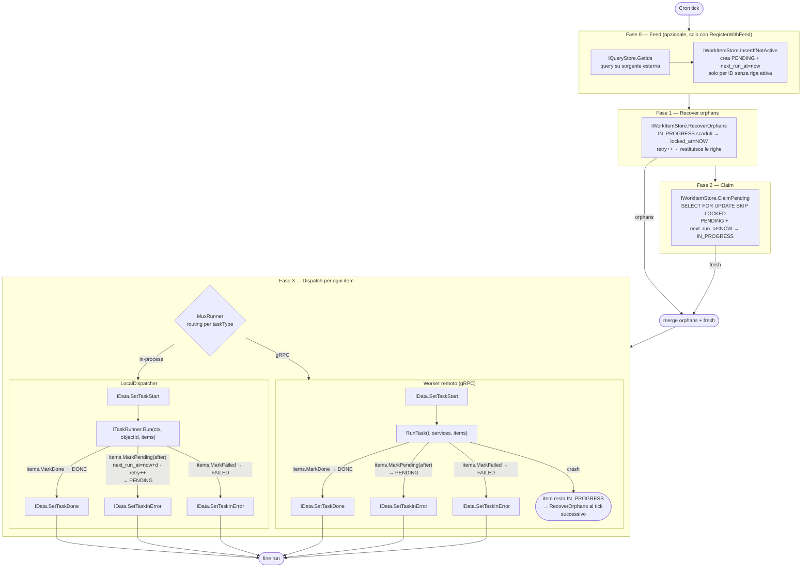

# go-core-batch

Framework per batch processing distribuito. Gestisce job schedulati, claiming atomico dei work item, recupero degli orfani e persistenza del ciclo di vita.

**Import:** `github.com/GPA-Gruppo-Progetti-Avanzati-SRL/go-core-batch`

---

## Processo — flusso completo



> **Il task controlla il proprio lifecycle.** `ITaskRunner.Run` riceve `store.IWorkItemStore`
> direttamente — è responsabile di chiamare `items.MarkDone` / `items.MarkPending` / `items.MarkFailed`.
> Questo permette transazioni atomiche: inserire workitem figli e chiudere quello corrente in un'unica TX.

---

## Struttura package

```
go-core-batch/
├── redis/                        # Client Redis (distributed lock scheduler)
├── scheduler/
│   ├── scheduler.go              # NewScheduler — gocron + Redis lock
│   ├── config.go                 # Config: Name, Type, Cron, Disabled, SingletonMode, LockTimeout, Properties
│   ├── registry.go               # Jobs map[string]JobFactory
│   ├── metrics.go                # Prometheus: TaskAssigned, TaskAssignedKO, JobExecution
│   │
│   ├── distributedjob/           # Unico job type distribuito — claiming sempre attivo
│   │   ├── distributedjob.go     # Register / RegisterWithFeed
│   │   ├── dispatcher.go         # Interface: ITaskDispatcher
│   │   ├── store.go              # Interface: IQueryStore (feed opzionale)
│   │   ├── job_claiming.go       # jobRunWithClaiming — feed → orphans → claim → dispatch
│   │   ├── runner/               # Infrastruttura condivisa tra tutti i dispatcher
│   │   │   └── runner.go         # ITaskRunner, TaskRunner, MuxRunner, Provide()
│   │   ├── localdispatcher/      # ITaskDispatcher in-process + Module()
│   │   ├── grpcdispatcher/       # ITaskDispatcher via gRPC + Module()
│   │   ├── sqlstore/             # IQueryStore su SQL
│   │   └── mongostore/           # IQueryStore su MongoDB
│   │
│   ├── simplejob/                # Job semplice in-process (senza claiming, senza task_logs)
│   └── kafkajob/                 # Job che invia WorkItem su Kafka
│
├── store/
│   ├── work_item.go              # WorkItem — outbox record (tabella work_items)
│   ├── work_item_store.go        # IWorkItemStore: ClaimPending, RecoverOrphans, InsertIfNotActive, ...
│   ├── errors.go                 # RetryError{After duration} — retry ritardato
│   ├── task_log.go               # TaskLog — ciclo di vita task (tabella task_logs)
│   ├── store.go                  # IData: SetTaskStart/Done/InError/Assigned/AssignationKO
│   ├── sqlstore/                 # WorkItemDataSQL + BatchDataSQL
│   └── mongostore/               # WorkItemData + BatchData
│
├── worker/                       # Worker pool per task distribuiti via gRPC
│   └── grpchandler/              # Router gRPC → worker pool + Module() + Provide()
├── grpc/                         # Client/Server gRPC
└── kafka/                        # ProducerService (franz-go)
```

---

## WorkItem lifecycle

```
         InsertIfNotActive          manuale / API
sorgente ──────────────────► PENDING ◄─────────────────────
esterna    next_run_at=now       │
                                 │ ClaimPending
                                 │ (next_run_at ≤ NOW)
                                 ▼
                           IN_PROGRESS
                          /      |      \
            items.MarkDone  items.MarkPending  items.MarkFailed
                        /    (RetryError)  \
                       ▼            ▼            ▼
                     DONE        PENDING        FAILED
                             next_run_at=now+d
                              retry++

    Se il worker crasha (nessun Mark chiamato):
    item resta IN_PROGRESS → RecoverOrphans (locked_at=NOW, retry++)
    → ri-dispatch immediato nello stesso run
```

---

## Pattern consigliato — Module() + runner.Provide()

Il modo canonico per aggiungere task runner a un'applicazione. Ogni task type è in un file autonomo; il wiring centrale non cambia mai.

### Struttura app/batch/

```
app/batch/
  batch.go           — chiama localdispatcher.Module() in init()
  miotask.go         — definisce runner + lo registra con runner.Provide()
  altrotask.go       — idem per un secondo task type
```

### app/batch/batch.go

```go
package batch

import "github.com/GPA-Gruppo-Progetti-Avanzati-SRL/go-core-batch/scheduler/distributedjob/localdispatcher"

func init() {
    localdispatcher.Module()
}
```

### app/batch/miotask.go

```go
package batch

import (
    "context"
    "github.com/GPA-Gruppo-Progetti-Avanzati-SRL/go-core-batch/scheduler/distributedjob/runner"
    "github.com/GPA-Gruppo-Progetti-Avanzati-SRL/go-core-batch/store"
)

func init() {
    runner.Provide(newMioTaskRunner)
}

// I parametri del costruttore sono iniettati da Fx — business, data, ecc.
func newMioTaskRunner(svc mySvc.IService) *runner.TaskRunner {
    return runner.New("MIO_TASK", &mioTaskRunner{svc: svc})
}

type mioTaskRunner struct {
    svc mySvc.IService
}

func (r *mioTaskRunner) Run(ctx context.Context, objectId string, items store.IWorkItemStore) error {
    if err := r.svc.DoWork(ctx, objectId); err != nil {
        items.MarkFailed(ctx, objectId, err.Error())
        return err
    }
    return items.MarkDone(ctx, []string{objectId})
}
```

### app-config.go — blank import

```go
import _ "myapp/app/batch"   // attiva tutti gli init() in app/batch/
```

### config.yml

```yaml
scheduler:
  - name: "mio-job"
    type: "DistribuiteTask"
    cron: "* * * * *"
    singleton: true
    lock-timeout: 15m
    disabled: false
    properties:
      task:  "MIO_TASK"
      limit: "10"
```

---

## Modalità di registrazione a confronto

### Manuale (bassa configurazione)

Utile per un singolo task type o quando non si usa il pattern `app/batch/`.

```go
// main.go — prima di core.Invoke(scheduler.NewScheduler)
core.Invoke(func(items store.IWorkItemStore, data store.IData) {
    distributedjob.Register(
        localdispatcher.New(runner.NewMux([]*runner.TaskRunner{
            runner.New("MY_TASK", &batch.MyRunner{}),
        }), items, data),
        items, data,
    )
})
```

### Con feed — workitem alimentati da sorgente esterna

```go
core.Invoke(func(items store.IWorkItemStore, qs distributedjob.IQueryStore, data store.IData) {
    distributedjob.RegisterWithFeed(
        localdispatcher.New(mux, items, data),
        items, qs, data,
    )
})
```

```yaml
properties:
  task:       "ProcessOrder"
  limit:      "200"
  collection: "orders"
  filter:     "status = 'READY'"
  sort:       "created_at:asc"
  objectType: "Order"
```

---

## Configurazione YAML — campi

| Campo | Tipo | Descrizione |
|---|---|---|
| `name` | string | Nome univoco del job |
| `type` | string | `"DistribuiteTask"` oppure tipo simplejob |
| `cron` | string | Espressione cron (secondi abilitati) |
| `singleton` | bool | Redis lock — evita run paralleli su repliche diverse |
| `lock-timeout` | duration | Dopo quanto un IN_PROGRESS è considerato orfano (default: 10m) |
| `disabled` | bool | Disabilita il job senza rimuoverlo dalla config |
| `properties.task` | string | TaskType passato al dispatcher |
| `properties.limit` | int | Max item per run |
| `properties.collection` | string | Tabella/collection sorgente (solo con feed) |
| `properties.filter` | string | WHERE SQL o JSON query Mongo (solo con feed) |
| `properties.sort` | string | `"col:asc,col2:desc"` (solo con feed) |
| `properties.objectType` | string | Finisce in `WorkItem.ObjectType` (solo con feed, opzionale) |

---

## Wiring Fx completo (services/data layer)

```go
// services/services.go
core.Provides(
    batchredis.NewService,
    fx.Annotate(mongostore.NewBatchData,    fx.As(new(store.IData))),
    fx.Annotate(mongostore.NewWorkItemData, fx.As(new(store.IWorkItemStore))),
    scheduler.NewScheduler,
)

// app-config.go
core.Supply(&cfg.Batch.Redis, cfg.Scheduler)
```

---

## RetryError — retry ritardato

```go
return store.Retry(5 * time.Minute)              // riprova tra 5 min
return store.Retry(0)                            // retry immediato
return store.RetryWithCause(5*time.Minute, err)  // wrappa l'errore originale
```

Il campo `next_run_at` viene impostato a `now + After` da `MarkPending`. `ClaimPending` filtra `next_run_at <= NOW()`.

---

## IQueryStore — SQL vs MongoDB

```go
// SQL (distributedjob/sqlstore) — filter = WHERE clause raw, sort = "col:asc"
// MongoDB (distributedjob/mongostore) — filter = JSON query '{"status":"NEW"}'

// Registrazione:
fx.Annotate(djsqlstore.NewQueryDataSQL,   fx.As(new(distributedjob.IQueryStore)))
fx.Annotate(djmongostore.NewQueryDataMongo, fx.As(new(distributedjob.IQueryStore)))
```

---

## Worker distribuito (gRPC)

Due processi separati: il **scheduler** dispatcha via gRPC, il **worker** riceve ed esegue.
I runner si registrano con `runner.Provide()` identicamente al caso local — solo `Module()` cambia.

### Scheduler side (scheduler process)

```go
// app/batch/batch.go nel processo scheduler
import "github.com/GPA-Gruppo-Progetti-Avanzati-SRL/go-core-batch/scheduler/distributedjob/grpcdispatcher"

func init() {
    grpcdispatcher.Module()  // registra GrpcDispatcher — nessun runner locale
}
```

### Worker side (worker process)

```go
// app/batch/batch.go nel processo worker
import "github.com/GPA-Gruppo-Progetti-Avanzati-SRL/go-core-batch/worker/grpchandler"

func init() {
    grpchandler.Module()  // avvia gRPC server + worker pool con i runner registrati
}

// app/batch/miotask.go — identico al caso local
func init() {
    runner.Provide(newMioTaskRunner)
}
```

Il worker deve connettersi allo stesso DB del scheduler per `IWorkItemStore` (`MarkDone`/`MarkFailed`).

### grpchandler.Module() — dipendenze Fx richieste

`grpchandler.Module()` richiede via Fx:
- `store.IWorkItemStore`
- `store.IData`
- `*batchgrpc.Server`
- `[]worker.Config` — pool sizes per task type (dalla config applicazione)
- `[]*runner.TaskRunner` (gruppo `batch_runners`, popolato da `runner.Provide()`)

---

## simplejob — alternativa senza infrastruttura

Usa `simplejob` solo se non serve `task_logs`, non prevedi di scalare a gRPC, e vuoi un runner minimo su `work_items`.

```go
simplejob.Register("MyJobType", items, &batch.MyRunner{})
```

`simplejob.ITaskRunner` riceve il `*store.WorkItem` completo invece del solo `objectId`.

---

## Interfacce chiave

```go
// runner.ITaskRunner — implementata dai task runner applicativi
type ITaskRunner interface {
    Run(ctx context.Context, objectId string, items store.IWorkItemStore) error
}

// distributedjob.ITaskDispatcher — chiamata dal job per ogni item
type ITaskDispatcher interface {
    DispatchTask(ctx context.Context, jobId, taskId, objectId, taskType string) error
}

// store.IWorkItemStore — claiming + lifecycle
type IWorkItemStore interface {
    ClaimPending(ctx context.Context, workType, destination, objectType string, limit int) ([]*WorkItem, *core.ApplicationError)
    RecoverOrphans(ctx context.Context, workType, destination, objectType string, maxAge time.Duration, limit int) ([]*WorkItem, *core.ApplicationError)
    InsertIfNotActive(ctx context.Context, items []*WorkItem) (int, *core.ApplicationError)
    MarkDone(ctx context.Context, ids []string) *core.ApplicationError
    MarkFailed(ctx context.Context, id, reason string) *core.ApplicationError
    MarkPending(ctx context.Context, id string, after time.Duration) *core.ApplicationError
    Insert(ctx context.Context, items []*WorkItem) *core.ApplicationError
}

// store.IData — ciclo di vita task su task_logs
type IData interface {
    SetTaskStart(ctx context.Context, taskid, jobid, typeTask, objectid string)
    SetTaskDone(ctx context.Context, taskid, jobid, typeTask, objectid string)
    SetTaskInError(ctx context.Context, taskid, jobid, typeTask, objectid, errMsg string)
    SetTaskAssigned(ctx context.Context, taskid, jobid, typeTask, objectid string)
    SetTaskAssignationKO(ctx context.Context, taskid, jobid, typeTask, objectid, errMsg string)
}
```

---

## Concorrenza — local vs gRPC

| | LocalDispatcher | gRPC worker pool |
|---|---|---|
| **Dispatch** | lancia goroutine, ritorna subito | invia gRPC call, ritorna subito |
| **Concorrenza** | `limit` item in parallelo | `limit` item dispatchati, concorrenza controllata dal pool size |
| **Scaling** | verticale (un processo) | orizzontale (N worker process × M goroutine) |
| **Config pool** | non necessaria — bound implicito = `limit` | `[]worker.Config` per task type |

In locale, `limit` è il bound naturale: `ClaimPending` restituisce al massimo `limit` item, quindi al massimo `limit` goroutine attive per run. Non serve configurare un pool separato.

In gRPC, `limit` e pool size sono dimensioni ortogonali: lo scheduler può claimare 100 item per tick mentre ogni worker process esegue al massimo M task in concorrenza, e si possono avere N worker process in parallelo.

---

## Trappole

- **`core.Invoke(func(_ *scheduler.Scheduler) {})`** è obbligatorio — senza di esso lo scheduler non viene costruito da Fx.
- **`distributedjob.Register` / `localdispatcher.Module()`** deve essere invocato prima dello scheduler — gli Invoke Fx sono ordinati.
- **`runner.Provide(constructor)`** deve essere chiamato in `init()` — Fx raccoglie il gruppo `batch_runners` prima di invocare `Module()`.
- **`gocron.NewTask` deve usare una closure zero-arg** che cattura le dipendenze — non passare interface nil come `...any` o gocron va in panic in reflect.
- **Tabelle**: `work_items` e `task_logs` (costanti `store.TableWorkItems`, `store.TableTaskLogs`).
- **`singleton: true`** richiede Redis attivo — senza Redis il lock fallisce all'avvio.
- **Worker distribuito**: il processo worker deve connettersi allo stesso DB del scheduler per chiamare `MarkDone`/`MarkFailed`.