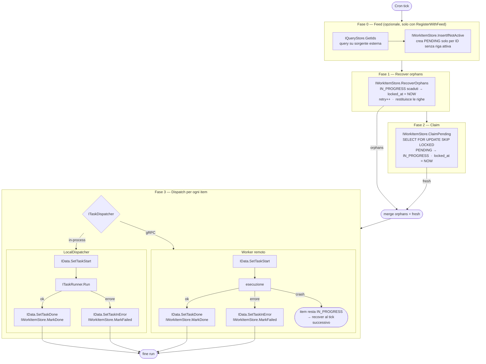

# go-core-batch

Framework per batch processing distribuito. Gestisce job schedulati, claiming atomico dei work item, recupero degli orfani e persistenza del ciclo di vita.

**Import:** `github.com/GPA-Gruppo-Progetti-Avanzati-SRL/go-core-batch`

---

## Processo — flusso completo



---

## Struttura package

```
go-core-batch/
├── redis/                        # Client Redis (distributed lock scheduler)
├── scheduler/
│   ├── scheduler.go              # NewScheduler — gocron + Redis lock
│   ├── config.go                 # Config: Name, Type, Cron, Disabled, SingletonMode, LockTimeout, Properties
│   ├── registry.go               # Jobs map[string]JobFactory
│   ├── metrics.go                # Prometheus: TaskAssigned, TaskAssignedKO, JobExecution
│   │
│   ├── distributedjob/           # Unico job type distribuito — claiming sempre attivo
│   │   ├── distributedjob.go     # Register / RegisterWithFeed
│   │   ├── dispatcher.go         # Interface: ITaskDispatcher
│   │   ├── store.go              # Interface: IQueryStore (feed opzionale)
│   │   ├── job_claiming.go       # jobRunWithClaiming — feed → orphans → claim → dispatch
│   │   ├── localdispatcher/      # ITaskDispatcher in-process
│   │   ├── grpcdispatcher/       # ITaskDispatcher via gRPC
│   │   ├── sqlstore/             # IQueryStore su SQL
│   │   └── mongostore/           # IQueryStore su MongoDB
│   │
│   ├── simplejob/                # Job semplice in-process (senza claiming, senza task_logs)
│   └── kafkajob/                 # Job che invia WorkItem su Kafka
│
├── store/
│   ├── work_item.go              # WorkItem — outbox record (tabella workitems)
│   ├── work_item_store.go        # IWorkItemStore: ClaimPending, RecoverOrphans, InsertIfNotActive, ...
│   ├── task_log.go               # TaskLog — ciclo di vita task (tabella task_logs)
│   ├── store.go                  # IData: SetTaskStart/Done/InError/Assigned/AssignationKO
│   ├── sqlstore/                 # WorkItemDataSQL + BatchDataSQL
│   └── mongostore/               # WorkItemData + BatchData
│
├── worker/                       # Worker pool per task distribuiti via gRPC
├── grpc/                         # Client/Server gRPC
└── kafka/                        # ProducerService (franz-go)
```

---

## WorkItem lifecycle

```
         InsertIfNotActive
sorgente ──────────────────► PENDING
esterna                          │
                                 │ ClaimPending
    workitems inseriti           ▼
    manualmente         ►  IN_PROGRESS ──────────────────► DONE
                                 │                          ▲
                                 │ timeout (lock-timeout)   │
                                 ▼                          │
                            RecoverOrphans ── ri-dispatch ──┘
                           (locked_at=NOW, retry++)
                                 │
                                 │ max retry
                                 ▼
                              FAILED
```

---

## Modalità d'uso

### Senza feed — workitems gestiti esternamente

I workitem vengono inseriti da un processo esterno (API, altro job, script). Il job schedula solo claim + dispatch.

```go
// main.go
core.Invoke(func(items store.IWorkItemStore, data store.IData) {
    distributedjob.Register(
        localdispatcher.New(&batch.MyRunner{}, items, data),
        items,
        data,
    )
})
```

```yaml
scheduler:
  - name: "my-job"
    type: "DistribuiteTask"
    cron: "*/30 * * * * *"
    lock-timeout: 10m
    properties:
      task:  "MyTaskType"
      limit: "100"
```

### Con feed — workitems alimentati da sorgente esterna

Il job interroga una tabella/collection esterna, crea i workitem per gli ID non ancora attivi, poi fa il claim.

```go
// app-config.go
core.Provides(
    fx.Annotate(djsqlstore.NewQueryDataSQL, fx.As(new(distributedjob.IQueryStore))),
)

// main.go
core.Invoke(func(items store.IWorkItemStore, qs distributedjob.IQueryStore, data store.IData) {
    distributedjob.RegisterWithFeed(
        localdispatcher.New(&batch.MyRunner{}, items, data),
        items,
        qs,
        data,
    )
})
```

```yaml
scheduler:
  - name: "orders-job"
    type: "DistribuiteTask"
    cron: "0 * * * *"
    lock-timeout: 15m
    properties:
      task:       "ProcessOrder"
      limit:      "200"
      collection: "orders"
      filter:     "status = 'READY'"
      sort:       "created_at:asc"
      objectType: "Order"         # opzionale — finisce in WorkItem.ObjectType
```

---

## Configurazione YAML — campi

| Campo | Tipo | Descrizione |
|---|---|---|
| `name` | string | Nome univoco del job |
| `type` | string | `"DistribuiteTask"` oppure tipo simplejob |
| `cron` | string | Espressione cron (secondi abilitati) |
| `singleton` | bool | Redis lock — evita run paralleli su repliche diverse |
| `lock-timeout` | duration | Dopo quanto un IN_PROGRESS è considerato orfano (default: 10m) |
| `disabled` | bool | Disabilita il job |
| `properties.task` | string | TaskType passato al dispatcher |
| `properties.limit` | int | Max item per run |
| `properties.collection` | string | Tabella/collection sorgente (solo con feed) |
| `properties.filter` | string | WHERE SQL o JSON query Mongo (solo con feed) |
| `properties.sort` | string | `"col:asc,col2:desc"` (solo con feed) |
| `properties.objectType` | string | Finisce in `WorkItem.ObjectType` (solo con feed, opzionale) |

---

## Implementare un task runner

```go
type MyRunner struct{}

var _ localdispatcher.ITaskRunner = (*MyRunner)(nil)

func (r *MyRunner) Run(ctx context.Context, objectId, taskType string) error {
    // objectId = WorkItem.ObjectId (ID dalla sorgente)
    // nil → MarkDone, errore → MarkFailed
    return nil
}
```

---

## Wiring Fx completo

```go
// data/data.go — init()
core.Provides(
    coresql.NewService,
    fx.Annotate(sqlstore.NewWorkItemDataSQL, fx.As(new(store.IWorkItemStore))),
    fx.Annotate(sqlstore.NewBatchDataSQL,    fx.As(new(store.IData))),
)

// app-config.go — init()
core.Supply(&cfg.Batch.Redis, cfg.Scheduler)
core.Provides(
    func() schema.Dialect { return pgdialect.New() },
    batchredis.NewService,
    scheduler.NewScheduler,
    // solo se si usa la modalità con feed:
    fx.Annotate(djsqlstore.NewQueryDataSQL, fx.As(new(distributedjob.IQueryStore))),
)

// main.go
core.Invoke(func(items store.IWorkItemStore, qs distributedjob.IQueryStore, data store.IData) {
    distributedjob.RegisterWithFeed(localdispatcher.New(&batch.MyRunner{}, items, data), items, qs, data)
})
core.Invoke(func(_ *scheduler.Scheduler) {})

// Creazione tabelle all'avvio
core.Invoke(func(db *bun.DB, lc fx.Lifecycle) {
    lc.Append(fx.Hook{OnStart: func(ctx context.Context) error {
        _, err := db.NewCreateTable().Model((*store.WorkItem)(nil)).IfNotExists().Exec(ctx)
        if err != nil {
            return err
        }
        _, err = db.NewCreateTable().Model((*store.TaskLog)(nil)).IfNotExists().Exec(ctx)
        return err
    }})
})
```

---

## Worker distribuito (gRPC)

Per scalare i worker su processi separati, sostituire `localdispatcher` con `grpcdispatcher`:

```go
// Scheduler side (schedula e dispatcha via gRPC)
core.Provides(batchgrpc.NewClient)
core.Invoke(func(d *grpcdispatcher.GrpcDispatcher, items store.IWorkItemStore, data store.IData) {
    distributedjob.Register(d, items, data)
})

// Worker side (riceve ed esegue)
core.Provides(
    worker.NewWorkers[MyServices],
    grpchandler.NewRouter[MyServices],
    batchgrpc.NewServer,
)
```

Il `worker.NewWorkers` accetta `store.IWorkItemStore` per chiudere il lifecycle (`MarkDone`/`MarkFailed`) dopo ogni task. Se il worker crasha prima di marcare, il job scheduler recupera l'item tramite `RecoverOrphans` al tick successivo.

---

## simplejob — alternativa senza infrastruttura

Usa `simplejob` solo se non serve `task_logs`, non prevedi di scalare a gRPC, e vuoi un runner minimo su `workitems`.

```go
simplejob.Register("MyJobType", items, &batch.MyRunner{})
```

`simplejob.ITaskRunner` riceve il `*store.WorkItem` completo invece del solo `objectId`.

---

## Dipendenze opzionali

| Package | Dipendenza | Quando usare |
|---|---|---|
| `redis/` | `go-redis/v9` | sempre (lock scheduler) |
| `store/sqlstore/` | `uptrace/bun` | DB SQL |
| `store/mongostore/` | `go-mongo-driver` | MongoDB |
| `distributedjob/sqlstore/` | `uptrace/bun` | feed da tabelle SQL |
| `distributedjob/mongostore/` | `go-mongo-driver` | feed da collection MongoDB |
| `distributedjob/grpcdispatcher/` | `grpc-go` | deployment distribuito |
| `kafka/` | `twmb/franz-go` | notifiche Kafka |
