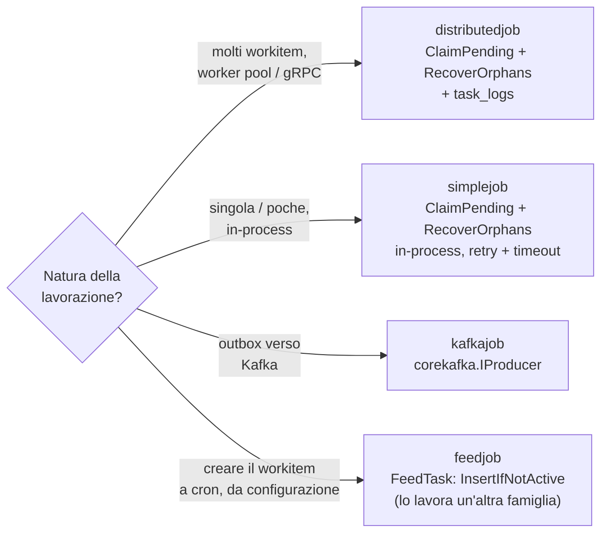
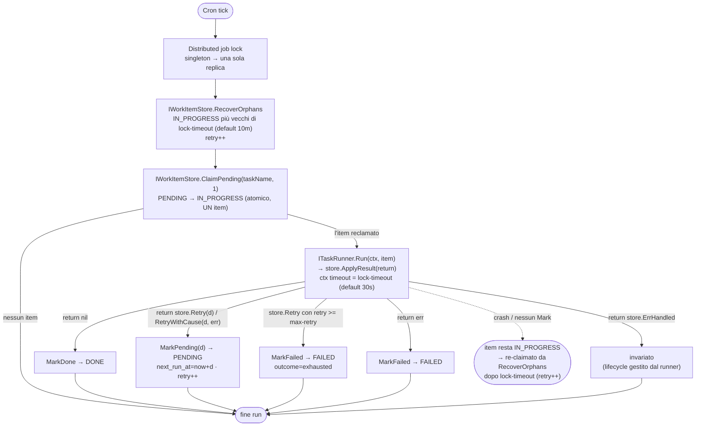

# go-core-batch

Framework per batch processing distribuito. Gestisce job schedulati, claiming atomico dei work item, recupero degli orfani e persistenza del ciclo di vita.

**Import:** `github.com/GPA-Gruppo-Progetti-Avanzati-SRL/go-core-batch`

---

## Orchestratore — `batch.Module` (wiring consigliato)

Il package **root** `batch` espone un unico entry-point che sostituisce la sfilza di `*.Module()` da chiamare a mano negli `init()`. È il modo **consigliato** di cablare il sottosistema batch: una `batch.Config` unificata + una sola chiamata a `batch.Module(...)` con opzioni dichiarative.

### `batch.Config` — config unificata

Raccoglie i sotto-config di tutti i pezzi cablati da `Module`. L'app tipicamente la embedda nella propria `Config` come campo `BatchConfig batch.Config` e la carica come singola sezione YAML: sono i `Module()` dei singoli package a fare il `core.Supply` interno, quindi l'app non deve suppliere nulla a Fx.

| Campo | Tipo | Tag yaml/mapstructure/json |
|---|---|---|
| `Grpc` | `grpc.Config` (`Client{Url}`, `Server{Hostname,Port}`) | `grpc` |
| `S3` | `s3.Config` | `s3` |
| `JobsConfig` | `[]scheduler.Config` | `jobs` |
| `TasksConfig` | `[]task.Config` (`name`, `type`, `properties`) | `tasks` |
| `WorkersConfig` | `[]worker.Config` | `workers` |
| `TaskLog` | `string` — `all` (default) · `errors` · `off` | `task-log` |

> **`task-log` è il volume dello storico.** Sul percorso distributedjob si scrivono **tre** righe
> di `task_logs` per item lavorato (`ASSIGNED` dal job, `START` e `DONE`/`ERROR` dal worker), e in
> molti deploy quelle di successo non vengono mai lette: restano un costo di scrittura e una
> collection che cresce. `errors` tiene i soli esiti negativi, `off` non scrive nulla (lo stato
> vive sul WorkItem e l'andamento sulle metriche). Un valore diverso dai tre **ferma l'avvio**:
> indovinare significherebbe scrivere — o non scrivere — dati senza che nulla lo dica.

> **Il lock distribuito non è più qui.** Lo wira l'applicazione con `corelock.Module` e il suo
> eventuale config (es. `redis.Config` di go-core-redis) è gestito dalla sua libreria: `batch` non
> importa più Redis.

> **`jobs[].properties` e `tasks[].properties` non sono la stessa cosa.** Il primo blocco è
> **infrastrutturale**: configura il *job type* (`task`, `limit`, `collection`, `filter`, `topic`,
> `task`, …) e lo legge il framework. Il secondo è **applicativo**: sono le properties del task,
> mappate sui campi `prop:` della struct del runner. Vedi "Configurazione dei task — `tasks:`".

### `batch.Module(cfg *batch.Config, register func(), opts ...batch.Option)`

Wira ogni componente **esplicitamente** e lo gate **solo** tramite i suoi modes: è il `core.Mode` a runtime a decidere cosa viene effettivamente costruito, non un `if` sul valore del config. I backend (store, dispatcher, feed, job Kafka, worker pool) **non sono selezionati da enum ma iniettati dall'app come `batch.ModuleFunc` per riferimento diretto** (niente closure). Così il package `batch` non importa nessun package di backend — solo i loro `Config`, struct leggere — e ogni app trascina in `go.mod` **solo** le dipendenze di ciò che passa: un'app mongo-only non si porta dietro `uptrace/bun`; una senza Kafka non si porta dietro **nessun client Kafka** — `kafkajob` nomina il solo seam `producer.IProducer` di go-core-kafka, e quale client giri lo decide l'import dell'app (`driver/franz` o `driver/confluent`).

`ModuleFunc` è la firma comune di tutti i `Module()` componibili — `func(modes ...string)`, ormai **modes-only**: il config non è più un parametro ma viene iniettato da fx, ed è `batch.Module` a fornirlo con `core.Supply` della Config unificata. I config dei backend (grpc client/server, s3, worker) sono suppliti **solo se valorizzati**: se un componente attivo richiede un config non impostato, fx fallisce subito con un chiaro "missing dependency" invece di far girare il backend con valori vuoti. Il **lock distribuito** non è un'opzione di batch: lo Scheduler dipende dal `corelock.Locker` di **go-core-locker** come da qualsiasi altra dipendenza fx, e la scelta del backend si fa una volta sola dove il lock vive. Se manca, l'avvio fallisce con un `missing type`.

**Opzioni:**

| Opzione | Effetto |
|---|---|
| `WithSchedulerModes(...string)` | gate dei componenti lato scheduler (dispatcher, feed, kafkajob, query store) e dello Scheduler ai `core.Mode` indicati; vuoto = sempre attivi |
| `WithWorkerModes(...string)` | gate dei componenti lato worker (worker pool gRPC) ai `core.Mode` indicati; vuoto = sempre attivo |
| `WithStore(m batch.ModuleFunc)` | **obbligatorio** (panic se assente); wirato **sempre** (no mode gate, serve sia a scheduler che a worker): `storemongo.Module` / `storesql.Module` (copre `IData`/`IWorkItemStore`) |
| `WithModule(m ...batch.ModuleFunc)` | componenti lato **scheduler** (gate scheduler modes), accumula su più chiamate: `grpcdispatcher.Module`/`localdispatcher.Module`, `djmongo.Module`(o `djsql.Module`) **+** `queryfeed.Module`, `s3feed.Module`, `kafkajob.Module` |
| `WithWorkerModule(m ...batch.ModuleFunc)` | componenti lato **worker** (gate worker modes): tipicamente `grpchandler.Module` |

**Nessun default implicito:** `WithStore` è obbligatorio ed esplicito; non esistono coppie store/dispatch mutuamente esclusive né un default Mongo/local: si passano esplicitamente i `Module` desiderati.

**Ordine di registrazione indifferente.** I job type confluiscono nel value group fx `batch_jobs` (`scheduler.ProvideJob`) e `newScheduler` li consuma dal gruppo: fx risolve tutti i contributori prima di costruire lo scheduler, a prescindere dall'ordine di registrazione. Tutte le registrazioni di `Module` sono inoltre raggruppate in un `core.ModuleClosed("batch")`: batch è un **sottosistema chiuso** — consuma i seam dell'app (gli `ITaskRunner`) e non le espone nulla in cambio, quindi config dei backend, dispatcher, feed, query store, worker pool e `*Scheduler` sono privati al modulo. Fa eccezione, per scelta, il **seam pubblico** `store.IWorkItemStore`/`store.IData`: `WithStore` è wirato a root, fuori dallo scope, così il data layer dell'app può accodare WorkItem dal lato API. I runner restano forniti a root e i value group (`batch_runners`, `batch_jobs`) aggregano come prima.

> In precedenza lo Scheduler doveva essere registrato **per ultimo** perché `newScheduler` leggeva una mappa globale `scheduler.Jobs` alla costruzione (popolata dai `Register()` dei componenti); registrarlo prima dava `"Job Type ... not found"`. Con il value group `batch_jobs` questo vincolo non esiste più.

**La funzione `register`** è il gemello di quella di `corekafka.Module`: `batch.Module` la esegue **sincronamente**, con la config già nota. Le `runner.Register[T]` chiamate al suo interno forniscono a fx **una istanza di runner per ogni task attivo** — cioè per ogni voce di `tasks:` referenziata da un job o da un worker — ciascuna con le proprie properties. Un task che nessuno referenzia non viene istanziato: le sue dipendenze non entrano nel grafo e non vengono mai connesse.

`register` è `nil` solo per un'app che non registra task runner: **registrare in un `init()` non è più supportato** (panic — lì la sezione `tasks:` non è nota). I costruttori scritti a mano con `runner.Provide` restano invece registrabili ovunque.

**Restano a carico dell'app:** fornire il driver DB (`coremongo.Module(&cfg.Mongo)` o `coresql.Module(&cfg.Sql, pgdialect.New())`). Il **simplejob NON è coperto** dall'orchestratore: resta wiring separato (vedi la sezione dedicata).

### Esempio — distribuito (gRPC + Mongo)

```go
import (
    "github.com/GPA-Gruppo-Progetti-Avanzati-SRL/go-core-batch"
    storemongo "github.com/GPA-Gruppo-Progetti-Avanzati-SRL/go-core-batch/store/mongostore"
    "github.com/GPA-Gruppo-Progetti-Avanzati-SRL/go-core-batch/scheduler/distributedjob/grpcdispatcher"
    djmongo "github.com/GPA-Gruppo-Progetti-Avanzati-SRL/go-core-batch/scheduler/distributedjob/mongostore"
    "github.com/GPA-Gruppo-Progetti-Avanzati-SRL/go-core-batch/scheduler/distributedjob/queryfeed"
    "github.com/GPA-Gruppo-Progetti-Avanzati-SRL/go-core-batch/scheduler/kafkajob"
    "github.com/GPA-Gruppo-Progetti-Avanzati-SRL/go-core-batch/worker/grpchandler"
    corelock "github.com/GPA-Gruppo-Progetti-Avanzati-SRL/go-core-locker"
    "github.com/GPA-Gruppo-Progetti-Avanzati-SRL/go-core-locker/mongostore"
)

func Register() {
    runner.Register[mioTaskRunner]("MIO_TASK")   // un runner per ogni istanza in `tasks:`
}

batch.Module(&cfg.BatchConfig, Register,
    batch.WithSchedulerModes(engine.Scheduler, engine.Batch),
    batch.WithWorkerModes(engine.Worker, engine.Batch),
    batch.WithStore(storemongo.Module),          // obbligatorio
    batch.WithModule(                            // gate scheduler modes, riferimento diretto
        grpcdispatcher.Module,                   // dispatch via gRPC
        djmongo.Module, queryfeed.Module,        // feed by-query (query store + feed)
        kafkajob.Module,                         // job NotificationKafka (il producer lo wira l'app)
    ),
    batch.WithWorkerModule(grpchandler.Module),  // gate worker modes
)
```

### Esempio — single-instance (in-process + Mongo)

```go
// import localdispatcher "...go-core-batch/scheduler/distributedjob/localdispatcher"
batch.Module(&cfg.BatchConfig, Register,
    batch.WithStore(storemongo.Module),          // obbligatorio
    batch.WithModule(
        localdispatcher.Module,                  // dispatch in-process (niente gRPC)
        djmongo.Module, queryfeed.Module,        // feed by-query
    ),
)
```

### Schedulare una cosa a un'ora — `feedjob`

Quando il workitem non arriva da fuori (API, altro processo) né da una query, ma è **uno solo e
sempre lo stesso**, il job `FeedTask` lo crea da configurazione. Non ha runner: lo lavora il job
che serve il task indicato, qualunque famiglia sia.

```go
batch.Module(&cfg.BatchConfig, Register,
    batch.WithStore(storemongo.Module),
    batch.WithModule(
        feedjob.Module,                          // job FeedTask (solo feed)
        simplejob.Module,                        // chi lo lavora
    ),
)
```

```yaml
tasks:
  - name: import-anagrafiche       # il task che ESEGUE
    type: IMPORT
jobs:
  - name: feed-anagrafiche         # crea il workitem alle 3:00
    type: FeedTask
    cron: "0 0 3 * * *"
    singleton: true
    properties:
      task: import-anagrafiche
      objectId: ANAGRAFICHE
  - name: import-pickup            # lo lavora entro 30s
    type: IMPORT
    cron: "*/30 * * * * *"
    singleton: true
    lock-timeout: 30m
    properties: {task: import-anagrafiche, limit: 1}
```

La deduplica è `InsertIfNotActive` sulla coppia (task, objectId): finché l'esecuzione
precedente è PENDING o IN_PROGRESS il tick successivo non ne accoda un'altra. **Attenzione alle
chiavi del `payload`**: viper abbassa ricorsivamente le chiavi della config, quindi
`payload: {idOrdine: X}` arriva come `idordine` e va riletto in modo case-insensitive.

### Notifiche Kafka — il producer lo wira l'app

Il job `NotificationKafka` (`kafkajob.Module`) produce col producer di **go-core-kafka**, che l'app
wira dalla composition root insieme al driver che ha scelto:

```go
corekafka.ProducerModule(&svc.Kafka,
    corekafka.WithDriver(franzdriver.Driver),      // puro Go; o driver/confluent per librdkafka
    corekafka.WithModes(engine.Scheduler))

batch.Module(&cfg.BatchConfig, Register,
    batch.WithStore(storemongo.Module),
    batch.WithModule(kafkajob.Module),
)
```

La configurazione Kafka è quella di go-core-kafka — sezione `server`, con `producer` dentro — e non
una seconda dentro il batch: `batch.Config` **non ha più il campo `kafka`**. Se il producer non è
wirato, fx fallisce all'avvio con un `missing type`: fail-fast, non un nil silenzioso.

La **transazionalità** è una scelta di quella config: con `server.producer.transactional-id`
valorizzato (univoco per replica, es. `notifiche-${HOSTNAME}`) i messaggi di un tick diventano
visibili ai consumer `read_committed` tutti o nessuno; senza, il producer è idempotente e compare un
Warn al boot. In entrambi i casi il contratto del framework resta **at-least-once**: `MarkDone` non
è nella transazione, quindi un suo fallimento dopo il commit fa ripubblicare al tick successivo.

Il producer **non è iniettabile in un task runner**: per mandare una notifica si crea un WorkItem
`NotificationKafka` (outbox), che il job drena — non si pubblica inline.

> I singoli `*.Module()` (`localdispatcher`, `grpcdispatcher`, `queryfeed`, `s3feed`, `kafkajob`, `mongostore`/`sqlstore`, `grpchandler`, `scheduler`, …) **restano validi** per il wiring manuale: sono il livello sotto l'orchestratore, documentato nelle sezioni seguenti. Essendo modes-only, lì il config va fornito prima con `core.Supply` (es. `core.Supply(&cfg.Client); grpcdispatcher.Module()`). `batch.Module` non fa che comporli in un'unica chiamata gate-ata per mode.

### Configurazione dei task — sezione `tasks:`

Un task è un'**istanza** di task type: `name` (come lo referenziano job e worker), `type` (il task type registrato dal runner) e `properties` (la sua configurazione applicativa). Due job possono così eseguire lo stesso task type con configurazioni diverse.

```yaml
batch:
  tasks:
    - name: import-in            # il nome referenziato dai job e dai worker pool
      type: IMPORT               # il task type registrato: runner.Register[importRunner]("IMPORT")
      properties:                # applicative → campi `prop:` del runner
        folder: /data/in
        dry-run: false
    - name: import-bulk          # stesso type, properties diverse → istanza distinta
      type: IMPORT
      max-retry: 3               # tetto ai RITENTATIVI: 3 ritentativi = 4 esecuzioni
      properties:
        folder: /data/bulk
  jobs:
    - name: import-a
      type: DistribuiteTaskByQuery
      cron: "*/5 * * * * *"
      properties:                # INFRASTRUTTURALI: configurano il job type
        task: import-in          # ← referenzia il task per NOME
        collection: docs
        limit: 100
  workers:
    - name: default
      size: 10
      tasks: [import-in, import-bulk]
```

**La dichiarazione è obbligatoria** (breaking change): ogni task type registrato deve avere almeno una voce in `tasks:`, e ogni task referenziato da `jobs:`/`workers:` deve esistere. Le incoerenze fanno **fallire l'avvio** con l'elenco dei nomi coinvolti — in caso contrario il job girerebbe a vuoto senza trovare un runner. Un task dichiarato ma che nessuno referenzia non viene istanziato (log Info): le sue dipendenze non entrano nel grafo fx.

Il **`name` è obbligatorio su ogni voce e non ha fallback sul `type`**: va scritto anche quando i due coincidono, perché è la chiave di instradamento (i job lo referenziano con `properties.task`, i worker pool lo elencano in `tasks`, e finisce in `WorkItem.TaskName` — ci filtra `ClaimPending` e ci instrada il `MuxRunner`). Due istanze dello stesso `type` si distinguono solo per `name`. Una voce senza `name` fa fallire l'avvio prima che `register()` giri.

La validazione riguarda i riferimenti **espliciti**: la property `task` di un distributedjob, di un simplejob o di un `FeedTask`, le `tasks` di un worker pool — nomi scritti a mano, quindi un nome inesistente è un typo. Quando nessuna property nomina il task, il nome è **dedotto** dal job type (è il caso del simplejob senza `task`): lì il task omonimo viene attivato se dichiarato, ma non se ne pretende l'esistenza, perché nello stesso campo stanno i job type del framework (`NotificationKafka`, `DistribuiteTask`, `DistribuiteTaskByQuery`, …) che non nominano alcun task.

**Il fail-fast è gate-ato sui modes.** `register` — e con esso la validazione di `tasks:` — gira solo se `core.Mode` è tra gli scheduler modes (`WithSchedulerModes`) o tra i worker modes (`WithWorkerModes`). In un processo `MODE=API`, dove nessun runner verrebbe costruito, il sottosistema batch non registra e non valida nulla: una misconfig della sezione `tasks:` deve far cadere i mode che il batch lo eseguono davvero, non l'API. Lo store resta l'eccezione di sempre (wirato in ogni mode), così l'API può iniettare `store.IWorkItemStore`. Una famiglia con modes vuoti è "sempre attiva", quindi un'app che non gate-a nulla si comporta come prima.

**`max-retry` è il tetto ai ritentativi** di un work item, ed è opzionale. È un dato del *task*
e non del job perché il ciclo di vita dell'item è per task — `ClaimPending` e `RecoverOrphans`
filtrano per nome di task — e lo stesso task può essere servito da più job o da un worker pool:
item identici devono avere lo stesso limite.

| valore | effetto |
|---|---|
| assente | illimitato — la condotta storica, prima che il tetto esistesse |
| `-1` | illimitato, esplicito |
| `0` | nessun ritentativo: il primo `store.Retry` manda l'item in FAILED |
| `N` | N **ritentativi**, quindi N+1 esecuzioni in tutto |

Esaurito il tetto, `store.ApplyResult` non rimette l'item in PENDING: chiama `MarkFailed` con
«superati i N ritentativi previsti: \<causa\>» e classifica l'esito come `OutcomeExhausted` —
un'etichetta a sé di `batch_task_outcome_total`, distinta da `failed`, perché l'errore era
transiente e si è solo smesso di riprovare. Senza tetto un guasto transiente permanente — un
mainframe irraggiungibile — fa riprovare l'item per sempre, a ogni ciclo.

⚠️ **Il contatore è uno solo.** Il tetto si misura su `WorkItem.Retry`, che incrementa anche
`RecoverOrphans`: il recupero di un item orfano — tipicamente il riavvio di un pod — **consuma
un tentativo** anche se il runner non ha mai fallito. Con `max-retry: 2`, tre riavvii
consecutivi mandano l'item in FAILED senza un solo fallimento applicativo.

### Nomenclatura: name, non type

Il vocabolario è stato ripulito perché diceva "type" dove intendeva "name". La chiave che instrada un
work item al suo runner **è un nome di istanza**, non un tipo:

| Prima | Ora | Cos'è |
|---|---|---|
| `WorkItem.Type` (`bson:"type"`, `bun:"type"`) | `WorkItem.TaskName` (`bson:"taskName"`, `bun:"task_name"`) | il nome del task che deve eseguire l'item |
| `TaskLog.Type` (`bson:"type"`) | `TaskLog.TaskName` (`bson:"taskName"`, `bun:"task_name"`) | idem, sul log di esecuzione |
| `worker.Task.Type` | `worker.Task.TaskName` | idem, nel pool |
| parametri `workType` / `taskType` | `taskName` | in `IWorkItemStore`, `IData`, `ITaskDispatcher`, `IFeed`, `MuxRunner.Run` |
| property di job `workType` (simplejob) | `task` | chiave unica: la stessa che usa distributedjob |
| label pprof `batch_task_type` | `batch_task_name` | goroutine del worker pool e del localdispatcher |
| proto `TaskMessage.TaskType` | `TaskMessage.TaskName` | field number 4 invariato → **compatibile a livello binario** |
| `task.Config.TaskName()` | `.Name` | il metodo era diventato un getter banale dopo la rimozione della fallback |

Restano `taskType` e `SimpleTaskRunner.TaskType` dove il tipo è davvero un tipo: il parametro di
`runner.Register[T]`, cioè il task type registrato dal codice.

**Il rename dei campi persistiti richiede una migrazione dei dati.** Mongo:

```js
db.<collezione_work_items>.updateMany({}, { $rename: { "type": "taskName" } })
db.<collezione_work_items>.dropIndex("<vecchio indice su {type, objectId}>")   // EnsureIndexes ricrea quello nuovo
db.<collezione_task_log>.updateMany({}, { $rename: { "type": "taskName" } })
```

SQL:

```sql
ALTER TABLE work_items RENAME COLUMN type TO task_name;
DROP INDEX IF EXISTS <vecchio indice parziale su (type, object_id)>;  -- EnsureIndexes ricrea quello nuovo
ALTER TABLE task_log   RENAME COLUMN type TO task_name;
```

Senza la migrazione il claiming filtra su un campo che non esiste: nessun errore, semplicemente
nessun item trovato.

Il **nome** del task è la chiave di tutto il percorso: è il `WorkItem.TaskName` creato dal job, quello su cui il claiming filtra e quello con cui il worker instrada al runner. Va sempre scritto: non c'è fallback sul `type`.

```go
type importRunner struct {
    Data   mypkg.IData `inject:""`                            // dipendenza iniettata da fx
    Folder string      `prop:"folder" validate:"required"`    // property del task
    DryRun bool        `prop:"dry-run" default:"false"`
    buf    []byte                                             // campo di lavorazione: dig non lo vede
}

func (r *importRunner) Run(ctx context.Context, item *store.WorkItem) error { ... }
```

I tre tag sono quelli di go-core-app (`core.ProvideStruct`), condivisi con go-core-kafka:

| Tag sul campo | Significato |
|---|---|
| `inject:""` / `inject:"nome"` | dipendenza iniettata da fx (il nome diventa `name:` per dig) |
| `from:"gruppo"` | dipendenza da un value group fx |
| `optional:"true"` | dipendenza opzionale |
| `prop:"chiave"` (+ `default:`, `validate:`) | property del task, presa da `tasks[].properties` |
| *nessun tag* | campo di lavorazione: ignorato sia dal grafo fx sia dal binding |

Le properties sono risolte **al boot**: un valore non convertibile o un `validate:"required"` mancante fa fallire l'avvio dell'app, con task, campo e tipo nel messaggio.

> L'istanza del runner è **condivisa** fra tutte le esecuzioni di quel task: i campi di lavorazione non sono per-esecuzione.

---

## Modalità (job families)

Cinque famiglie di job, ciascuna un modulo Fx self-contained che registra la propria `scheduler.JobRegistration` nel value group `batch_jobs` (via `scheduler.ProvideJob`). Condividono lo scheduler (gocron + **distributed job lock** pluggable, applicato a *ogni* job) e lo store `work_items`.

Tre CONSUMANO workitem, una li PRODUCE e una li CANCELLA: `feedjob` e `purgejob` sono le due che non hanno runner, e si compongono con qualunque delle altre.

| Famiglia | Job type / registrazione | Quando usarla |
|---|---|---|
| **distributedjob** | `DistribuiteTask` · `DistribuiteTaskByQuery` · `DistribuiteTaskByS3File` — `localdispatcher`/`grpcdispatcher.Module()` + `runner.Register[T]` | **Molti** workitem da distribuire: claiming atomico anti-doppione, recovery orfani, `task_logs`, scaling orizzontale gRPC |
| **simplejob** | `SingleTask` — `simplejob.Module()` + `runner.Register[T]` | **Una lavorazione alla volta** in-process: `RecoverOrphans`→`ClaimPending(1)`→`Run(item)`, eseguito dentro il tick. Niente gRPC/task_logs |
| **kafkajob** | tipo libero — invia i WorkItem su un topic Kafka col producer di go-core-kafka | Notifiche/outbox verso Kafka |
| **feedjob** | `FeedTask` — `feedjob.Module()`, nessun runner | **Schedulare una cosa a un'ora**: crea UN workitem per tick, descritto nelle properties del job (`task`, `objectId`, `payload`). Non reclama e non dispatcha: a lavorarlo è il job che serve quel task |
| **purgejob** | `PurgeWorkItems` — `purgejob.Module()`, nessun runner | **Retention**: cancella gli item in uno stato terminale più vecchi di una finestra, e su richiesta anche le righe di `task_logs`. Senza, le due collection crescono per sempre e con esse gli indici su cui gira il claim di ogni tick |



---

## distributedjob — flusso completo


> **Runner unico e interscambiabile.** distributedjob e simplejob condividono la stessa interfaccia
> `store.ITaskRunner` — `Run(ctx, item *WorkItem) error` — e la stessa semantica:
> il framework applica `store.ApplyResult` sul valore di ritorno (`nil`→MarkDone, `store.Retry`→MarkPending
> finché il `max-retry` del task lo consente e poi MarkFailed,
> `err`→MarkFailed, `store.ErrHandled`→invariato). Spostare un runner da una famiglia all'altra è un cambio
> di **registrazione + config `type`**, non di logica.
>
> Per un `MarkDone` **transazionale** (es. chiudere il corrente + inserire workitem figli in un'unica TX) il
> runner inietta un `store.IWorkItemStore` via fx nella propria struct e ritorna `store.ErrHandled`, così il
> framework non applica alcun `Mark*`.

---

## Errori

Catalogo dei codici in **[ERRORI.md](ERRORI.md)**. I codici sono nel package interno
`internal/errs`, quindi le app li vedono nel campo `Code` dell'`ApplicationError` ma non li nominano
in codice. Gli errori di **produzione Kafka** non sono più di questa libreria: arrivano da
go-core-kafka come `KAFKA-PRODUCE` con `Ambit = "go-core-kafka"`.

## Lock distribuito — ottimizzazione, non correttezza

**La correttezza del batch è garantita dal DB claiming** (`store.ClaimBatch`: PENDING→IN_PROGRESS +
`RecoverOrphans`, nei runner distributedjob/simplejob/kafkajob). Il lock distribuito dello scheduler
serve solo a evitare che N repliche eseguano lo stesso tick cron contemporaneamente
(**dispatch-dedup**).

È il [`corelock.Locker`](../go-core-locker) di go-core-locker, wirato dall'applicazione e
adattato a gocron da `scheduler/gocronlock` — l'unico punto di batch legato a gocron per il lock.
Tre backend, tutti `Module(modes ...string)` modes-only:

| Backend | Package | Nota |
|---|---|---|
| Redis | `go-core-redis/locker` (redsync/Redlock) | richiede `redis.Module(&cfg.Redis, ...)` wirato prima |
| MongoDB | `go-core-mongo/locker` (documento lease TTL) | consuma il `*coremongo.Service` |
| SQL | `go-core-sql/locker` (tabella `scheduler_locks`) | consuma il `*bun.DB`; `locker.EnsureTable` crea la tabella |

I lease hanno un TTL (redsync ~30s, mongo/sql 30s): se un tick supera il TTL il lock può scadere e
un'altra replica potrebbe ripartire, ma **il claiming lo rende innocuo**. È per questo che il backend
è una scelta libera: un'app mongo-only o sql-only usa `mongostore`/`sqlstore` e **non deploya Redis**.

## Struttura package

```
go-core-batch/
├── scheduler/
│   ├── scheduler.go              # NewScheduler — gocron + lock.Locker iniettato
│   ├── gocronlock/               # Adapter lock.Locker → gocron.Locker (UNICO punto legato a gocron)
│   ├── config.go                 # Config: Name, Type, Cron, Disabled, SingletonMode, LockTimeout, Properties
│   ├── registry.go               # JobRegistration, JobGroup ("batch_jobs"), ProvideJob, JobFactory
│   ├── metrics.go                # Prometheus: TaskAssigned, TaskAssignedKO, JobExecution
│   │
│   ├── distributedjob/           # Job type distribuiti — claiming sempre attivo
│   │   ├── distributedjob.go     # Register / RegisterByQuery / RegisterByS3File
│   │   ├── feed.go               # IFeedSource interface + queryStoreFeed adapter
│   │   ├── dispatcher.go         # Interface: ITaskDispatcher
│   │   ├── store.go              # Interface: IQueryStore (feed DB)
│   │   ├── job_claiming.go       # jobRunWithClaiming — feed → orphans → claim → dispatch
│   │   ├── localdispatcher/      # ITaskDispatcher in-process + Module()
│   │   ├── grpcdispatcher/       # ITaskDispatcher via gRPC + Module()
│   │   ├── queryfeed/            # Modulo Fx per DistribuiteTaskByQuery
│   │   ├── s3feed/               # Modulo Fx per DistribuiteTaskByS3File (feed + runner + module)
│   │   ├── sqlstore/             # IQueryStore su SQL
│   │   └── mongostore/           # IQueryStore su MongoDB
│   │
│   ├── simplejob/                # Job SingleTask: un item per tick, eseguito in-process (no gRPC/task_logs)
│   ├── kafkajob/                 # Job che invia WorkItem su Kafka (producer di go-core-kafka)
│   └── feedjob/                  # Job FeedTask: crea un WorkItem per tick da configurazione (solo feed, nessun runner)
│
├── runner/                       # Registro AGNOSTICO dei task runner, condiviso da tutte le famiglie
│   └── runner.go                 # ITaskRunner, TaskRunner, MuxRunner, Register[T](), Provide(), RegisterFile()
│
├── s3/                           # Client S3 multi-service (aws-sdk-go-v2)
│   ├── config.go                 # ServiceConfig, Config
│   ├── service.go                # Service: List, Get, Move
│   └── registry.go               # Registry: NewRegistry, Get
│
├── store/
│   ├── work_item.go              # WorkItem — outbox record (tabella work_items)
│   ├── work_item_store.go        # IWorkItemStore: ClaimPending, RecoverOrphans, InsertIfNotActive, ...
│   ├── errors.go                 # RetryError{After duration} — retry ritardato
│   ├── task_log.go               # TaskLog — ciclo di vita task (tabella task_logs)
│   ├── store.go                  # IData: SetTaskStart/Done/InError/Assigned/AssignationKO
│   ├── sqlstore/                 # WorkItemDataSQL + BatchDataSQL
│   └── mongostore/               # WorkItemData + BatchData
│
├── worker/                       # Worker pool per task distribuiti via gRPC
│   └── grpchandler/              # Router gRPC → worker pool + Module() + Provide()
├── grpc/                         # Client/Server gRPC
└── kafka/                        # kafka.Message: la forma del payload di un WorkItem NotificationKafka
```

---

## WorkItem lifecycle

```
         InsertIfNotActive          manuale / API
sorgente ──────────────────► PENDING ◄─────────────────────
esterna    next_run_at=now       │
                                 │ ClaimPending
                                 │ (next_run_at ≤ NOW)
                                 ▼
                           IN_PROGRESS
                          /      |      \
            items.MarkDone  items.MarkPending  items.MarkFailed
                        /    (RetryError)  \
                       ▼            ▼            ▼
                     DONE        PENDING        FAILED
                             next_run_at=now+d
                              retry++

    Se il worker crasha (nessun Mark chiamato):
    item resta IN_PROGRESS → RecoverOrphans (locked_at=NOW, retry++)
    → ri-dispatch immediato nello stesso run

    Se il DISPATCH viene rifiutato (pool saturo, worker irraggiungibile):
    items.Release → PENDING, next_run_at=now, retry INVARIATO
    → ripreso al tick successivo, senza aspettare l'orphan timeout
      e senza consumare un ritentativo che nessuno ha usato

    DONE / FAILED sono stati terminali: a rimuoverli è il job PurgeWorkItems,
    se configurato. Senza, la collection cresce per sempre.
```

---

## Indici — obbligatori, e non creati da soli

Il claim di **ogni job a ogni tick** è una query per `(task_name, status, next_run_at)` ordinata
per scadenza; il recupero orfani una per `(task_name, status, locked_at)`. Senza gli indici
corrispondenti quelle query scandiscono la collection intera — un costo che cresce con lo
**storico** invece che col lavoro da fare, e che non si vede finché la collection è piccola.

`EnsureIndexes` (mongo e sql) li crea tutti:

| Indice | Serve a | Senza |
|---|---|---|
| `uk_workitem_active` — unico parziale su `(task_name, object_id)` per gli stati attivi | la deduplica di `InsertIfNotActive` | nessun duplicate-key da intercettare: **il dedup salta in silenzio** e nascono workitem doppi |
| `ix_workitem_claim` — `(task_name, status, next_run_at, create_time)` | `ClaimPending` | collection scan a ogni tick di ogni job |
| `ix_workitem_orphan` — `(task_name, status, locked_at)` | `RecoverOrphans` | idem |
| `ix_workitem_claim_dest` — `(task_name, status, destination, object_type, next_run_at)` | il claim filtrato per destinazione (`NotificationKafka`) | idem |

I tre indici del claim sono **parziali sugli stati attivi**: gli item `DONE`/`FAILED` non vengono
mai claimati, quindi tenerli fuori mantiene l'indice della dimensione del *lavoro* e non dello
storico.

La libreria **non li crea da sola** (gestione via `EnsureIndexes` allo startup, o migration/ops),
ma alla **prima operazione sullo store** — il primo claim o il primo insert, quindi entro il primo
tick — verifica quali mancano e lo dice con un Warn: l'assenza dev'essere una scelta, non una
svista.

```go
// main.go, prima di core.Run()
core.Invoke(func(ms *coremongo.Service) {
    if err := mongostore.EnsureIndexes(context.Background(), ms); err != nil {
        log.Fatal().Err(err).Msg("EnsureIndexes failed")
    }
})
```

---

## Retention — `PurgeWorkItems`

Gli stati `DONE` e `FAILED` sono terminali: senza retention `work_items` e `task_logs` crescono
per sempre, e con loro gli indici del claim. Il job `PurgeWorkItems` cancella a finestra, con un
tetto per tick che tiene corta la singola transazione: un arretrato grosso si smaltisce in più
tick invece che in una botta sola che tiene il database occupato.

```yaml
jobs:
  - name: retention-done
    type: PurgeWorkItems
    cron: "0 30 3 * * *"
    singleton: true
    lock-timeout: 10m
    properties:
      status:     DONE     # obbligatoria
      older-than: 168h     # obbligatoria
      limit:      5000     # facoltativa (default 1000)
      task-logs:  true     # facoltativa: cancella anche le righe di task_logs più vecchie
```

```go
batch.Module(&cfg.BatchConfig, Register,
    batch.WithStore(storemongo.Module),
    batch.WithModule(localdispatcher.Module, purgejob.Module),
)
```

**Non c'è un default.** La retention va scritta in `jobs:`: cancellare dati non può essere un
comportamento che si ottiene aggiornando la libreria. Chi preferisce delegarla al database può
usare un TTL index su Mongo al posto del job — il contratto è lo stesso.

Un tick che cancella esattamente `limit` item logga un Warn: l'arretrato non è finito, e se
succede sempre la finestra o la cadenza del cron sono sbagliate.

---

## Pattern consigliato — Module() + runner.Provide()

Il modo canonico per aggiungere task runner a un'applicazione. Ogni task type è in un file autonomo; il wiring centrale non cambia mai.

### Struttura app/batch/

```
app/batch/
  batch.go           — la funzione Register() passata a batch.Module
  miotask.go         — definisce il runner e lo registra
  altrotask.go       — idem per un secondo task type
```

### app/batch/batch.go

```go
package batch

import "github.com/GPA-Gruppo-Progetti-Avanzati-SRL/go-core-batch/runner"

// Register è passata a batch.Module, che la esegue con la config già nota: i runner sono
// istanziati una volta per ogni task attivo, con le properties della loro voce di `tasks:`.
func Register() {
    runner.Register[mioTaskRunner]("MIO_TASK")
}
```

### app/batch/miotask.go

```go
package batch

import (
    "context"
    "github.com/GPA-Gruppo-Progetti-Avanzati-SRL/go-core-batch/runner"
    "github.com/GPA-Gruppo-Progetti-Avanzati-SRL/go-core-batch/store"
)

// Le dipendenze sono taggate `inject:`, le properties del task `prop:`; i campi senza tag sono
// di lavorazione e restano invisibili al grafo fx.
type mioTaskRunner struct {
    Svc     mySvc.IService `inject:""`
    Soglia  int            `prop:"soglia" default:"10"`
}

func (r *mioTaskRunner) Run(ctx context.Context, item *store.WorkItem) error {
    if err := r.Svc.DoWork(ctx, item); err != nil {
        if isTransient(err) {
            return store.RetryWithCause(5*time.Minute, err) // → MarkPending
        }
        return err                                          // → MarkFailed
    }
    return nil                                              // → MarkDone
}
```

> Il lifecycle lo applica il framework dal valore di ritorno (`store.ApplyResult`). Per gestirlo a mano
> (es. `MarkDone` transazionale con l'insert di workitem figli) inietta un `store.IWorkItemStore` via fx nella
> struct, chiudi tu l'item e ritorna `store.ErrHandled`.

> Un costruttore scritto a mano resta possibile con `runner.Provide(newMioTaskRunner)` (in `init()` o dentro `Register`): in quel caso il runner non riceve le properties del task, che le legge da sé.

### config.yml

```yaml
tasks:
  - name: "MIO_TASK"          # name omesso = uguale al type
    type: "MIO_TASK"
    properties:
      soglia: 25              # applicative → campi `prop:` del runner

jobs:
  - name: "mio-job"
    type: "DistribuiteTask"
    cron: "* * * * *"
    singleton: true
    lock-timeout: 15m
    disabled: false
    properties:               # infrastrutturali → lette dal framework
      task:  "MIO_TASK"       # il NOME del task da eseguire
      limit: 10
```

---

## Modalità di registrazione a confronto

### Manuale (bassa configurazione)

Utile per un singolo task type o quando non si usa il pattern `app/batch/`.

```go
// main.go — l'ordine rispetto a scheduler.Module non conta (value group batch_jobs)
scheduler.ProvideJob(func(items store.IWorkItemStore, data store.IData) scheduler.JobRegistration {
    return distributedjob.Register(
        localdispatcher.New(runner.NewMux([]*runner.TaskRunner{
            runner.New("MY_TASK", &batch.MyRunner{}),
        }), items, data),
        items, data,
    )
})
```

> `distributedjob.Register`/`RegisterByQuery`/`RegisterByS3File` ora **ritornano** una `scheduler.JobRegistration` (non scrivono più una mappa globale): vanno passate a `scheduler.ProvideJob`, che le inserisce nel value group `batch_jobs`. Nel wiring normale ci pensano `localdispatcher.Module()`/`grpcdispatcher.Module()`/`queryfeed.Module()`/`s3feed.Module()`.

### Con feed DB — DistribuiteTaskByQuery

```go
// app/batch/batch.go
import (
    "github.com/GPA-Gruppo-Progetti-Avanzati-SRL/go-core-batch/scheduler/distributedjob/localdispatcher"
    "github.com/GPA-Gruppo-Progetti-Avanzati-SRL/go-core-batch/scheduler/distributedjob/queryfeed"
)

func init() {
    localdispatcher.Module()
    queryfeed.Module()
}
```

```yaml
scheduler:
  - name: "process-orders"
    type: "DistribuiteTaskByQuery"
    cron: "* * * * *"
    singleton: true
    lock-timeout: 15m
    properties:
      task:       "ProcessOrder"
      limit:      "200"
      collection: "orders"
      filter:     "status = 'READY'"
      sort:       "created_at:asc"
      objectType: "Order"
```

### Con feed S3 — DistribuiteTaskByS3File

```go
// app/batch/batch.go
import (
    "github.com/GPA-Gruppo-Progetti-Avanzati-SRL/go-core-batch/scheduler/distributedjob/localdispatcher"
    "github.com/GPA-Gruppo-Progetti-Avanzati-SRL/go-core-batch/runner"
    "github.com/GPA-Gruppo-Progetti-Avanzati-SRL/go-core-batch/scheduler/distributedjob/s3feed"
)

func init() {
    localdispatcher.Module()
    s3feed.Module()
    runner.RegisterFile[myS3Runner]("S3_IMPORT")
}
```

```go
// app/batch/s3_import.go
type myS3Runner struct {
    Svc mysvc.IService `inject:""`
}

func (r *myS3Runner) Run(ctx context.Context, key string, content io.Reader) error {
    // process the file stream; return nil → l'adapter s3feed sposta il file e fa MarkDone,
    // return err → il workitem resta pending per il retry
    return nil
}
```

> Nelle struct dei runner le dipendenze si dichiarano col tag `inject:` (`from:` per un value group, `optional:"true"` per una dipendenza facoltativa): è il costruttore sintetizzato da `core.ProvideStruct` a tradurli nei tag che dig si aspetta, quindi la struct non deve embeddare `core.In`. Negli altri punti del wiring `core.In`/`core.Out` restano gli alias di `fx.In`/`fx.Out` per i costruttori scritti a mano.

```yaml
batch:
  s3:
    services:
      main:
        endpoint: "https://s3.eu-west-1.amazonaws.com"
        region: "eu-west-1"
        access-key: "AKIA..."
        secret-key: "..."
        bucket: "my-bucket"
        use-path-style: false

scheduler:
  - name: "s3-import"
    type: "DistribuiteTaskByS3File"
    cron: "*/5 * * * *"
    singleton: true
    lock-timeout: 15m
    properties:
      task:      "S3_IMPORT"
      limit:     "50"
      service:   "main"
      path:      "inbox/"
      pattern:   "*.csv"
      dest-path: "processed"
```

---

## Configurazione YAML — campi

### `jobs[]` — configurazione INFRASTRUTTURALE del job

Il blocco `properties:` di un job configura il **job type** e lo legge il framework. La configurazione
**applicativa** del runner sta invece in `tasks[].properties` (vedi "Configurazione dei task").

| Campo | Tipo | Descrizione |
|---|---|---|
| `name` | string | Nome univoco del job |
| `type` | string | Il **job type**, sempre una stringa del framework: `"SingleTask"` · `"DistribuiteTask"` · `"DistribuiteTaskByQuery"` · `"DistribuiteTaskByS3File"` · `"FeedTask"` · `"NotificationKafka"` · `"PurgeWorkItems"`. Non è mai un task type: quale task eseguire lo dice `properties.task` |
| `cron` | string | Espressione cron (secondi abilitati) |
| `singleton` | bool | distributed job lock — evita run paralleli su repliche diverse |
| `lock-timeout` | duration | Dopo quanto un IN_PROGRESS è considerato orfano (default: 10m — distributedjob e simplejob). simplejob: anche timeout del context di `Run` (default: 30s) |
| `disabled` | bool | Disabilita il job senza rimuoverlo dalla config |
| `properties.task` | string | **Nome** del task da eseguire (una voce di `tasks:`) |
| `properties.limit` | int | Max item per run (simplejob: default 100) |
| `properties.collection` | string | Tabella/collection sorgente (solo DistribuiteTaskByQuery) |
| `properties.filter` | string | WHERE SQL o JSON query Mongo (solo DistribuiteTaskByQuery) |
| `properties.sort` | string | `"col:asc,col2:desc"` (solo DistribuiteTaskByQuery) |
| `properties.objectType` | string | Finisce in `WorkItem.ObjectType` (solo DistribuiteTaskByQuery, opzionale) |
| `properties.service` | string | Nome logico del servizio S3 (solo DistribuiteTaskByS3File) |
| `properties.path` | string | Prefisso S3 per il listing (solo DistribuiteTaskByS3File) |
| `properties.pattern` | string | Glob pattern sul basename del file, es. `"*.csv"` (solo DistribuiteTaskByS3File) |
| `properties.dest-path` | string | Prefisso S3 dove spostare i file elaborati (solo DistribuiteTaskByS3File) |
| `properties.task` | string | **Nome del task** da eseguire, che è anche il `WorkItem.TaskName` letto da `ClaimPending`/`RecoverOrphans`. Obbligatoria per `SingleTask`, `DistribuiteTask*` e `FeedTask`: nessun ripiego sul `type` del job |
| `properties.objectId` | string | Cosa accodare (solo `FeedTask`): finisce in `WorkItem.ObjectId` ed è la chiave della deduplica |
| `properties.status` | string | Stato degli item da cancellare, es. `DONE` (solo `PurgeWorkItems`, obbligatoria) |
| `properties.older-than` | duration | Finestra di retention, misurata su `update_time` (solo `PurgeWorkItems`, obbligatoria) |
| `properties.task-logs` | bool | Cancella anche le righe di `task_logs` più vecchie della finestra (solo `PurgeWorkItems`, default `false`) |
| `properties.backlog-metrics` | bool | Abilita le gauge `batch_workitems_pending` / `batch_workitems_oldest_age_seconds` per questo job. Default `false`: è una query in più per tick, e la paga chi la vuole |

> **Le property dei job sono validate alla COSTRUZIONE, non dentro il tick.** Un refuso in YAML
> compare nei log di avvio (`il job fallirà a ogni tick`) ed è poi restituito da ogni esecuzione.

> I valori conservano il tipo YAML (`limit: 100` è un intero, `singleton: true` un booleano). Le forme
> virgolettate delle config esistenti (`limit: "100"`) restano valide: la conversione è automatica.
> Le chiavi sono risolte in modo case-insensitive, perché viper abbassa le chiavi della config.

### `tasks[]` — configurazione APPLICATIVA del task

| Campo | Tipo | Descrizione |
|---|---|---|
| `name` | string | Nome dell'istanza, referenziato da `jobs[].properties.task`/`task` e da `workers[].tasks`; default = `type`. È anche il `WorkItem.TaskName` |
| `type` | string | Task type registrato con `runner.Register[T]("...")` |
| `properties` | map | Configurazione applicativa, mappata sui campi `prop:` della struct del runner |

---

## Wiring Fx completo (services/data layer)

```go
// services/services.go
redis.Module(&cfg.Redis)        // client Redis (solo se il lock è redis-backed)
corelock.Module(&cfg.Lock, corelock.WithBackend(redisstore.Module))  // oppure mongostore / sqlstore
mongostore.Module()             // store.IData + store.IWorkItemStore (unico entry-point)
scheduler.Module(cfg.Scheduler) // fornisce la config da sé + Provide/Invoke interni
```

> Questo wiring manuale è il livello sotto l'orchestratore: `batch.Module(&cfg.BatchConfig, ...)` compone `mongostore.Module()`/`sqlstore.Module()`, il locker, dispatcher, feed, kafkajob, grpchandler e `scheduler.Module()` in un'unica chiamata, nell'ordine corretto e gate-ata per mode (vedi "Orchestratore — `batch.Module`"). Usalo a mano solo quando serve un controllo fine non coperto dalle opzioni.

---

## RetryError — retry ritardato

```go
return store.Retry(5 * time.Minute)              // riprova tra 5 min
return store.Retry(0)                            // retry immediato
return store.RetryWithCause(5*time.Minute, err)  // wrappa l'errore originale
```

Il campo `next_run_at` viene impostato a `now + After` da `MarkPending`. `ClaimPending` filtra `next_run_at <= NOW()`.

Il ritentativo **non è garantito**: se il task dichiara `max-retry` e l'item ha già consumato i
tentativi previsti, `ApplyResult` lo manda in FAILED (`OutcomeExhausted`) invece di rimetterlo in
PENDING. Vedi "Configurazione dei task — sezione `tasks:`".

---

## IQueryStore — SQL vs MongoDB

```go
// SQL (distributedjob/sqlstore) — filter = WHERE clause raw, sort = "col:asc"
// MongoDB (distributedjob/mongostore) — filter = JSON query '{"status":"NEW"}'

// Registrazione:
fx.Annotate(djsqlstore.NewQueryDataSQL,   fx.As(new(distributedjob.IQueryStore)))
fx.Annotate(djmongostore.NewQueryDataMongo, fx.As(new(distributedjob.IQueryStore)))
```

---

## Worker distribuito (gRPC)

Due processi separati: il **scheduler** dispatcha via gRPC, il **worker** riceve ed esegue.
I runner si registrano con `runner.Provide()` identicamente al caso local — solo `Module()` cambia.

### Scheduler side (scheduler process)

```go
// app/batch/batch.go nel processo scheduler
import "github.com/GPA-Gruppo-Progetti-Avanzati-SRL/go-core-batch/scheduler/distributedjob/grpcdispatcher"

func init() {
    grpcdispatcher.Module()  // registra GrpcDispatcher — nessun runner locale
}
```

### Worker side (worker process)

```go
// app/batch/batch.go nel processo worker
import "github.com/GPA-Gruppo-Progetti-Avanzati-SRL/go-core-batch/worker/grpchandler"

func init() {
    grpchandler.Module()  // avvia gRPC server + worker pool con i runner registrati
}

// app/batch/miotask.go — identico al caso local
func init() {
    runner.Provide(newMioTaskRunner)
}
```

Il worker deve connettersi allo stesso DB del scheduler per `IWorkItemStore` (`MarkDone`/`MarkFailed`).

### grpchandler.Module() — dipendenze Fx richieste

`grpchandler.Module()` richiede via Fx:
- `store.IWorkItemStore`
- `store.IData`
- `*batchgrpc.Server`
- `[]worker.Config` — pool sizes per task type (dalla config applicazione)
- `[]*runner.TaskRunner` (gruppo `batch_runners`, popolato da `runner.Provide()`)

---

## simplejob — job in-process con claiming

Job leggero per **lavorazioni singole/poche** eseguite in-process: claiming atomico per-item e recovery orfani come distributedjob (`RecoverOrphans` + `ClaimPending`, fino a `limit` item per tick, default 100), ma nessun dispatch gRPC e nessun `task_logs`. L'esclusività **cross-replica** resta garantita dal distributed job lock dello scheduler + `singleton: true`. Il runner riceve il `*store.WorkItem` completo (payload diretto, niente `GetById`) e il **lifecycle è gestito dal framework** in base al valore di ritorno.



> Stessa interfaccia (`store.ITaskRunner`) e stessa semantica di distributedjob: un runner è interscambiabile tra le due famiglie senza modifiche di logica.

### Wiring — Module() + runner.Register[T]

```go
// app/batch/batch.go
import "github.com/GPA-Gruppo-Progetti-Avanzati-SRL/go-core-batch/scheduler/simplejob"

func init() {
    simplejob.Module()
}

// Register è passata a batch.Module (o chiamata a mano dopo aver caricato la config).
func Register() {
    runner.Register[myRunner]("MY_TASK")   // T: store.ITaskRunner, campi taggati
}
```

In alternativa `simplejob.ProvideRunner(constructor)` (costruttore esplicito che ritorna `*simplejob.SimpleTaskRunner`, senza properties). `simplejob.Module()` raccoglie i runner dal gruppo `batch_simple_runners` ed emette una `scheduler.JobRegistration` per job type nel gruppo `batch_jobs`.

Con più voci in `tasks:` dello stesso type, `runner.Register` fornisce **una istanza per voce**: la factory sceglie quella indicata dal `task` del job, che è il **nome del task** (ed è anche il `WorkItem.TaskName` su cui filtra il claiming). La property è obbligatoria e non ha ripieghi: il vecchio "omesso, vale il `type` del job" è ciò che confondeva job type e task type, e faceva sì che un refuso eseguisse in silenzio qualcos'altro.

La registrazione è **agnostica**: `runner.Register` non dice da chi il task verrà eseguito. Lo stesso task, registrato una volta, può essere servito da un `SingleTask`, da un `DistribuiteTask` (dispatch in-process o gRPC) o da un worker pool — e a deciderlo è la voce di `jobs:`, non una ricompilazione.

### Runner — lifecycle dal valore di ritorno

`store.ITaskRunner.Run(ctx, item)` — stessa interfaccia di distributedjob. Nel caso comune il runner segnala l'esito col valore di ritorno.

```go
type myRunner struct {
    Svc    mysvc.IService `inject:""`
    Soglia int            `prop:"soglia" default:"10"`   // da tasks[].properties
}

func (r *myRunner) Run(ctx context.Context, item *store.WorkItem) error {
    if err := r.Svc.Do(ctx, item); err != nil {
        if isTransient(err) {
            return store.RetryWithCause(5*time.Minute, err) // → MarkPending (retry differito)
        }
        return err                                          // → MarkFailed
    }
    return nil                                              // → MarkDone
}
```

**MarkDone manuale / transazionale.** Se il runner deve gestire il lifecycle da sé — es. `MarkDone` insieme all'insert di altri workitem (outbox) — inietta un `store.IWorkItemStore` via fx nella struct e ritorna `store.ErrHandled`: il framework non applica alcun `Mark*` (l'atomicità insert+MarkDone dipende dal supporto transazionale dello store).

```go
type myRunner struct {
    Svc   mysvc.IService       `inject:""`
    Items store.IWorkItemStore `inject:""`   // iniettato da fx per il MarkDone transazionale
}

func (r *myRunner) Run(ctx context.Context, item *store.WorkItem) error {
    children, err := r.Svc.Process(ctx, item)
    if err != nil {
        return err                                     // → MarkFailed (framework)
    }
    if err := r.Items.Insert(ctx, children); err != nil {
        return err
    }
    if err := r.Items.MarkDone(ctx, []string{item.Id}); err != nil {
        return err
    }
    return store.ErrHandled                            // il framework non tocca l'item
}
```

### Config YAML

```yaml
jobs:
  - name: "my-job"
    type: "SingleTask"      # job type, sempre questo: quale task eseguire lo dice `task`
    cron: "*/5 * * * * *"
    singleton: true         # esclusività cross-replica
    lock-timeout: 15m       # timeout del context di Run (default 30s)
    properties:
      task: "my-task"       # OBBLIGATORIA — il nome di una voce di `tasks:`
```

### Da `selfFeed` a `FeedTask`

`selfFeed` non esiste più: creare il work item è il perimetro di `FeedTask`, eseguirlo quello di
`SingleTask`. Un job che si auto-alimentava diventa due job, uno per perimetro — e i due *quando*,
che con `selfFeed` erano per forza lo stesso tick, tornano due cron distinti.

```yaml
# prima
scheduler:
  - name: "cleanup"
    type: "Cleanup"                 # task type usato come job type
    cron: "0 */5 * * * *"
    properties: {task: "Cleanup", selfFeed: "true"}

# dopo
jobs:
  - name: "cleanup-feed"
    type: "FeedTask"
    cron: "0 */5 * * * *"           # quando accodare
    properties: {task: "cleanup", objectId: "cleanup"}
  - name: "cleanup"
    type: "SingleTask"
    cron: "*/30 * * * * *"          # quando eseguire
    properties: {task: "cleanup"}
```

`objectId` uguale al nome del task riproduce esattamente la chiave che `selfFeed` usava, quindi la
deduplica si comporta come prima: finché l'item è PENDING o IN_PROGRESS non ne nasce un altro.

### Differenze da distributedjob

| | simplejob | distributedjob |
|---|---|---|
| Claiming per-item | sì — `ClaimPending` atomico (idem) | sì — `ClaimPending` atomico (SKIP LOCKED) |
| Recovery crash | `RecoverOrphans` su IN_PROGRESS scaduti (idem) | `RecoverOrphans` su IN_PROGRESS scaduti |
| Interfaccia runner | `store.ITaskRunner` (identica) | `store.ITaskRunner` (identica) |
| Runner riceve | `*store.WorkItem` + `items` | `*store.WorkItem` + `items` (idem) |
| Lifecycle | `store.ApplyResult` sul return: `nil`→Done, `store.Retry`→Pending (Failed oltre `max-retry`), `err`→Failed, `store.ErrHandled`→manuale (idem) | idem |
| `task_logs` | no | sì (`IData.SetTask*`) |
| Scaling | in-process | gRPC worker pool |
| Esclusività cross-replica | distributed job lock + `singleton` | distributed job lock + `singleton` + claiming |

---

## Interfacce chiave

```go
// store.ITaskRunner — interfaccia unica condivisa da simplejob e distributedjob
// (runner.ITaskRunner e simplejob.ITaskRunner sono alias di questa).
type ITaskRunner interface {
    Run(ctx context.Context, item *WorkItem) error
}

// store.ApplyResult — finalizza il workitem dal return del runner
//   nil→MarkDone · ErrHandled→noop · *RetryError→MarkPending (MarkFailed oltre maxRetry)
//   · altro err→MarkFailed
// L'item serve intero: id e LockToken per i Mark* fenced, Retry per il confronto col tetto.
func ApplyResult(ctx context.Context, items IWorkItemStore, item *WorkItem, maxRetry int, runErr error) (Outcome, *core.ApplicationError)

// distributedjob.ITaskDispatcher — chiamata dal job per ogni item.
// Riceve il WorkItem INTERO (il job l'ha appena claimato: rileggerlo sul percorso in-process
// era una query per item buttata) e il deadline del job, che è l'orphan timeout: oltre quella
// soglia l'item è ri-claimato altrove, e una task che proseguisse ne sarebbe il secondo esecutore.
type ITaskDispatcher interface {
    DispatchTask(ctx context.Context, req DispatchRequest) error
}

type DispatchRequest struct {
    JobId, TaskId, TaskName string
    Item                    *store.WorkItem
    Timeout                 time.Duration
}

// store.IWorkItemStore — claiming + lifecycle. Ogni Mark* è FENCED dal lock token del claim:
// un worker stale (il cui item è stato ri-claimato da RecoverOrphans) non può finalizzarlo.
type IWorkItemStore interface {
    ClaimPending(ctx context.Context, taskName, destination, objectType string, limit int) ([]*WorkItem, *core.ApplicationError)
    RecoverOrphans(ctx context.Context, taskName, destination, objectType string, maxAge time.Duration, limit int) ([]*WorkItem, *core.ApplicationError)
    InsertIfNotActive(ctx context.Context, items []*WorkItem) (int, *core.ApplicationError)
    MarkDone(ctx context.Context, ids []string, token string) *core.ApplicationError
    MarkFailed(ctx context.Context, id, token, reason string) *core.ApplicationError
    // MarkPending: status → PENDING, retry++, next_run_at = now + retryDelay
    MarkPending(ctx context.Context, id, token string, retryDelay time.Duration) *core.ApplicationError
    // Release: status → PENDING, next_run_at = now, retry INVARIATO. Per un item claimato che
    // NESSUNO ha eseguito (dispatch rifiutato): un tentativo non avvenuto non è un tentativo.
    Release(ctx context.Context, id, token string) *core.ApplicationError
    Insert(ctx context.Context, items []*WorkItem) *core.ApplicationError
    GetById(ctx context.Context, id string) (*WorkItem, *core.ApplicationError)
    HasActive(ctx context.Context, taskName, objectId string) (bool, *core.ApplicationError)
    DeleteIfPending(ctx context.Context, id string) (bool, *core.ApplicationError)
    List(ctx context.Context, taskName, status string, paging *page.Paging, sort page.SortRequest) ([]*WorkItem, *core.ApplicationError)
    // Purge: retention. Cancella gli item nello stato indicato più vecchi di olderThan.
    Purge(ctx context.Context, status string, olderThan time.Time, limit int) (int, *core.ApplicationError)
    // Backlog: quanti PENDING aspettano e da quando. Alimenta le gauge batch_workitems_*.
    Backlog(ctx context.Context, taskName, destination, objectType string) (int, time.Time, *core.ApplicationError)
}

// store.IData — ciclo di vita task su task_logs
type IData interface {
    SetTaskStart(ctx context.Context, taskid, jobid, typeTask, objectid string)
    SetTaskDone(ctx context.Context, taskid, jobid, typeTask, objectid string)
    SetTaskInError(ctx context.Context, taskid, jobid, typeTask, objectid, errMsg string)
    SetTaskAssigned(ctx context.Context, taskid, jobid, typeTask, objectid string)
    SetTaskAssignationKO(ctx context.Context, taskid, jobid, typeTask, objectid, errMsg string)
    // InsertTaskLogs: più righe in UNA scrittura. La fase di dispatch ne produce una per item.
    InsertTaskLogs(ctx context.Context, logs []*TaskLog)
    PurgeTaskLogs(ctx context.Context, olderThan time.Time, limit int) (int, *core.ApplicationError)
}
```

> `FindPending` **non esiste più**: era nell'interfaccia senza alcun caller di produzione, e
> costringeva ogni backend a implementarla. Per ispezionare la coda senza prenderla in carico ci
> sono `List` e `Backlog`.

---

## Concorrenza — local vs gRPC

| | LocalDispatcher | gRPC worker pool |
|---|---|---|
| **Dispatch** | lancia goroutine, ritorna subito | invia gRPC call, ritorna subito |
| **Concorrenza** | cap **derivato dalla config**: somma dei `limit` dei job attivi (pavimento 100) | `limit` item dispatchati, concorrenza controllata dal pool size |
| **Scaling** | verticale (un processo) | orizzontale (N worker process × M goroutine) |
| **Config pool** | non necessaria — il cap si dimensiona da sé sui `limit` | `[]worker.Config` per task type |
| **Deadline della task** | l'orphan timeout del job (`lock-timeout`) | governato dal processo worker |
| **Se il dispatch è rifiutato** | `Release` dell'item: PENDING subito, `retry` invariato | idem |

In locale il cap di concorrenza è **derivato dalla config**: la somma dei `limit` dei job attivi,
con un pavimento di 100. Dimensionato così il dispatcher assorbe per costruzione un giro completo
di ogni job, e non esiste più la configurazione che non poteva funzionare — un `limit` più alto di
un cap costante faceva fallire sistematicamente una parte dei dispatch a ogni tick. Oltre il cap
la back-pressure è la condotta giusta: l'item viene rilasciato (`Release`, nessun ritentativo
consumato) e ripreso al tick successivo.

Il **deadline** della task in-process è l'orphan timeout del job, non una costante: oltre quella
soglia l'item viene ri-claimato da un altro tick, e lasciar proseguire la task qui significherebbe
averne due che lavorano lo stesso item. Il fencing token impedisce al perdente di *finalizzare*,
ma non di aver già prodotto i suoi effetti.

In gRPC, `limit` e pool size sono dimensioni ortogonali: lo scheduler può claimare 100 item per tick mentre ogni worker process esegue al massimo M task in concorrenza, e si possono avere N worker process in parallelo.

---

## Trappole

- **L'Invoke sullo `*scheduler.Scheduler`** è obbligatorio per forzarne la costruzione da Fx — lo fa già `scheduler.Module()` internamente (non serve aggiungerlo a mano).
- **`localdispatcher.Module()` / `grpcdispatcher.Module()`** possono essere registrati in qualunque ordine rispetto allo scheduler: la `scheduler.JobRegistration` confluisce nel value group `batch_jobs`, che fx risolve prima di costruire `newScheduler`.
- **`runner.Register[T]` va chiamata dentro la funzione `register` passata a `batch.Module`**: è lì che la config è nota. In un `init()` panica. `runner.Provide(constructor)` (costruttore a mano) resta invece registrabile ovunque, ma non riceve le properties del task.
- **Ogni task va dichiarato in `tasks:`**: un task type registrato senza voce, o referenziato da un job con un nome inesistente, fa fallire l'avvio.
- **Un campo esportato senza tag NON è una dipendenza**: nelle struct passate a `Register` è un campo di lavorazione. Le dipendenze vanno taggate `inject:`/`from:`, le properties `prop:`.
- **`core.In` non va usato nelle struct dei runner**: è un errore al wiring. Il marker lo porta il param object sintetizzato dalla libreria; accettarlo lascerebbe passare struct scritte per la vecchia semantica, con le dipendenze silenziosamente a nil. Resta valido nei param object dei costruttori scritti a mano passati a `core.Provide`/`runner.Provide`.
- **`jobs[].properties` è infrastrutturale, `tasks[].properties` è applicativo**: mettere la config del runner nel blocco del job non la fa arrivare ai campi `prop:`.
- **Le chiavi delle properties sono case-insensitive**: viper abbassa le chiavi della config, quindi `task` nello YAML arriva come `worktype`. I getter di `core.Properties` e il binding `prop:` lo gestiscono; l'indicizzazione diretta della mappa no.
- **`gocron.NewTask` deve usare una closure zero-arg** che cattura le dipendenze — non passare interface nil come `...any` o gocron va in panic in reflect.
- **Tabelle**: `work_items` e `task_logs` (costanti `store.TableWorkItems`, `store.TableTaskLogs`). Senza un job `PurgeWorkItems` **crescono per sempre**, e con loro gli indici del claim.
- **Gli indici del claim non sono opzionali**: senza `ix_workitem_claim`/`ix_workitem_orphan` ogni tick di ogni job scandisce la collection. `EnsureIndexes` li crea; in assenza la libreria logga un Warn all'avvio ma non li crea da sola.
- **Il worker pool non installa più un handler di segnale**: i segnali li gestisce l'app (`core.Run`/fx) e l'arresto arriva come `OnStop`, che drena le task in volo fino al deadline del context di stop. Prima un `signal.Notify` di libreria faceva uscire i worker *prima* di `OnStop`, abbandonando a metà le task già partite.
- **`singleton: true`** richiede un `corelock.Locker` nel grafo: se `corelock.Module` non è wirato, fx fallisce l'avvio con un `missing type`, e il backend scelto dev'essere raggiungibile o il lock fallisce alla prima acquisizione.
- **Worker distribuito**: il processo worker deve connettersi allo stesso DB del scheduler per chiamare `MarkDone`/`MarkFailed`.