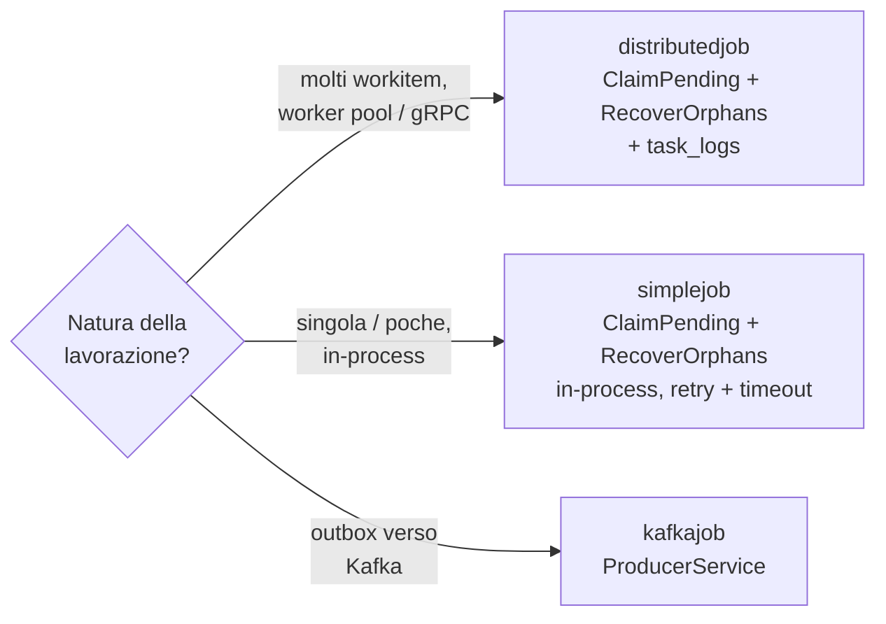
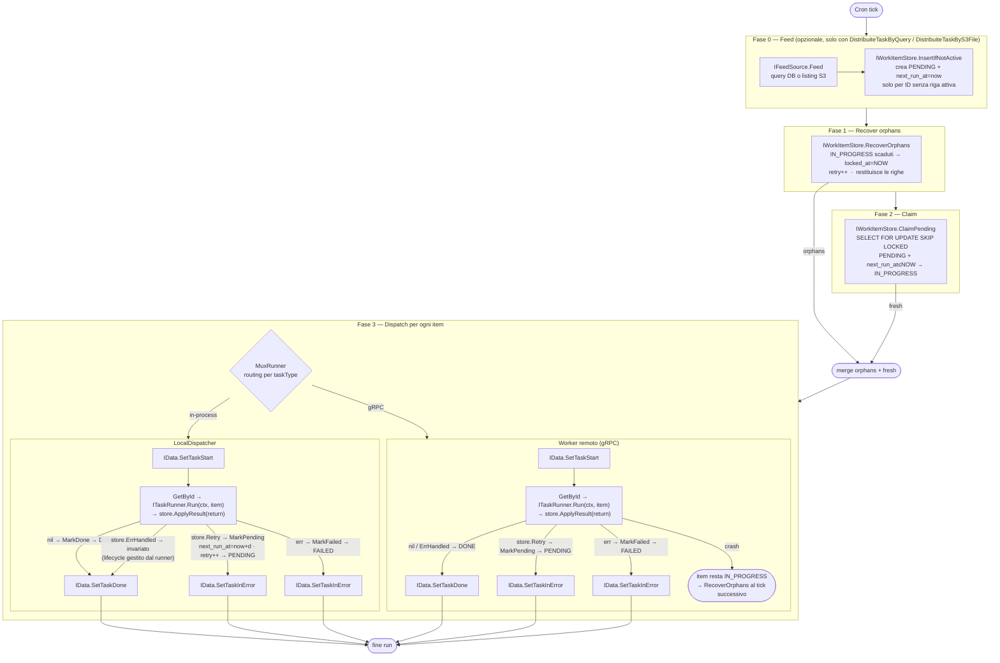
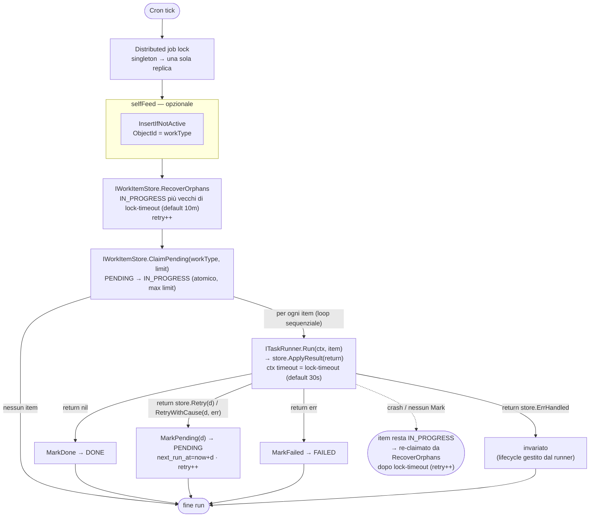

# go-core-batch

Framework per batch processing distribuito. Gestisce job schedulati, claiming atomico dei work item, recupero degli orfani e persistenza del ciclo di vita.

**Import:** `github.com/GPA-Gruppo-Progetti-Avanzati-SRL/go-core-batch`

---

## Modalità (job families)

Tre famiglie di job, ciascuna un modulo Fx self-contained registrato in `scheduler.Jobs`. Condividono lo scheduler (gocron + **Redis distributed job lock**, applicato a *ogni* job) e lo store `work_items`.

| Famiglia | Job type / registrazione | Quando usarla |
|---|---|---|
| **distributedjob** | `DistribuiteTask` · `DistribuiteTaskByQuery` · `DistribuiteTaskByS3File` — `localdispatcher`/`grpcdispatcher.Module()` + `runner.Register[T]` | **Molti** workitem da distribuire: claiming atomico anti-doppione, recovery orfani, `task_logs`, scaling orizzontale gRPC |
| **simplejob** | tipo libero — `simplejob.Module()` + `simplejob.RegisterRunner[T]` | **Lavorazioni singole/poche** in-process (es. `singleton:true`): `RecoverOrphans`→`ClaimPending`→loop→`Run(item)`. Niente gRPC/task_logs |
| **kafkajob** | tipo libero — invia i WorkItem su un topic Kafka | Notifiche/outbox verso Kafka |



---

## distributedjob — flusso completo



> **Runner unico e interscambiabile.** distributedjob e simplejob condividono la stessa interfaccia
> `store.ITaskRunner` — `Run(ctx, item *WorkItem) error` — e la stessa semantica:
> il framework applica `store.ApplyResult` sul valore di ritorno (`nil`→MarkDone, `store.Retry`→MarkPending,
> `err`→MarkFailed, `store.ErrHandled`→invariato). Spostare un runner da una famiglia all'altra è un cambio
> di **registrazione + config `type`**, non di logica.
>
> Per un `MarkDone` **transazionale** (es. chiudere il corrente + inserire workitem figli in un'unica TX) il
> runner inietta un `store.IWorkItemStore` via fx nella propria struct e ritorna `store.ErrHandled`, così il
> framework non applica alcun `Mark*`.

---

## Struttura package

```
go-core-batch/
├── redis/                        # Client Redis (distributed lock scheduler)
├── scheduler/
│   ├── scheduler.go              # NewScheduler — gocron + Redis lock
│   ├── config.go                 # Config: Name, Type, Cron, Disabled, SingletonMode, LockTimeout, Properties
│   ├── registry.go               # Jobs map[string]JobFactory
│   ├── metrics.go                # Prometheus: TaskAssigned, TaskAssignedKO, JobExecution
│   │
│   ├── distributedjob/           # Job type distribuiti — claiming sempre attivo
│   │   ├── distributedjob.go     # Register / RegisterByQuery / RegisterByS3File
│   │   ├── feed.go               # IFeedSource interface + queryStoreFeed adapter
│   │   ├── dispatcher.go         # Interface: ITaskDispatcher
│   │   ├── store.go              # Interface: IQueryStore (feed DB)
│   │   ├── job_claiming.go       # jobRunWithClaiming — feed → orphans → claim → dispatch
│   │   ├── runner/               # Infrastruttura condivisa tra tutti i dispatcher
│   │   │   └── runner.go         # ITaskRunner, TaskRunner, MuxRunner, Provide(), IFileRunner, RegisterFile()
│   │   ├── localdispatcher/      # ITaskDispatcher in-process + Module()
│   │   ├── grpcdispatcher/       # ITaskDispatcher via gRPC + Module()
│   │   ├── queryfeed/            # Modulo Fx per DistribuiteTaskByQuery
│   │   ├── s3feed/               # Modulo Fx per DistribuiteTaskByS3File (feed + runner + module)
│   │   ├── sqlstore/             # IQueryStore su SQL
│   │   └── mongostore/           # IQueryStore su MongoDB
│   │
│   ├── simplejob/                # Job in-process con claiming (no gRPC/task_logs) — retry differito + timeout configurabile
│   └── kafkajob/                 # Job che invia WorkItem su Kafka
│
├── s3/                           # Client S3 multi-service (aws-sdk-go-v2)
│   ├── config.go                 # ServiceConfig, Config
│   ├── service.go                # Service: List, Get, Move
│   └── registry.go               # Registry: NewRegistry, Get
│
├── store/
│   ├── work_item.go              # WorkItem — outbox record (tabella work_items)
│   ├── work_item_store.go        # IWorkItemStore: ClaimPending, RecoverOrphans, InsertIfNotActive, ...
│   ├── errors.go                 # RetryError{After duration} — retry ritardato
│   ├── task_log.go               # TaskLog — ciclo di vita task (tabella task_logs)
│   ├── store.go                  # IData: SetTaskStart/Done/InError/Assigned/AssignationKO
│   ├── sqlstore/                 # WorkItemDataSQL + BatchDataSQL
│   └── mongostore/               # WorkItemData + BatchData
│
├── worker/                       # Worker pool per task distribuiti via gRPC
│   └── grpchandler/              # Router gRPC → worker pool + Module() + Provide()
├── grpc/                         # Client/Server gRPC
└── kafka/                        # ProducerService (franz-go)
```

---

## WorkItem lifecycle

```
         InsertIfNotActive          manuale / API
sorgente ──────────────────► PENDING ◄─────────────────────
esterna    next_run_at=now       │
                                 │ ClaimPending
                                 │ (next_run_at ≤ NOW)
                                 ▼
                           IN_PROGRESS
                          /      |      \
            items.MarkDone  items.MarkPending  items.MarkFailed
                        /    (RetryError)  \
                       ▼            ▼            ▼
                     DONE        PENDING        FAILED
                             next_run_at=now+d
                              retry++

    Se il worker crasha (nessun Mark chiamato):
    item resta IN_PROGRESS → RecoverOrphans (locked_at=NOW, retry++)
    → ri-dispatch immediato nello stesso run
```

---

## Pattern consigliato — Module() + runner.Provide()

Il modo canonico per aggiungere task runner a un'applicazione. Ogni task type è in un file autonomo; il wiring centrale non cambia mai.

### Struttura app/batch/

```
app/batch/
  batch.go           — chiama localdispatcher.Module() in init()
  miotask.go         — definisce runner + lo registra con runner.Provide()
  altrotask.go       — idem per un secondo task type
```

### app/batch/batch.go

```go
package batch

import "github.com/GPA-Gruppo-Progetti-Avanzati-SRL/go-core-batch/scheduler/distributedjob/localdispatcher"

func init() {
    localdispatcher.Module()
}
```

### app/batch/miotask.go

```go
package batch

import (
    "context"
    "github.com/GPA-Gruppo-Progetti-Avanzati-SRL/go-core-batch/scheduler/distributedjob/runner"
    "github.com/GPA-Gruppo-Progetti-Avanzati-SRL/go-core-batch/store"
)

func init() {
    runner.Provide(newMioTaskRunner)
}

// I parametri del costruttore sono iniettati da Fx — business, data, ecc.
func newMioTaskRunner(svc mySvc.IService) *runner.TaskRunner {
    return runner.New("MIO_TASK", &mioTaskRunner{svc: svc})
}

type mioTaskRunner struct {
    svc mySvc.IService
}

func (r *mioTaskRunner) Run(ctx context.Context, item *store.WorkItem) error {
    if err := r.svc.DoWork(ctx, item); err != nil {
        if isTransient(err) {
            return store.RetryWithCause(5*time.Minute, err) // → MarkPending
        }
        return err                                          // → MarkFailed
    }
    return nil                                              // → MarkDone
}
```

> Il lifecycle lo applica il framework dal valore di ritorno (`store.ApplyResult`). Per gestirlo a mano
> (es. `MarkDone` transazionale con l'insert di workitem figli) inietta un `store.IWorkItemStore` via fx nella
> struct, chiudi tu l'item e ritorna `store.ErrHandled`.

### app-config.go — blank import

```go
import _ "myapp/app/batch"   // attiva tutti gli init() in app/batch/
```

### config.yml

```yaml
scheduler:
  - name: "mio-job"
    type: "DistribuiteTask"
    cron: "* * * * *"
    singleton: true
    lock-timeout: 15m
    disabled: false
    properties:
      task:  "MIO_TASK"
      limit: "10"
```

---

## Modalità di registrazione a confronto

### Manuale (bassa configurazione)

Utile per un singolo task type o quando non si usa il pattern `app/batch/`.

```go
// main.go — prima di scheduler.Module(cfg.Scheduler)
core.Invoke(func(items store.IWorkItemStore, data store.IData) {
    distributedjob.Register(
        localdispatcher.New(runner.NewMux([]*runner.TaskRunner{
            runner.New("MY_TASK", &batch.MyRunner{}),
        }), items, data),
        items, data,
    )
})
```

### Con feed DB — DistribuiteTaskByQuery

```go
// app/batch/batch.go
import (
    "github.com/GPA-Gruppo-Progetti-Avanzati-SRL/go-core-batch/scheduler/distributedjob/localdispatcher"
    "github.com/GPA-Gruppo-Progetti-Avanzati-SRL/go-core-batch/scheduler/distributedjob/queryfeed"
)

func init() {
    localdispatcher.Module()
    queryfeed.Module()
}
```

```yaml
scheduler:
  - name: "process-orders"
    type: "DistribuiteTaskByQuery"
    cron: "* * * * *"
    singleton: true
    lock-timeout: 15m
    properties:
      task:       "ProcessOrder"
      limit:      "200"
      collection: "orders"
      filter:     "status = 'READY'"
      sort:       "created_at:asc"
      objectType: "Order"
```

### Con feed S3 — DistribuiteTaskByS3File

```go
// app/batch/batch.go
import (
    "github.com/GPA-Gruppo-Progetti-Avanzati-SRL/go-core-batch/scheduler/distributedjob/localdispatcher"
    "github.com/GPA-Gruppo-Progetti-Avanzati-SRL/go-core-batch/scheduler/distributedjob/runner"
    "github.com/GPA-Gruppo-Progetti-Avanzati-SRL/go-core-batch/scheduler/distributedjob/s3feed"
)

func init() {
    localdispatcher.Module()
    s3feed.Module()
    runner.RegisterFile[myS3Runner]("S3_IMPORT")
}
```

```go
// app/batch/s3_import.go
type myS3Runner struct {
    fx.In
    Svc mysvc.IService
}

func (r *myS3Runner) Run(ctx context.Context, key string, content io.Reader) error {
    // process the file stream; return nil → l'adapter s3feed sposta il file e fa MarkDone,
    // return err → il workitem resta pending per il retry
    return nil
}
```

```yaml
batch:
  s3:
    services:
      main:
        endpoint: "https://s3.eu-west-1.amazonaws.com"
        region: "eu-west-1"
        access-key: "AKIA..."
        secret-key: "..."
        bucket: "my-bucket"
        use-path-style: false

scheduler:
  - name: "s3-import"
    type: "DistribuiteTaskByS3File"
    cron: "*/5 * * * *"
    singleton: true
    lock-timeout: 15m
    properties:
      task:      "S3_IMPORT"
      limit:     "50"
      service:   "main"
      path:      "inbox/"
      pattern:   "*.csv"
      dest-path: "processed"
```

---

## Configurazione YAML — campi

| Campo | Tipo | Descrizione |
|---|---|---|
| `name` | string | Nome univoco del job |
| `type` | string | distributedjob: `"DistribuiteTask"` · `"DistribuiteTaskByQuery"` · `"DistribuiteTaskByS3File"`. simplejob/kafkajob: il tipo registrato (arg di `RegisterRunner`) |
| `cron` | string | Espressione cron (secondi abilitati) |
| `singleton` | bool | Redis lock — evita run paralleli su repliche diverse |
| `lock-timeout` | duration | Dopo quanto un IN_PROGRESS è considerato orfano (default: 10m — distributedjob e simplejob). simplejob: anche timeout del context di `Run` (default: 30s) |
| `disabled` | bool | Disabilita il job senza rimuoverlo dalla config |
| `properties.task` | string | TaskType passato al dispatcher |
| `properties.limit` | int | Max item per run (simplejob: default 100) |
| `properties.collection` | string | Tabella/collection sorgente (solo DistribuiteTaskByQuery) |
| `properties.filter` | string | WHERE SQL o JSON query Mongo (solo DistribuiteTaskByQuery) |
| `properties.sort` | string | `"col:asc,col2:desc"` (solo DistribuiteTaskByQuery) |
| `properties.objectType` | string | Finisce in `WorkItem.ObjectType` (solo DistribuiteTaskByQuery, opzionale) |
| `properties.service` | string | Nome logico del servizio S3 (solo DistribuiteTaskByS3File) |
| `properties.path` | string | Prefisso S3 per il listing (solo DistribuiteTaskByS3File) |
| `properties.pattern` | string | Glob pattern sul basename del file, es. `"*.csv"` (solo DistribuiteTaskByS3File) |
| `properties.dest-path` | string | Prefisso S3 dove spostare i file elaborati (solo DistribuiteTaskByS3File) |
| `properties.workType` | string | `WorkItem.Type` letto da `ClaimPending`/`RecoverOrphans` (solo simplejob) — default = `type` |
| `properties.selfFeed` | bool-string | `"true"`: il simplejob crea da sé un workitem a ogni tick (solo simplejob) |

---

## Wiring Fx completo (services/data layer)

```go
// services/services.go
core.Supply(&cfg.Batch.Redis)   // config del lock Redis
core.Provide(batchredis.NewService)
mongostore.Module()             // store.IData + store.IWorkItemStore (unico entry-point)
scheduler.Module(cfg.Scheduler) // fornisce la config da sé + Provide/Invoke interni
```

---

## RetryError — retry ritardato

```go
return store.Retry(5 * time.Minute)              // riprova tra 5 min
return store.Retry(0)                            // retry immediato
return store.RetryWithCause(5*time.Minute, err)  // wrappa l'errore originale
```

Il campo `next_run_at` viene impostato a `now + After` da `MarkPending`. `ClaimPending` filtra `next_run_at <= NOW()`.

---

## IQueryStore — SQL vs MongoDB

```go
// SQL (distributedjob/sqlstore) — filter = WHERE clause raw, sort = "col:asc"
// MongoDB (distributedjob/mongostore) — filter = JSON query '{"status":"NEW"}'

// Registrazione:
fx.Annotate(djsqlstore.NewQueryDataSQL,   fx.As(new(distributedjob.IQueryStore)))
fx.Annotate(djmongostore.NewQueryDataMongo, fx.As(new(distributedjob.IQueryStore)))
```

---

## Worker distribuito (gRPC)

Due processi separati: il **scheduler** dispatcha via gRPC, il **worker** riceve ed esegue.
I runner si registrano con `runner.Provide()` identicamente al caso local — solo `Module()` cambia.

### Scheduler side (scheduler process)

```go
// app/batch/batch.go nel processo scheduler
import "github.com/GPA-Gruppo-Progetti-Avanzati-SRL/go-core-batch/scheduler/distributedjob/grpcdispatcher"

func init() {
    grpcdispatcher.Module()  // registra GrpcDispatcher — nessun runner locale
}
```

### Worker side (worker process)

```go
// app/batch/batch.go nel processo worker
import "github.com/GPA-Gruppo-Progetti-Avanzati-SRL/go-core-batch/worker/grpchandler"

func init() {
    grpchandler.Module()  // avvia gRPC server + worker pool con i runner registrati
}

// app/batch/miotask.go — identico al caso local
func init() {
    runner.Provide(newMioTaskRunner)
}
```

Il worker deve connettersi allo stesso DB del scheduler per `IWorkItemStore` (`MarkDone`/`MarkFailed`).

### grpchandler.Module() — dipendenze Fx richieste

`grpchandler.Module()` richiede via Fx:
- `store.IWorkItemStore`
- `store.IData`
- `*batchgrpc.Server`
- `[]worker.Config` — pool sizes per task type (dalla config applicazione)
- `[]*runner.TaskRunner` (gruppo `batch_runners`, popolato da `runner.Provide()`)

---

## simplejob — job in-process con claiming

Job leggero per **lavorazioni singole/poche** eseguite in-process: claiming atomico per-item e recovery orfani come distributedjob (`RecoverOrphans` + `ClaimPending`, fino a `limit` item per tick, default 100), ma nessun dispatch gRPC e nessun `task_logs`. L'esclusività **cross-replica** resta garantita dal distributed job lock dello scheduler + `singleton: true`. Il runner riceve il `*store.WorkItem` completo (payload diretto, niente `GetById`) e il **lifecycle è gestito dal framework** in base al valore di ritorno.



> Stessa interfaccia (`store.ITaskRunner`) e stessa semantica di distributedjob: un runner è interscambiabile tra le due famiglie senza modifiche di logica.

### Wiring — Module() + RegisterRunner[T]

```go
// app/batch/batch.go
import "github.com/GPA-Gruppo-Progetti-Avanzati-SRL/go-core-batch/scheduler/simplejob"

func init() {
    simplejob.Module()
    simplejob.RegisterRunner[myRunner]("MY_JOB")   // T: fx.In + store.ITaskRunner
}
```

In alternativa `simplejob.ProvideRunner(constructor)` (costruttore esplicito che ritorna `*simplejob.SimpleTaskRunner`). Resta disponibile anche la registrazione low-level `simplejob.Register("MY_JOB", items, runner)`.

### Runner — lifecycle dal valore di ritorno

`store.ITaskRunner.Run(ctx, item)` — stessa interfaccia di distributedjob. Nel caso comune il runner segnala l'esito col valore di ritorno.

```go
type myRunner struct {
    fx.In
    Svc mysvc.IService
}

func (r *myRunner) Run(ctx context.Context, item *store.WorkItem) error {
    if err := r.Svc.Do(ctx, item); err != nil {
        if isTransient(err) {
            return store.RetryWithCause(5*time.Minute, err) // → MarkPending (retry differito)
        }
        return err                                          // → MarkFailed
    }
    return nil                                              // → MarkDone
}
```

**MarkDone manuale / transazionale.** Se il runner deve gestire il lifecycle da sé — es. `MarkDone` insieme all'insert di altri workitem (outbox) — inietta un `store.IWorkItemStore` via fx nella struct e ritorna `store.ErrHandled`: il framework non applica alcun `Mark*` (l'atomicità insert+MarkDone dipende dal supporto transazionale dello store).

```go
type myRunner struct {
    fx.In
    Svc   mysvc.IService
    Items store.IWorkItemStore   // iniettato da fx per il MarkDone transazionale
}

func (r *myRunner) Run(ctx context.Context, item *store.WorkItem) error {
    children, err := r.Svc.Process(ctx, item)
    if err != nil {
        return err                                     // → MarkFailed (framework)
    }
    if err := r.Items.Insert(ctx, children); err != nil {
        return err
    }
    if err := r.Items.MarkDone(ctx, []string{item.Id}); err != nil {
        return err
    }
    return store.ErrHandled                            // il framework non tocca l'item
}
```

### Config YAML

```yaml
scheduler:
  - name: "my-job"
    type: "MY_JOB"          # = arg di RegisterRunner
    cron: "*/5 * * * * *"
    singleton: true         # esclusività cross-replica
    lock-timeout: 15m       # timeout del context di Run (default 30s)
    properties:
      workType: "MY_JOB"    # opzionale — default = type
```

### selfFeed — job auto-alimentato

Con la property `selfFeed: "true"`, il simplejob crea automaticamente un work item a ogni tick via `InsertIfNotActive` con `ObjectId = workType`. Finché l'item è PENDING o IN_PROGRESS non ne viene creato un altro; una volta DONE, al tick successivo ne crea uno nuovo.

```yaml
scheduler:
  - name: "cleanup"
    type: "Cleanup"
    cron: "0 */5 * * * *"
    properties:
      selfFeed: "true"
      workType: "Cleanup"   # opzionale — default = type
```

### Differenze da distributedjob

| | simplejob | distributedjob |
|---|---|---|
| Claiming per-item | sì — `ClaimPending` atomico (idem) | sì — `ClaimPending` atomico (SKIP LOCKED) |
| Recovery crash | `RecoverOrphans` su IN_PROGRESS scaduti (idem) | `RecoverOrphans` su IN_PROGRESS scaduti |
| Interfaccia runner | `store.ITaskRunner` (identica) | `store.ITaskRunner` (identica) |
| Runner riceve | `*store.WorkItem` + `items` | `*store.WorkItem` + `items` (idem) |
| Lifecycle | `store.ApplyResult` sul return: `nil`→Done, `store.Retry`→Pending, `err`→Failed, `store.ErrHandled`→manuale (idem) | idem |
| `task_logs` | no | sì (`IData.SetTask*`) |
| Scaling | in-process | gRPC worker pool |
| Esclusività cross-replica | distributed job lock + `singleton` | distributed job lock + `singleton` + claiming |

---

## Interfacce chiave

```go
// store.ITaskRunner — interfaccia unica condivisa da simplejob e distributedjob
// (runner.ITaskRunner e simplejob.ITaskRunner sono alias di questa).
type ITaskRunner interface {
    Run(ctx context.Context, item *WorkItem) error
}

// store.ApplyResult — finalizza il workitem dal return del runner
//   nil→MarkDone · ErrHandled→noop · *RetryError→MarkPending · altro err→MarkFailed
func ApplyResult(ctx context.Context, items IWorkItemStore, id string, runErr error) (Outcome, *core.ApplicationError)

// distributedjob.ITaskDispatcher — chiamata dal job per ogni item
type ITaskDispatcher interface {
    DispatchTask(ctx context.Context, jobId, taskId, objectId, taskType string) error
}

// store.IWorkItemStore — claiming + lifecycle
type IWorkItemStore interface {
    ClaimPending(ctx context.Context, workType, destination, objectType string, limit int) ([]*WorkItem, *core.ApplicationError)
    RecoverOrphans(ctx context.Context, workType, destination, objectType string, maxAge time.Duration, limit int) ([]*WorkItem, *core.ApplicationError)
    InsertIfNotActive(ctx context.Context, items []*WorkItem) (int, *core.ApplicationError)
    MarkDone(ctx context.Context, ids []string) *core.ApplicationError
    MarkFailed(ctx context.Context, id, reason string) *core.ApplicationError
    // MarkPending: status → PENDING, retry++, next_run_at = now + retryDelay
    MarkPending(ctx context.Context, id string, retryDelay time.Duration) *core.ApplicationError
    Insert(ctx context.Context, items []*WorkItem) *core.ApplicationError
    GetById(ctx context.Context, id string) (*WorkItem, *core.ApplicationError)
    HasActive(ctx context.Context, workType, objectId string) (bool, *core.ApplicationError)
    DeleteIfPending(ctx context.Context, id string) (bool, *core.ApplicationError)
    List(ctx context.Context, workType, status string, paging *page.Paging, sort page.SortRequest) ([]*WorkItem, *core.ApplicationError)
    FindPending(ctx context.Context, workType, destination, objectType string) ([]*WorkItem, *core.ApplicationError) // legacy, nessun caller
}

// store.IData — ciclo di vita task su task_logs
type IData interface {
    SetTaskStart(ctx context.Context, taskid, jobid, typeTask, objectid string)
    SetTaskDone(ctx context.Context, taskid, jobid, typeTask, objectid string)
    SetTaskInError(ctx context.Context, taskid, jobid, typeTask, objectid, errMsg string)
    SetTaskAssigned(ctx context.Context, taskid, jobid, typeTask, objectid string)
    SetTaskAssignationKO(ctx context.Context, taskid, jobid, typeTask, objectid, errMsg string)
}
```

---

## Concorrenza — local vs gRPC

| | LocalDispatcher | gRPC worker pool |
|---|---|---|
| **Dispatch** | lancia goroutine, ritorna subito | invia gRPC call, ritorna subito |
| **Concorrenza** | `limit` item in parallelo | `limit` item dispatchati, concorrenza controllata dal pool size |
| **Scaling** | verticale (un processo) | orizzontale (N worker process × M goroutine) |
| **Config pool** | non necessaria — bound implicito = `limit` | `[]worker.Config` per task type |

In locale, `limit` è il bound naturale: `ClaimPending` restituisce al massimo `limit` item, quindi al massimo `limit` goroutine attive per run. Non serve configurare un pool separato.

In gRPC, `limit` e pool size sono dimensioni ortogonali: lo scheduler può claimare 100 item per tick mentre ogni worker process esegue al massimo M task in concorrenza, e si possono avere N worker process in parallelo.

---

## Trappole

- **L'Invoke sullo `*scheduler.Scheduler`** è obbligatorio per forzarne la costruzione da Fx — lo fa già `scheduler.Module()` internamente (non serve aggiungerlo a mano).
- **`distributedjob.Register` / `localdispatcher.Module()`** deve essere invocato prima dello scheduler — gli Invoke Fx sono ordinati.
- **`runner.Provide(constructor)`** deve essere chiamato in `init()` — Fx raccoglie il gruppo `batch_runners` prima di invocare `Module()`.
- **`gocron.NewTask` deve usare una closure zero-arg** che cattura le dipendenze — non passare interface nil come `...any` o gocron va in panic in reflect.
- **Tabelle**: `work_items` e `task_logs` (costanti `store.TableWorkItems`, `store.TableTaskLogs`).
- **`singleton: true`** richiede Redis attivo — senza Redis il lock fallisce all'avvio.
- **Worker distribuito**: il processo worker deve connettersi allo stesso DB del scheduler per chiamare `MarkDone`/`MarkFailed`.