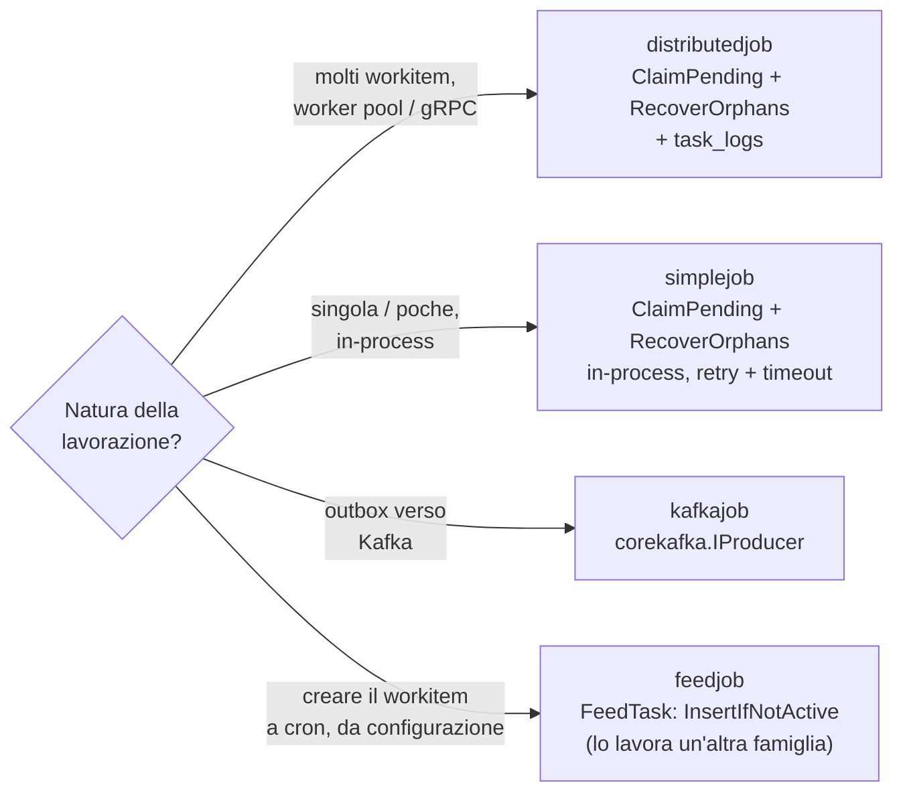
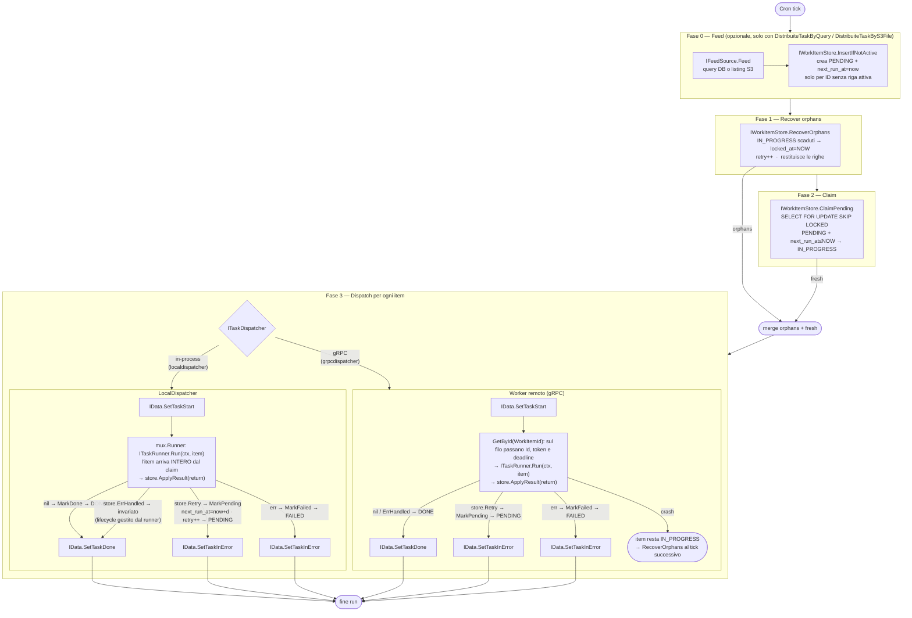
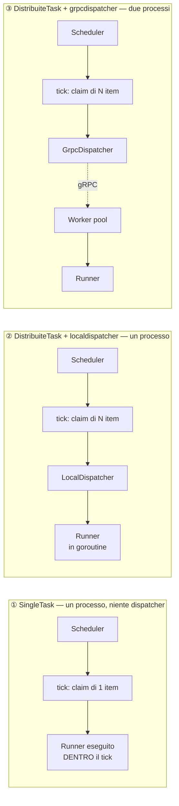
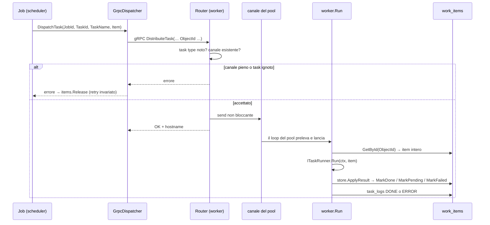
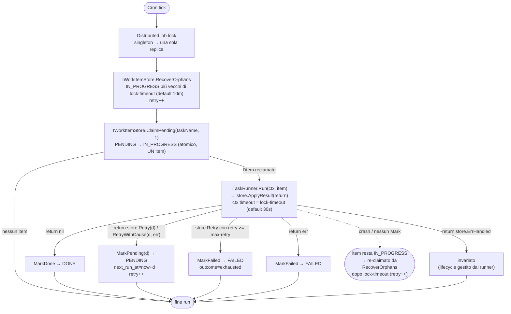

# go-core-batch

Framework per batch processing distribuito. Gestisce job schedulati, claiming atomico dei work item, recupero degli orfani e persistenza del ciclo di vita.

**Import:** `github.com/GPA-Gruppo-Progetti-Avanzati-SRL/go-core-batch`

---

## Orchestratore — `batch.Module` (wiring consigliato)

Il package **root** `batch` espone l'unico entry-point del sottosistema batch: una `batch.Config` unificata + una sola chiamata a `batch.Module(...)` con opzioni dichiarative.

### `batch.Config` — config unificata

Raccoglie i sotto-config di tutti i pezzi cablati da `Module`. L'app tipicamente la embedda nella propria `Config` come campo `BatchConfig batch.Config` e la carica come singola sezione YAML: è `batch.Module` a supplire a fx i sotto-config che servono ai componenti, quindi l'app non deve supplire nulla.

| Campo | Tipo | Tag yaml/mapstructure/json |
|---|---|---|
| `Grpc` | `grpc.Config` (`Client{Url}`, `Server{Hostname,Port}`) | `grpc` |
| `Lock` | `corelock.Config` (`ttl`, `retry-delay`, `key-prefix`, `mongo.collection`, `sql.table`) | `lock` |
| `S3` | `s3.Config` | `s3` |
| `JobsConfig` | `[]scheduler.Config` | `jobs` |
| `TasksConfig` | `[]task.Config` (`name`, `type`, `properties`) | `tasks` |
| `WorkersConfig` | `[]worker.Config` | `workers` |
| `TaskLog` | `string` — `all` (default) · `errors` · `off` | `task-log` |

> **`task-log` è il volume dello storico.** Sul percorso distributedjob si scrivono **tre** righe
> di `task_logs` per item lavorato (`ASSIGNED` dal job, `START` e `DONE`/`ERROR` dal worker), e in
> molti deploy quelle di successo non vengono mai lette: restano un costo di scrittura e una
> collection che cresce. `errors` tiene i soli esiti negativi, `off` non scrive nulla (lo stato
> vive sul WorkItem e l'andamento sulle metriche). Un valore diverso dai tre **ferma l'avvio**:
> indovinare significherebbe scrivere — o non scrivere — dati senza che nulla lo dica.

> **Il lock distribuito lo wira `batch.Module`.** Il motore è quello di **go-core-locker**, ma la
> chiamata a `corelock.Module` non è più dell'applicazione: `batch.WithLocker(lockmongo.Module)` —
> **obbligatoria** — passa il solo backend, per riferimento diretto come ogni altro Module, e la
> config è la sezione `lock:` di `batch.Config`. `batch` importa il package root di go-core-locker
> ma **nessuno dei suoi backend**: il `go.mod` dell'app elenca solo quello che ha importato lei.
>
> Il `corelock.Locker` prodotto è fornito a **root**, non dentro il `ModuleClosed("batch")`: resta
> quindi iniettabile dall'applicazione per le proprie sezioni critiche, esattamente come prima. Per
> la stessa ragione un'app che wira il batch **non deve** chiamare `corelock.Module` da sé — sarebbe
> un secondo provider dello stesso tipo.
>
> `key-prefix` va scritto quando più deployment condividono lo stesso backend: senza, due
> applicazioni si contendono il lock sui nomi dei propri job — che spesso coincidono — e il sintomo
> è soltanto un tick che non parte.

> **`jobs[].properties` e `tasks[].properties` non sono la stessa cosa.** Il primo blocco è
> **infrastrutturale**: configura il *job type* (`task`, `limit`, `collection`, `filter`, `topic`,
> `task`, …) e lo legge il framework. Il secondo è **applicativo**: sono le properties del task,
> mappate sui campi `prop:` della struct del runner. Vedi "Configurazione dei task — `tasks:`".

### `batch.Module(cfg *batch.Config, register func(), opts ...batch.Option)`

**I job sono della libreria, l'app scrive i task.** I job type (`SingleTask`, `DistribuiteTask*`,
`FeedTask`, `PurgeWorkItems`, `NotificationKafka`) li fornisce go-core-batch, e la macchina che li
esegue — scheduler, registry dei job type, tick di claiming, dispatcher, worker pool — sta in
`internal/`: un'app non ne scrive di nuovi. Il suo unico punto di estensione è il **task**
(`runner.Register[T]` / `runner.RegisterFile[T]`), che i job della libreria eseguono.

**Cosa si wira lo dicono i `jobs:`.** `batch.Module` legge i job attivi (non `disabled`) e wira da sé
i componenti che servono, gate-ati sui loro modes:

| condizione in config | componente wirato da batch | modes |
|---|---|---|
| un job `SingleTask` | job SingleTask (esecuzione in linea) | scheduler |
| un job `FeedTask` | job FeedTask (accoda, nessun runner) | scheduler |
| un job `PurgeWorkItems` | job di retention | scheduler |
| un job `DistribuiteTask*` **senza** `grpc.client.url` | dispatcher in-process (`internal/localdispatcher`) | scheduler |
| un job `DistribuiteTask*` **con** `grpc.client.url` | dispatcher gRPC (`internal/grpcdispatcher`) | scheduler |
| un job `DistribuiteTask` / `DistribuiteTaskByQuery` | la loro `JobRegistration` (il query store resta dell'app, vedi sotto) | scheduler |
| `workers:` non vuota **+** `grpc.server.port` | worker pool gRPC (`internal/grpchandler`) | worker |

`workers:` senza `grpc.server.port` in un worker mode è un **errore di avvio**: il worker pool riceve
i task solo via gRPC. Il criterio "automatico" è misurato con `go list -deps`: questi componenti non
aggiungono dipendenze (il gRPC aggiunge otelgrpc e protobuf, con grpc-go già presente via
go-core-app). Restano invece **dell'app**, passati con `WithModule`, i soli backend che portano
dipendenze pesanti — ed è ciò che preserva la modularità compile-time: un'app mongo-only non si porta
dietro `uptrace/bun`, una senza Kafka non si porta dietro go-core-kafka, una senza S3 l'SDK AWS.

| backend (`WithModule`) | serve a | dipendenza |
|---|---|---|
| `djmongo.Module` / `djsql.Module` (`scheduler/distributedjob/{mongostore,sqlstore}`) | query store di `DistribuiteTaskByQuery` | driver Mongo / bun |
| `s3feed.Module` (`scheduler/distributedjob/s3feed`) | job `DistribuiteTaskByS3File` | SDK AWS |
| `kafkajob.Module` (`scheduler/kafkajob`) | job `NotificationKafka` (il producer lo wira l'app) | go-core-kafka |

**Regola: ogni package pubblico sotto `scheduler/` è un guscio di registrazione** da passare a
`batch.WithModule` — un solo file con la sola `func Module(modes ...string)` — ed esiste come package
separato **solo** perché porta una dipendenza pesante (go-core-kafka, mongo-driver, bun, SDK AWS).
Le implementazioni stanno in `internal/kafkajob`, `internal/querystore/{mongostore,sqlstore}` e
`internal/s3feed`; gli import path dei gusci sono quelli di sempre.

**Il vocabolario del YAML è pubblico** (`scheduler/definitions.go`): i `type` dei job della
libreria (`scheduler.JobTypeSingleTask`, `JobTypeDistribuiteTask*`, `JobTypeFeedTask`,
`JobTypePurgeWorkItems`, `JobTypeNotificationKafka`) e le chiavi delle loro `properties`
(`PropTask`, `PropLimit`, `PropBacklogMetrics`, `PropObjectId`, `PropPayload`, `PropStatus`,
`PropOlderThan`, `PropTaskLogs`, `PropStream`, `PropTopic`, `PropMaxRetry`). Non sono macchina
dei job ma il contratto della config: un'app che legge i propri `jobs:` (per esempio per sapere
quali definizioni accoda un `FeedTask`) confronta questi nomi invece di riscriverne le stringhe,
e la macchina in `internal/` li prende da qui, quindi la fonte è una e un rename rompe la
compilazione invece di lasciare una stringa che non corrisponde più a nulla.

Un job type in config il cui backend non è passato (`DistribuiteTaskByS3File` senza `s3feed`,
`NotificationKafka` senza `kafkajob`) ferma l'avvio con `type ... non registrato`; un query store
mancante con un `missing type` di fx.

`ModuleFunc` è la firma dei `Module()` che l'app passa — `func(modes ...string)`, **modes-only**: il
config non è un parametro, lo fornisce `batch.Module` con `core.Supply` della Config unificata. I
config dei componenti (grpc client/server, s3, worker) sono suppliti **solo se valorizzati**: un
componente attivo che ne richieda uno non impostato fa fallire fx con un "missing dependency" invece
di girare con valori vuoti.

**Opzioni:**

| Opzione | Effetto |
|---|---|
| `WithSchedulerModes(...string)` | gate di Scheduler, job type, dispatcher e backend di `WithModule` ai `core.Mode` indicati; vuoto = sempre attivi |
| `WithWorkerModes(...string)` | gate del worker pool gRPC ai `core.Mode` indicati; vuoto = sempre attivo |
| `WithStore(m batch.ModuleFunc)` | **obbligatorio** (panic se assente); wirato **sempre** (serve sia a scheduler che a worker): `storemongo.Module` / `storesql.Module` (copre `IData`/`IWorkItemStore`) |
| `WithLocker(m corelock.ModuleFunc)` | **obbligatorio** (panic se assente): backend del lock distribuito di go-core-locker, wirato a root |
| `WithModule(m ...batch.ModuleFunc)` | i soli backend pesanti (tabella sopra), gate scheduler modes, accumula su più chiamate |

**Ordine di registrazione indifferente.** I job type confluiscono nel value group fx `batch_jobs` e
lo scheduler li consuma dal gruppo: fx risolve tutti i contributori prima di costruirlo. Tutte le
registrazioni di `Module` sono raggruppate in un `core.ModuleClosed("batch")`: batch è un
**sottosistema chiuso** — consuma i seam dell'app (gli `ITaskRunner`) e non le espone nulla in
cambio, quindi config, dispatcher, feed, query store, worker pool e scheduler sono privati al
modulo. Fanno eccezione, per scelta, il **seam pubblico** `store.IWorkItemStore`/`store.IData`
(wirato a root, così il data layer dell'app può accodare WorkItem dal lato API) e il `corelock.Locker`.
I runner restano forniti a root e i value group aggregano come prima.

**La funzione `register`** è il gemello di quella di `corekafka.Module`: `batch.Module` la esegue
**sincronamente**, con la config già nota. Le `runner.Register[T]` chiamate al suo interno forniscono
a fx **una istanza di runner per ogni task eseguito in questo processo**, ciascuna con le proprie
properties. "Eseguito qui" vuol dire:

- in uno **scheduler mode**: il `task` dei job che eseguono in linea — `SingleTask` sempre, i
  `DistribuiteTask*` solo col dispatch in-process;
- in un **worker mode** col worker pool wirato: i `workers[].tasks`.

Un task nominato da un `FeedTask` (che accoda e non esegue), o consegnato via gRPC a un worker
remoto, **non** diventa runner qui: le sue dipendenze non entrano nel grafo. I nomi citati da
`jobs:`/`workers:` sono comunque tutti **validati** (un nome che non esiste in `tasks:` ferma
l'avvio in ogni processo), e un task eseguito qui il cui type nessun runner registra in questo
binario ferma l'avvio invece di fallire item per item.

`register` è `nil` solo per un'app che non registra task runner: **registrare in un `init()` non è
supportato** (panic — lì la sezione `tasks:` non è nota). `runner.Register[T]` (e
`runner.RegisterFile[T]` per l'altro contratto) è l'unica forma, uguale per ogni famiglia di job.

**Il gate per-task: `runner.Register[T]("IMPORT", engine.Worker)`.** I `core.Mode` in coda sono un
filtro **in AND** sulla config, nella stessa forma di `corekafka.RegisterHandler`: possono solo
**spegnere**, mai accendere ciò che la config non esegue qui.

| la config lo esegue qui | modes del register | risultato |
|---|---|---|
| sì | assenti, o MODE fra quelli indicati | istanziato |
| sì | MODE escluso | **errore di avvio** — un job o un worker di qui lo eseguirebbe senza runner |
| no | qualsiasi | non istanziato |

```
batch: i task import-in (type "IMPORT") sono eseguiti in questo processo da un job o da un worker pool,
ma runner.Register li limita ai MODE [WORKER] e il MODE corrente è "SCHEDULER": togliere il task dal
job/worker di questo MODE, oppure aggiungere il MODE al register
```

Resta un errore **per item a runtime** (`no runner registered for task name`) solo un item il cui
`TaskName` nessun job di questo processo nomina — per esempio accodato a mano su una coda servita da
un altro binario.

**Restano a carico dell'app:** fornire il driver DB (`coremongo.Module(&cfg.Mongo)` o `coresql.Module(&cfg.Sql, pgdialect.New())`).

> **Breaking — cosa togliere dal wiring.** `batch.WithWorkerModule` non esiste più, e dalle
> `batch.WithModule(...)` vanno tolti `localdispatcher.Module`, `grpcdispatcher.Module`,
> `queryfeed.Module`, `simplejob.Module`, `feedjob.Module`, `purgejob.Module` e
> `grpchandler.Module`: li wira batch dai `jobs:`, e i loro package non sono più importabili
> (`internal/`). `scheduler/distributedjob/queryfeed` è eliminato. Lasciano la superficie anche
> `runner.MuxRunner`/`NewMux` (→ `internal/mux`), `runner.TaskRunner`/`New`/`FileTaskRunner`/
> `NewFile`/`Group`/`FileGroup` (→ `internal/taskrunner`), `task.ActiveSet`/`Apply`/`Instances`/
> `InApply` (→ `internal/taskreg`), `s3feed.S3Feed`/`New`/`S3Payload` (→ `internal/s3feed`) e
> `grpc/proto` (→ `internal/grpcproto`). Pubblici restano `batch`, `runner` (`Register`,
> `RegisterFile`, `ITaskRunner`, `IFileRunner`), `store` (+ `mongostore`/`sqlstore`/`storetest`),
> `task` (`Config`), `kafka`, `grpc`, `s3`, i `Config` di `scheduler` e `worker`, il vocabolario YAML di `scheduler` (`JobType*`, `Prop*`), e i quattro gusci
> della tabella dei backend. Chi sceglieva il dispatcher passando il Module ora lo sceglie con
> `grpc.client.url`.

### Esempio — distribuito (gRPC + Mongo)

```go
import (
    "github.com/GPA-Gruppo-Progetti-Avanzati-SRL/go-core-batch"
    "github.com/GPA-Gruppo-Progetti-Avanzati-SRL/go-core-batch/runner"
    storemongo "github.com/GPA-Gruppo-Progetti-Avanzati-SRL/go-core-batch/store/mongostore"
    djmongo "github.com/GPA-Gruppo-Progetti-Avanzati-SRL/go-core-batch/scheduler/distributedjob/mongostore"
    "github.com/GPA-Gruppo-Progetti-Avanzati-SRL/go-core-batch/scheduler/kafkajob"
    lockmongo "github.com/GPA-Gruppo-Progetti-Avanzati-SRL/go-core-locker/mongostore"
)

func Register() {
    runner.Register[mioTaskRunner]("MIO_TASK")   // un runner per ogni istanza eseguita qui
}

batch.Module(&cfg.BatchConfig, Register,
    batch.WithSchedulerModes(engine.Scheduler, engine.Batch),
    batch.WithWorkerModes(engine.Worker, engine.Batch),
    batch.WithStore(storemongo.Module),          // obbligatorio
    batch.WithLocker(lockmongo.Module),          // obbligatorio
    batch.WithModule(                            // solo i backend pesanti
        djmongo.Module,                          // query store di DistribuiteTaskByQuery
        kafkajob.Module,                         // job NotificationKafka (il producer lo wira l'app)
    ),
)
```

Dispatcher gRPC e worker pool non compaiono: li deducono `grpc.client.url` (lato scheduler) e
`workers:` + `grpc.server.port` (lato worker).

### Esempio — single-instance (in-process + Mongo)

```go
batch.Module(&cfg.BatchConfig, Register,
    batch.WithStore(storemongo.Module),          // obbligatorio
    batch.WithLocker(lockmongo.Module),          // obbligatorio
    batch.WithModule(djmongo.Module),            // query store di DistribuiteTaskByQuery
)
```

Senza `grpc.client.url` i `DistribuiteTask*` dispatchano in-process, ed eseguono qui i loro task.

### Schedulare una cosa a un'ora — `FeedTask`

Quando il workitem non arriva da fuori (API, altro processo) né da una query, ma è **uno solo e
sempre lo stesso**, il job `FeedTask` lo crea da configurazione. Non ha runner: lo lavora il job
che serve il task indicato, qualunque famiglia sia. Nel wiring non compare nulla: `FeedTask` e
`SingleTask` li wira batch perché sono nei `jobs:`.

```yaml
tasks:
  - name: import-anagrafiche       # il task che ESEGUE
    type: IMPORT
jobs:
  - name: feed-anagrafiche         # crea il workitem alle 3:00
    type: FeedTask
    cron: "0 0 3 * * *"
    singleton: true
    properties:
      task: import-anagrafiche
      objectId: ANAGRAFICHE
  - name: import-pickup            # lo lavora entro 30s
    type: SingleTask
    cron: "*/30 * * * * *"
    singleton: true
    lock-timeout: 30m
    properties: {task: import-anagrafiche, limit: 1}
```

La deduplica è `InsertIfNotActive` sulla coppia (task, objectId): finché l'esecuzione
precedente è PENDING o IN_PROGRESS il tick successivo non ne accoda un'altra. **Attenzione alle
chiavi del `payload`**: viper abbassa ricorsivamente le chiavi della config, quindi
`payload: {idOrdine: X}` arriva come `idordine` e va riletto in modo case-insensitive.

### Notifiche Kafka — il producer lo wira l'app

Il job `NotificationKafka` (`kafkajob.Module`) produce col producer di **go-core-kafka**, che l'app
wira dalla composition root insieme al driver che ha scelto:

```go
corekafka.ProducerModule(&svc.Kafka,
    corekafka.WithDriver(franzdriver.Driver),      // puro Go; o driver/confluent per librdkafka
    corekafka.WithModes(engine.Scheduler))

batch.Module(&cfg.BatchConfig, Register,
    batch.WithStore(storemongo.Module),
    batch.WithLocker(lockmongo.Module),
    batch.WithModule(kafkajob.Module),
)
```

La configurazione Kafka è quella di go-core-kafka — sezione `server`, con `producer` dentro — e non
una seconda dentro il batch: `batch.Config` **non ha più il campo `kafka`**. Se il producer non è
wirato, fx fallisce all'avvio con un `missing type`: fail-fast, non un nil silenzioso.

La **transazionalità** è una scelta di quella config: con `server.producer.transactional-id`
valorizzato (univoco per replica, es. `notifiche-${HOSTNAME}`) i messaggi di un tick diventano
visibili ai consumer `read_committed` tutti o nessuno; senza, il producer è idempotente e compare un
Warn al boot. In entrambi i casi il contratto del framework resta **at-least-once**: `MarkDone` non
è nella transazione, quindi un suo fallimento dopo il commit fa ripubblicare al tick successivo.

Il producer **non è iniettabile in un task runner**: per mandare una notifica si crea un WorkItem
(outbox), che il job drena — non si pubblica inline.

#### Accodare una notifica

```yaml
jobs:
  - name: notifiche-bacheca
    type: NotificationKafka
    cron: "*/10 * * * * *"
    singleton: true
    properties:
      stream:    notifiche-bacheca   # la CODA: è il WorkItem.TaskName degli item accodati
      topic:     eventi.bacheca      # topic di DEFAULT, facoltativo
      limit:     200
      max-retry: 5                   # facoltativo; assente o -1 = illimitato
```

```go
import "github.com/GPA-Gruppo-Progetti-Avanzati-SRL/go-core-batch/kafka"

wi := kafka.NewWorkItem("notifiche-bacheca", ricorrenza.Id, kafka.Message{
    MessageKey:    ricorrenza.Id,
    MessageValue:  evento,                             // struct, mappa: va sul record come JSON
    MessageHeader: map[string]string{"tipo": "RICORRENZA"},
    // Topic: "eventi.altro",                          // facoltativo: vince sul default del job
})

// Dentro la transazione del dato di dominio (outbox vero e proprio):
appErr := items.Insert(ctx, []*store.WorkItem{wi})
// Oppure, per non accodare una seconda notifica finché la prima non è partita:
inserted, appErr := items.InsertIfNotActive(ctx, []*store.WorkItem{wi})
```

Il primo argomento è il `stream` del job che drenerà l'item, il secondo l'`objectId`: insieme sono
la chiave su cui `InsertIfNotActive` deduplica (indice unico parziale `uk_workitem_active`), quindi
**due flussi diversi possono avere un item attivo per lo stesso oggetto** — cosa che prima non era
possibile, perché il claim girava su un `TaskName` costante per tutte le notifiche.

`NewWorkItem` esiste perché il contratto era finora solo documentato: `Status`, `CreateTime`,
`NextRunAt` e soprattutto `TaskName` non sono facoltativi, e un item senza `TaskName` non viene
claimato da nessuno — in silenzio.

Il **topic** può stare sul singolo messaggio (`kafka.Message.Topic`): se c'è vince, altrimenti si
usa `properties.topic` del job. Un job può così drenare un flusso verso topic diversi invece di
moltiplicarsi per moltiplicare le destinazioni. Se mancano entrambi, quel singolo item è marcato
`FAILED` come un payload senza `messageKey`: il tick prosegue con gli altri.

Il **tetto ai ritentativi** è `properties.max-retry`, con la convenzione di `tasks[].max-retry`
(assente o `-1` = illimitato). Serve perché su questo percorso `store.ApplyResult` non passa mai —
il job chiama i `Mark*` da sé — quindi `WorkItem.Retry` veniva incrementato da `MarkPending` e da
`RecoverOrphans` e non letto da nessuno: una notifica irrecuperabile ritentava per sempre e
occupava uno slot del `limit` a ogni tick, rubando capacità a quelle sane. Il controllo è applicato
sul batch **appena claimato**, che è l'unico punto in cui copre anche il percorso degli orfani.

> Non esiste un wiring manuale sotto l'orchestratore: job type, dispatcher, worker pool e scheduler
> stanno in `internal/` e li compone soltanto `batch.Module`. Le sole `Module()` pubbliche sono quelle
> dei backend pesanti (`djmongo`/`djsql`, `s3feed`, `kafkajob`), da passare a `WithModule`.

### Configurazione dei task — sezione `tasks:`

Un task è un'**istanza** di task type: `name` (come lo referenziano job e worker), `type` (il task type registrato dal runner) e `properties` (la sua configurazione applicativa). Due job possono così eseguire lo stesso task type con configurazioni diverse.

```yaml
batch:
  tasks:
    - name: import-in            # il nome referenziato dai job e dai worker pool
      type: IMPORT               # il task type registrato: runner.Register[importRunner]("IMPORT")
      properties:                # applicative → campi `prop:` del runner
        folder: /data/in
        dry-run: false
    - name: import-bulk          # stesso type, properties diverse → istanza distinta
      type: IMPORT
      max-retry: 3               # tetto ai RITENTATIVI: 3 ritentativi = 4 esecuzioni
      properties:
        folder: /data/bulk
  jobs:
    - name: import-a
      type: DistribuiteTaskByQuery
      cron: "*/5 * * * * *"
      properties:                # INFRASTRUTTURALI: configurano il job type
        task: import-in          # ← referenzia il task per NOME
        collection: docs
        limit: 100
  workers:
    - name: default
      size: 10
      tasks: [import-in, import-bulk]
```

**La dichiarazione è obbligatoria** (breaking change): ogni task type registrato deve avere almeno una voce in `tasks:`, e ogni task referenziato da `jobs:`/`workers:` deve esistere. Le incoerenze fanno **fallire l'avvio** con l'elenco dei nomi coinvolti — in caso contrario il job girerebbe a vuoto senza trovare un runner. Un task dichiarato ma che nessun job o worker di **questo processo** esegue non viene istanziato (log Info): le sue dipendenze non entrano nel grafo fx.

Il **`name` è obbligatorio su ogni voce e non ha fallback sul `type`**: va scritto anche quando i due coincidono, perché è la chiave di instradamento (i job lo referenziano con `properties.task`, i worker pool lo elencano in `tasks`, e finisce in `WorkItem.TaskName` — ci filtra `ClaimPending` e ci instrada il mux in-process). Due istanze dello stesso `type` si distinguono solo per `name`. Una voce senza `name` fa fallire l'avvio prima che `register()` giri.

La validazione riguarda tutti i nomi scritti a mano — la property `task` di un `DistribuiteTask*`, di un `SingleTask` o di un `FeedTask`, le `tasks` di un worker pool —, in qualunque processo li esegua: un nome inesistente è un typo. Un job che un task non lo nomina (`NotificationKafka` usa `stream`, `PurgeWorkItems` nessuno dei due) non entra nel conto. Quali di quei nomi diventino runner lo decide invece dove vengono eseguiti (vedi sopra, "La funzione `register`").

**Il fail-fast è gate-ato sui modes.** `register` — e con esso la validazione di `tasks:` — gira solo se `core.Mode` è tra gli scheduler modes (`WithSchedulerModes`) o tra i worker modes (`WithWorkerModes`). In un processo `MODE=API`, dove nessun runner verrebbe costruito, il sottosistema batch non registra e non valida nulla: una misconfig della sezione `tasks:` deve far cadere i mode che il batch lo eseguono davvero, non l'API. Lo store resta l'eccezione di sempre (wirato in ogni mode), così l'API può iniettare `store.IWorkItemStore`. Una famiglia con modes vuoti è "sempre attiva", quindi un'app che non gate-a nulla si comporta come prima.

**`max-retry` è il tetto ai ritentativi** di un work item, ed è opzionale. È un dato del *task*
e non del job perché il ciclo di vita dell'item è per task — `ClaimPending` e `RecoverOrphans`
filtrano per nome di task — e lo stesso task può essere servito da più job o da un worker pool:
item identici devono avere lo stesso limite.

| valore | effetto |
|---|---|
| assente | illimitato — la condotta storica, prima che il tetto esistesse |
| `-1` | illimitato, esplicito |
| `0` | nessun ritentativo: il primo `store.Retry` manda l'item in FAILED |
| `N` | N **ritentativi**, quindi N+1 esecuzioni in tutto |

Esaurito il tetto, `store.ApplyResult` non rimette l'item in PENDING: chiama `MarkFailed` con
«superati i N ritentativi previsti: \<causa\>» e classifica l'esito come `OutcomeExhausted` —
un'etichetta a sé di `batch_task_outcome_total`, distinta da `failed`, perché l'errore era
transiente e si è solo smesso di riprovare. Senza tetto un guasto transiente permanente — un
mainframe irraggiungibile — fa riprovare l'item per sempre, a ogni ciclo.

⚠️ **Il contatore è uno solo.** Il tetto si misura su `WorkItem.Retry`, che incrementa anche
`RecoverOrphans`: il recupero di un item orfano — tipicamente il riavvio di un pod — **consuma
un tentativo** anche se il runner non ha mai fallito. Con `max-retry: 2`, tre riavvii
consecutivi mandano l'item in FAILED senza un solo fallimento applicativo.

Il tetto vale **anche per gli orfani**: prima di eseguire un item, ogni percorso — `SingleTask`, il
il mux in-process (`internal/mux`), il bridge del worker gRPC — confronta `Retry` col tetto (`store.CheckExhausted`)
e, superato, lo manda in FAILED senza eseguirlo (`OutcomeExhausted`). Prima il tetto lo leggeva solo
`ApplyResult`, cioè dopo che il runner era tornato: un item la cui esecuzione **non ritorna mai** (OOM,
pod ucciso) veniva ri-claimato da `RecoverOrphans` a ogni giro, per sempre.

⚠️ **`max-retry` ha effetto solo dalla versione corrente.** Fino a prima, `Instances` (il registro dei task, ora `internal/taskreg`)
ricostruiva la voce di `tasks:` campo per campo e dimenticava `MaxRetry`: il valore veniva letto
dallo YAML, validato, documentato — e poi buttato, quindi **ogni task ritentava all'infinito**
qualunque cosa fosse scritto. Ora la voce passa intera. Chi aggiorna deve rileggere i propri
`max-retry:` come se li scrivesse adesso: un `max-retry: 2` scritto anni fa e mai applicato
comincia a mandare item in FAILED, e va riletto insieme all'avvertenza qui sopra sugli orfani.
La stessa lacuna c'era su `runner.RegisterFile` (il wrapper dei file runner, oggi in `internal/taskrunner`, non portava affatto il campo,
e `s3feed` lo perdeva avvolgendolo): anche lì il tetto ora arriva a destinazione.

### Nomenclatura: name, non type

Il vocabolario è stato ripulito perché diceva "type" dove intendeva "name". La chiave che instrada un
work item al suo runner **è un nome di istanza**, non un tipo:

| Prima | Ora | Cos'è |
|---|---|---|
| `WorkItem.Type` (`bson:"type"`, `bun:"type"`) | `WorkItem.TaskName` (`bson:"taskName"`, `bun:"task_name"`) | il nome del task che deve eseguire l'item |
| `TaskLog.Type` (`bson:"type"`) | `TaskLog.TaskName` (`bson:"taskName"`, `bun:"task_name"`) | idem, sul log di esecuzione |
| `worker.Task.Type` | `worker.Task.TaskName` | idem, nel pool |
| parametri `workType` / `taskType` | `taskName` | in `IWorkItemStore`, `IData`, `ITaskDispatcher`, `IFeed`, il `Run` del mux in-process |
| property di job `workType` (simplejob) | `task` | chiave unica: la stessa che usa distributedjob |
| label pprof `batch_task_type` | `batch_task_name` | goroutine del worker pool e del localdispatcher |
| proto `TaskMessage.TaskType` | `TaskMessage.TaskName` | field number 4 invariato → **compatibile a livello binario** |
| `task.Config.TaskName()` | `.Name` | il metodo era diventato un getter banale dopo la rimozione della fallback |

Resta `taskType` dove il tipo è davvero un tipo: il parametro di `runner.Register[T]`, cioè il task
type registrato dal codice.

**Il rename dei campi persistiti richiede una migrazione dei dati.** Mongo:

```js
db.<collezione_work_items>.updateMany({}, { $rename: { "type": "taskName" } })
db.<collezione_work_items>.dropIndex("<vecchio indice su {type, objectId}>")   // EnsureIndexes ricrea quello nuovo
db.<collezione_task_log>.updateMany({}, { $rename: { "type": "taskName" } })
```

SQL:

```sql
ALTER TABLE work_items RENAME COLUMN type TO task_name;
DROP INDEX IF EXISTS <vecchio indice parziale su (type, object_id)>;  -- EnsureIndexes ricrea quello nuovo
ALTER TABLE task_log   RENAME COLUMN type TO task_name;
```

Senza la migrazione il claiming filtra su un campo che non esiste: nessun errore, semplicemente
nessun item trovato.

### Breaking — via `Destination` e `ObjectType` dal `WorkItem`

`store.WorkItem` non ha più i campi `Destination`/`ObjectType`, e `ClaimPending`, `RecoverOrphans`,
`Backlog` e `store.ClaimBatch` non ne prendono più i due parametri. Erano due filtri di claim
**facoltativi che solo `NotificationKafka` valorizzava**, e che nessun runner, dispatcher o worker
ha mai letto per decidere alcunché: gli servivano perché quel job claimava su
`TaskName = "NotificationKafka"`, la stessa costante per ogni notifica dell'applicazione.

Ora il job nomina la propria coda con `properties.stream`, che finisce in `WorkItem.TaskName` come
per ogni altra famiglia. Oltre a togliere due campi, **ripara la deduplica**: `uk_workitem_active`
è unico su `(task_name, object_id)`, quindi finché `task_name` era costante due flussi diversi
sullo stesso `objectId` collidevano e `InsertIfNotActive` **scartava il secondo in silenzio**.

Migrazione YAML — su una voce `NotificationKafka`:

```yaml
    properties:
      destination: BACHECA        # ← via
      object:      RICORRENZA     # ← via
      stream:      notifiche-bacheca   # ← il nome della coda, che va anche nei WorkItem accodati
```

E su un `FeedTask`: `destination:` e `objectType:` non hanno più destinatario (venivano scritti sul
work item e letti solo dal job Kafka).

Dati: le colonne non vanno droppate — la libreria non possiede la tabella, smette semplicemente di
scriverle. Va invece rimosso l'indice che le serviva, e creato quello della retention:

```js
db.<collezione_work_items>.dropIndex("ix_workitem_claim_dest")   // EnsureIndexes crea ix_workitem_purge
```

```sql
DROP INDEX IF EXISTS ix_workitem_claim_dest;   -- EnsureIndexes crea ix_workitem_purge
```

Gli item `NotificationKafka` già accodati portano `taskName: "NotificationKafka"`: o si lascia uno
`stream: NotificationKafka` finché la coda si svuota, oppure si rinominano
(`updateMany({taskName: "NotificationKafka"}, {$set: {taskName: "<stream>"}})`).

Il **nome** del task è la chiave di tutto il percorso: è il `WorkItem.TaskName` creato dal job, quello su cui il claiming filtra e quello con cui il worker instrada al runner. Va sempre scritto: non c'è fallback sul `type`.

```go
type importRunner struct {
    Data   mypkg.IData `inject:""`                            // dipendenza iniettata da fx
    Folder string      `prop:"folder" validate:"required"`    // property del task
    DryRun bool        `prop:"dry-run" default:"false"`
    buf    []byte                                             // campo di lavorazione: dig non lo vede
}

func (r *importRunner) Run(ctx context.Context, item *store.WorkItem) error { ... }
```

I tre tag sono quelli di go-core-app (`core.ProvideStruct`), condivisi con go-core-kafka:

| Tag sul campo | Significato |
|---|---|
| `inject:""` / `inject:"nome"` | dipendenza iniettata da fx (il nome diventa `name:` per dig) |
| `from:"gruppo"` | dipendenza da un value group fx |
| `optional:"true"` | dipendenza opzionale |
| `prop:"chiave"` (+ `default:`, `validate:`) | property del task, presa da `tasks[].properties` |
| *nessun tag* | campo di lavorazione: ignorato sia dal grafo fx sia dal binding |

Le properties sono risolte **al boot**: un valore non convertibile o un `validate:"required"` mancante fa fallire l'avvio dell'app, con task, campo e tipo nel messaggio.

> L'istanza del runner è **condivisa** fra tutte le esecuzioni di quel task: i campi di lavorazione non sono per-esecuzione.

---

## Modalità (job families)

Cinque famiglie di job, tutte **della libreria**: ciascuna registra la propria `JobRegistration` nel value group `batch_jobs`, e `batch.Module` wira quelle che compaiono nei `jobs:`. Condividono lo scheduler (gocron + **distributed job lock** pluggable, applicato a *ogni* job) e lo store `work_items`. L'app non ne aggiunge: scrive task, e sceglie da quale famiglia farli eseguire con una riga di `jobs:`.

Il dettaglio di come una lavorazione arriva dal cron al runner — scheduler, tick, dispatcher,
worker pool — sta in **[Anatomia dell'esecuzione](#anatomia-dellesecuzione--scheduler-job-dispatcher-worker)**.

Tre CONSUMANO workitem, una li PRODUCE e una li CANCELLA: `feedjob` e `purgejob` sono le due che non hanno runner, e si compongono con qualunque delle altre.

| Famiglia | Job type / registrazione | Quando usarla |
|---|---|---|
| **distributedjob** | `DistribuiteTask` · `DistribuiteTaskByQuery` · `DistribuiteTaskByS3File` — dispatcher dedotto da `grpc.client.url` + `runner.Register[T]` | **Molti** workitem da distribuire: claiming atomico anti-doppione, recovery orfani, `task_logs`, scaling orizzontale gRPC |
| **simplejob** | `SingleTask` — `runner.Register[T]` | **Una lavorazione alla volta** in-process: `RecoverOrphans`→`ClaimPending(1)`→`Run(item)`, eseguito dentro il tick. Niente gRPC/task_logs |
| **kafkajob** | `NotificationKafka` — `WithModule(kafkajob.Module)`; invia i WorkItem su un topic Kafka col producer di go-core-kafka | Notifiche/outbox verso Kafka |
| **feedjob** | `FeedTask` — nessun runner | **Schedulare una cosa a un'ora**: crea UN workitem per tick, descritto nelle properties del job (`task`, `objectId`, `payload`). Non reclama e non dispatcha: a lavorarlo è il job che serve quel task |
| **purgejob** | `PurgeWorkItems` — nessun runner | **Retention**: cancella gli item in uno stato terminale più vecchi di una finestra, e su richiesta anche le righe di `task_logs`. Senza, le due collection crescono per sempre e con esse gli indici su cui gira il claim di ogni tick |


```mermaid
flowchart LR
    Q{Natura della\nlavorazione?}
    Q -- "molti workitem,\nworker pool / gRPC" --> DJ["distributedjob\nClaimPending + RecoverOrphans\n+ task_logs"]
    Q -- "singola / poche,\nin-process" --> SJ["simplejob\nClaimPending + RecoverOrphans\nin-process, retry + timeout"]
    Q -- "outbox verso\nKafka" --> KJ["kafkajob\ncorekafka.IProducer"]
    Q -- "creare il workitem\na cron, da configurazione" --> FJ["feedjob\nFeedTask: InsertIfNotActive\n(lo lavora un'altra famiglia)"]
```

---

## distributedjob — flusso completo


```mermaid
flowchart TD
    CRON([Cron tick]) --> FEED

    subgraph FEED["Fase 0 — Feed (opzionale, solo con DistribuiteTaskByQuery / DistribuiteTaskByS3File)"]
        QS[IFeedSource.Feed\nquery DB o listing S3] --> IINA["IWorkItemStore.InsertIfNotActive\ncrea PENDING + next_run_at=now\nsolo per ID senza riga attiva"]
    end

    FEED --> ORPHAN

    subgraph ORPHAN["Fase 1 — Recover orphans"]
        RO["IWorkItemStore.RecoverOrphans\nIN_PROGRESS scaduti → locked_at=NOW\nretry++  ·  restituisce le righe"]
    end

    ORPHAN --> CLAIM

    subgraph CLAIM["Fase 2 — Claim"]
        CP["IWorkItemStore.ClaimPending\nSELECT FOR UPDATE SKIP LOCKED\nPENDING + next_run_at≤NOW → IN_PROGRESS"]
    end

    RO -- orphans --> MERGE
    CP -- fresh --> MERGE
    MERGE([merge orphans + fresh]) --> DISPATCH

    subgraph DISPATCH["Fase 3 — Dispatch per ogni item"]
        D{ITaskDispatcher}
        D -- "in-process\n(localdispatcher)" --> LOCAL
        D -- "gRPC\n(grpcdispatcher)" --> REMOTE

        subgraph LOCAL["LocalDispatcher"]
            LS[IData.SetTaskStart] --> RUN["mux.Runner: ITaskRunner.Run(ctx, item)\nl'item arriva INTERO dal claim\n→ store.ApplyResult(return)"]
            RUN -- "nil → MarkDone → DONE" --> LD[IData.SetTaskDone]
            RUN -- "store.ErrHandled → invariato\n(lifecycle gestito dal runner)" --> LD
            RUN -- "store.Retry → MarkPending\nnext_run_at=now+d · retry++ → PENDING" --> LP[IData.SetTaskInError]
            RUN -- "err → MarkFailed → FAILED" --> LE[IData.SetTaskInError]
        end

        subgraph REMOTE["Worker remoto (gRPC)"]
            WS[IData.SetTaskStart] --> WRUN["GetById(WorkItemId): sul filo passano Id, token e deadline\n→ ITaskRunner.Run(ctx, item)\n→ store.ApplyResult(return)"]
            WRUN -- "nil / ErrHandled → DONE" --> WD[IData.SetTaskDone]
            WRUN -- "store.Retry → MarkPending → PENDING" --> WP[IData.SetTaskInError]
            WRUN -- "err → MarkFailed → FAILED" --> WE[IData.SetTaskInError]
            WRUN -- crash --> ORPHANED(["item resta IN_PROGRESS\n→ RecoverOrphans al tick successivo"])
        end
    end

    LD & LP & LE & WD & WP & WE --> DONE([fine run])
```

> **Runner unico e interscambiabile.** distributedjob e simplejob condividono la stessa interfaccia
> `store.ITaskRunner` — `Run(ctx, item *WorkItem) error` — e la stessa semantica:
> il framework applica `store.ApplyResult` sul valore di ritorno (`nil`→MarkDone, `store.Retry`→MarkPending
> finché il `max-retry` del task lo consente e poi MarkFailed,
> `err`→MarkFailed, `store.ErrHandled`→invariato). Spostare un runner da una famiglia all'altra è un cambio
> di **registrazione + config `type`**, non di logica.
>
> Per un `MarkDone` **transazionale** (es. chiudere il corrente + inserire workitem figli in un'unica TX) il
> runner inietta un `store.IWorkItemStore` via fx nella propria struct e ritorna `store.ErrHandled`, così il
> framework non applica alcun `Mark*`.

---

## Anatomia dell'esecuzione — scheduler, job, dispatcher, worker

Fra il cron che scatta e la business logic che gira ci sono cinque ruoli distinti. Tenerli
separati è ciò che permette di cambiare **dove** un task viene eseguito senza toccarlo: un runner
non sa se lo esegue il tick, una goroutine dello stesso processo o un worker dall'altra parte di una
connessione gRPC.

| Ruolo | Tipo | Che cosa fa | In quale processo |
|---|---|---|---|
| **Scheduler** | `internal/scheduler` (gocron) | fa scattare i job al cron, tiene il lock di dedup fra repliche | scheduler modes |
| **Job / tick** | `internal/scheduler.ClaimingTick` | feed → recupero orfani → claim → *fase di elaborazione* | scheduler modes |
| **Dispatcher** | `internal/distributedjob.ITaskDispatcher` | consegna un item claimato a chi lo esegue | scheduler modes |
| **Worker pool** | `internal/worker` + `internal/grpchandler` | riceve i task via gRPC e li esegue | worker modes |
| **Runner** | `store.ITaskRunner` | la business logic | dove gira il dispatcher (local) o il pool (gRPC) |

I modes sono quelli di `batch.WithSchedulerModes` / `batch.WithWorkerModes`: in un processo
`MODE=API` non si costruisce né l'uno né l'altro, e i runner non vengono istanziati affatto (solo lo
store resta wirato, così l'API può accodare workitem).

### Le tre topologie


```mermaid
flowchart LR
    subgraph T1["① SingleTask — un processo, niente dispatcher"]
        S1[Scheduler] --> K1["tick: claim di 1 item"] --> R1["Runner eseguito\nDENTRO il tick"]
    end
    subgraph T2["② DistribuiteTask + localdispatcher — un processo"]
        S2[Scheduler] --> K2["tick: claim di N item"] --> D2[LocalDispatcher] --> R2["Runner\nin goroutine"]
    end
    subgraph T3["③ DistribuiteTask + grpcdispatcher — due processi"]
        S3[Scheduler] --> K3["tick: claim di N item"] --> D3[GrpcDispatcher]
        D3 -. gRPC .-> W3["Worker pool"]
        W3 --> R3[Runner]
    end
```

Passare da ① a ② a ③ è una questione di `jobs[].type` e di `grpc.client.url`: i componenti li
wira `batch.Module` di conseguenza, e il wiring dell'app non cambia. Il runner —
`Run(ctx, item) error` — è lo stesso, e si registra sempre con `runner.Register[T]` nel gruppo
`batch_runners`: quel gruppo è letto dal mux in-process (`internal/mux`), dal bridge del worker
gRPC e da `SingleTask`, perché **registrare un task non dice da chi verrà eseguito**. Lo dice la
config, ed è anche ciò che decide quali runner istanziare in un processo: solo quelli che un suo job
o un suo pool eseguono.

---

### Lo scheduler

`newScheduler` costruisce gocron e **istanzia tutti i job all'avvio**, non al primo tick:

- un `jobs[].type` che nessun modulo ha registrato **ferma l'avvio** (`job %q: type %q non
  registrato`) — un'app non deve partire con dei job silenziosamente mancanti;
- anche le property infrastrutturali del job sono risolte lì: per `SingleTask` e `DistribuiteTask*`
  la `JobRegistration.Check` (interna) **ferma l'avvio** su un `task` o un `limit` mancanti; per gli
  altri job type il refuso si vede nei log di avvio e poi a ogni tick come errore del job;
- le `JobFactory` arrivano dal value group fx `batch_jobs`, quindi **l'ordine di registrazione dei
  moduli è indifferente**: fx risolve tutti i contributori prima di costruire lo scheduler.

L'espressione cron è parsata con `gocron.CronJob(expr, true)`: il campo dei **secondi** è abilitato,
quindi sono ammesse sei posizioni (`*/5 * * * * *` = ogni 5 secondi) oltre alle cinque classiche.

Due lock, entrambi da `corelock.Locker` via l'adapter interno `internal/scheduler/gocronlock`:

| Opzione gocron | Effetto |
|---|---|
| `WithDistributedLocker` (scheduler) + `WithDistributedJobLocker` (ogni job) | fra **repliche**: a un dato tick un solo processo esegue quel job |
| `WithSingletonMode(LimitModeReschedule)` — solo con `singleton: true` | dentro **un** processo: un tick non parte se il precedente dello stesso job non è finito |

Il primo è un'ottimizzazione di dispatch-dedup, **non** il meccanismo di correttezza: quello è il
claiming sul DB (vedi *Lock distribuito — ottimizzazione, non correttezza*).

### Il tick — `scheduler.ClaimingTick`

Il preambolo è uno solo per tutte le famiglie claim-based; cambia solo `Process`.

```
NewJobID(name)                  → id dell'esecuzione, in ogni log e in ogni riga di task_logs
context.WithTimeout(RunTimeout) → il tetto dell'INTERO tick
span OTel                       → jobName / jobType / jobId / taskName
  Feed(ctx, jobID)              → opzionale: InsertIfNotActive da query DB o listing S3
  store.ClaimBatch(...)         → RecoverOrphans (best-effort) + ClaimPending(limit)
  Backlog                       → opzionale: gauge pending + età del più vecchio
  Process(ctx, jobID, batch)    → LA SOLA PARTE SPECIFICA DELLA FAMIGLIA
```

Due finezze del claim che si notano solo quando servono: un errore del **recupero orfani** non
ferma il tick, mentre un errore di `ClaimPending` sì — a meno che degli orfani siano già stati
recuperati, nel qual caso si lavorano quelli, perché sono già `IN_PROGRESS` e lasciarli lì
costerebbe un altro giro di orphan timeout. Il **backlog** si misura *dopo* il claim: ciò che resta
è l'arretrato che questo tick non ha preso, che è esattamente il numero su cui si costruisce un
alert.

**Un feed che fallisce è l'esito del tick**, ma non lo ferma: la lettura della sorgente o
l'accodamento falliti si registrano sullo span e diventano l'errore che il tick ritorna (quindi
gocron e le sue metriche lo vedono), mentre claim ed elaborazione proseguono sugli item già in coda.
Prima era un Warn, e un feed guasto da giorni si presentava come una serie di tick riusciti senza
lavoro.

**`lock-timeout` governa due cose insieme** (`Config.ResolveTimeouts`): il timeout del context del
tick (default 30s) e l'età oltre la quale un `IN_PROGRESS` è considerato orfano (default 10m).
Sono lo stesso valore di proposito — l'orphan timeout è il tempo oltre il quale *un altro tick*
ri-claima l'item, quindi è anche il tempo oltre il quale l'esecuzione in corso non deve più esistere.

---

### `SingleTask` — un item per tick, dentro il tick

`simplejob` è la famiglia senza dispatcher: claima **un** item e lo esegue in linea, nella
goroutine del tick.

```yaml
tasks:
  - name: "hello-world"
    type: "HelloWorld"
    properties: { saluto: "ciao" }
jobs:
  - name: "hello-world"
    type: "SingleTask"          # è un JOB type: quale task eseguire lo dice properties.task
    cron: "*/5 * * * * *"
    lock-timeout: 2m            # deadline dell'esecuzione E soglia di orphan
    properties:
      task: "hello-world"       # OBBLIGATORIA, nessun ripiego
```

- `properties.task` **non ha fallback**: prima, mancando, si eseguiva il task omonimo al job type,
  ed era il punto in cui «cosa so fare» e «come lo eseguo» si confondevano — un refuso eseguiva in
  silenzio qualcos'altro. Oggi è un errore.
- `properties.limit` è letta **solo per avvisare che è ignorata**: un item per tick è ciò che il
  nome promette. Prima il default era 100 e gli item venivano lavorati in serie dentro lo stesso
  tick — un batch nascosto, sotto un unico `lock-timeout` valido per tutti insieme.
- Il deadline del runner **è** quello del tick: un `Run` più lungo di `lock-timeout` riceve un
  context cancellato.
- **Non scrive `task_logs`** (nessun dispatch da tracciare, nessun processo remoto da correlare);
  emette però le metriche di task (`ObserveTask`) e quelle di job (`JobProcessed`).

Quando usarla: volumi bassi, lavorazioni che non vale la pena distribuire, oppure un job che
"fa una cosa" a un'ora. Chi ha volumi usa `DistribuiteTask`.

### `DistribuiteTask` — claim di molti, e consegna a qualcun altro

`distributedjob` claima fino a `limit` item per tick e ne consegna **uno per uno** al dispatcher,
senza attendere l'esito: la fase di elaborazione del tick è solo l'assegnazione.

```yaml
jobs:
  - name: "import"
    type: "DistribuiteTask"     # oppure DistribuiteTaskByQuery / DistribuiteTaskByS3File
    cron: "0 * * * * *"
    lock-timeout: 15m
    properties:
      task:  "import"           # OBBLIGATORIA — una voce di `tasks:`
      limit: 100                # OBBLIGATORIA — quanti item per tick
```

Per ogni item: `taskId = <jobId>-task-<n>`, `DispatchTask(...)`, metrica
`batch_task_assigned_total` e una riga di `task_logs` `ASSIGNED` (o `ASSIGNED_KO`). Le righe sono
**accumulate e scritte in una sola `InsertTaskLogs`** a fine ciclo: erano un'insert sincrona per
item, dentro il tick e quindi dentro il lock del job — con `limit: 100`, cento round-trip prima che
il tick potesse chiudere.

**Dispatch rifiutato ≠ item fallito.** Se `DispatchTask` ritorna errore (semaforo in-process
esaurito, canale del worker pieno, worker irraggiungibile) il job chiama `IWorkItemStore.Release`:
l'item torna `PENDING` con `next_run_at = now` e **`retry` invariato**, perché un tentativo che non
è avvenuto non è un tentativo. Senza, resterebbe `IN_PROGRESS` fino all'orphan timeout e il
recupero gli consumerebbe un ritentativo mai usato — con `max-retry` configurato, una saturazione
temporanea esauriva il budget di item mai eseguiti.

Il job **non** emette `batch_job_items_processed_total`: il dispatch è asincrono e l'esito non
torna indietro. Il livello job è coperto da `batch_task_assigned_total`, che è *assegnazione* e non
esecuzione; l'esito lo emette chi esegue.

---

### Il dispatch in-process — `internal/localdispatcher`

È il dispatcher dei `DistribuiteTask*` quando `grpc.client.url` **non** è valorizzato: nel wiring
non compare nulla.

```go
batch.Module(&cfg.Batch, Register,
    batch.WithSchedulerModes(engine.Batch),
    batch.WithStore(storemongo.Module),
    batch.WithLocker(lockmongo.Module),
)                                               // jobs: DistribuiteTask, niente grpc.client.url
```

`LocalDispatcher.DispatchTask` **ritorna subito**: lancia una goroutine e ne traccia il ciclo di
vita. Quattro cose che vale la pena sapere:

1. **Il WorkItem non viene riletto.** `ClaimPending`/`RecoverOrphans` ritornano i record completi,
   quindi la `DispatchRequest` porta l'`*store.WorkItem` intero fino al mux (`internal/mux`). La `GetById`
   che c'era qui era una query per item buttata.
2. **Il cap di concorrenza è derivato dalla config**: la somma dei `limit` dei job attivi, con un
   pavimento di 100. Così il dispatcher assorbe per costruzione un giro completo di ogni job. Con
   una costante, un `limit` più alto del cap faceva fallire sistematicamente una parte dei dispatch
   a ogni tick — una configurazione che non poteva funzionare, senza che niente lo dicesse. Il
   semaforo è **non bloccante**: a slot esauriti ritorna errore, e il job rilascia l'item.
3. **La task è scollegata dal context del tick** (`context.WithoutCancel`) e riceve un deadline
   proprio, che è `req.Timeout`, cioè **l'orphan timeout del job**. Non è una costante: oltre quella
   soglia l'item viene ri-claimato da un altro tick, e lasciar proseguire la task significherebbe
   averne due che lavorano lo stesso item. Il fencing token impedisce al perdente di *finalizzare*,
   non di aver già prodotto i suoi effetti.
4. **Su `OnStop` smette di accettare e drena** le task in volo fino al deadline del context di stop
   di fx. Le residue vengono abbandonate: i loro item restano `IN_PROGRESS` e li recupera
   `RecoverOrphans`.

Il routing è del mux in-process (`internal/mux`), per `item.TaskName`. Che ogni task nominato da un `DistribuiteTask*`
abbia un runner qui lo verifica `batch.Module` al wiring (sono task **eseguiti qui**). Un item con un
nome che nessun job di questo processo nomina **non diventa un orphan-loop**: l'item viene subito `MarkFailed`, perché riprovare all'infinito un task che questo
processo non sa eseguire non porta da nessuna parte. Il suo `Run` è anche il punto che applica
`store.ApplyResult` ed emette `ObserveTask` per questo percorso; le righe di `task_logs`
(`SetTaskStart` / `SetTaskDone` / `SetTaskInError`) le scrive il dispatcher attorno.

### Il dispatch via gRPC — `internal/grpcdispatcher` + `internal/grpchandler`

Due processi, lo **stesso database**: il worker chiude il lifecycle degli item che lo scheduler ha
claimato, quindi deve vedere lo stesso `work_items`.

```go
// main.go — uno solo per i due ruoli: a decidere quale si costruisce è MODE
batch.Module(&cfg.Batch, Register,
    batch.WithSchedulerModes(engine.Scheduler),
    batch.WithWorkerModes(engine.Worker),
    batch.WithStore(storemongo.Module),
    batch.WithLocker(lockmongo.Module),
)
```

```yaml
grpc:
  client: {url: "worker:9000"}   # ⇒ i DistribuiteTask* dispatchano via gRPC (lato scheduler)
  server: {port: 9000}           # ⇒ con workers: c'è il worker pool gRPC (lato worker)
workers:
  - {name: import, size: 8, tasks: [import-in]}
```

Lo stesso binario serve i due ruoli: a decidere è `MODE`. `Register` è la stessa funzione e gira in
entrambi i processi (è gate-ata sull'unione di scheduler e worker modes: in un `MODE=API` non gira
affatto). L'insieme dei task istanziati **è per ruolo**: nel processo scheduler nessuno, perché i
`DistribuiteTask*` consegnano al worker e non eseguono; nel worker i `workers[].tasks`. Un runner e
le sue dipendenze entrano quindi solo nel grafo del processo che lo esegue, senza scrivere modes sul
`runner.Register`.

**Sul filo passa l'`Id`, non il WorkItem**, che il bridge lato worker ricarica con `GetById`. Col
`Id` viaggiano due cose che la rilettura non può dare:

- **`LockToken`, il token del claim che ha dispatchato.** Il worker finalizza con quello e, se
  l'item riletto ne porta un altro — ri-claimato perché l'orphan timeout è scaduto mentre il task era
  in coda —, **non lo esegue** (esito `ErrHandled`): il lavoro è di un altro claim. Prima usava il
  token riletto, quindi eseguiva comunque e poteva chiudere l'esecuzione altrui.
- **`TimeoutMs`, la deadline del task**, cioè l'orphan timeout del job: la stessa del percorso
  in-process. È **relativa** e la applica il worker col proprio orologio, perché un istante assoluto
  passato fra due processi è una misura fatta con due orologi. Prima sul worker il task non aveva
  deadline, e un task più lungo del `lock-timeout` veniva ri-claimato mentre ancora girava.

**Un pool in arresto rifiuta.** Durante `OnStop` i worker si fermano prima del server gRPC, e in
quella finestra il router accodava su canali che nessuno legge più. Ora risponde `Unavailable`: lo
scheduler fa `Release` e l'item torna `PENDING` senza consumare un ritentativo.

Il percorso completo di un task, lato worker:


```mermaid
sequenceDiagram
    participant J as Job (scheduler)
    participant G as GrpcDispatcher
    participant R as Router (worker)
    participant C as canale del pool
    participant W as worker.Run
    participant DB as work_items
    J->>G: DispatchTask(JobId, TaskId, TaskName, Item)
    G->>R: gRPC DistribuiteTask(… ObjectId …)
    R->>R: task type noto? canale esistente?
    alt canale pieno o task ignoto
        R-->>G: errore
        G-->>J: errore → items.Release (retry invariato)
    else accettato
        R->>C: send non bloccante
        R-->>G: OK + hostname
        C->>W: il loop del pool preleva e lancia
        W->>DB: GetById(ObjectId) → item intero
        W->>W: ITaskRunner.Run(ctx, item)
        W->>DB: store.ApplyResult → MarkDone / MarkPending / MarkFailed
        W->>DB: task_logs DONE o ERROR
    end
```

`worker.Run` è **l'unico punto** che finalizza il lifecycle sul percorso gRPC: applica
`store.ApplyResult` con il token del claim e il `MaxRetry` dell'istanza di task, poi scrive la riga
di `task_log` e le metriche. Un **task name sconosciuto** viene rifiutato già dal Router,
prima di entrare in coda (errore al chiamante → `Release` lato scheduler); se uno ci finisce
comunque, `worker.Run` lo tratta come un errore normale — recupera l'item con una `GetById` apposta
e lo porta a `MarkFailed` — invece di lasciarlo `IN_PROGRESS` a ripresentarsi a ogni recupero
orfani.

Se il processo worker **muore** a metà lavorazione non succede niente di speciale: l'item resta
`IN_PROGRESS`, e al tick successivo `RecoverOrphans` lo rimette in gioco incrementandone il `retry`.

### Il worker pool — `worker.Workers`

Il pool esiste **solo** sul lato ricevente gRPC: il dispatch in-process non lo usa (quello ha il suo
semaforo e le sue goroutine).

```yaml
workers:
  - name: "import"        # nome del pool
    size: 8               # capacità del canale E tetto di concorrenza
    tasks: ["import", "import-massivo"]   # i NOMI delle istanze di `tasks:` servite dal pool
  - name: "Default"       # pool di ripiego per i task non instradati altrove
    size: 2
    tasks: []
```

- `tasks` è ciò che rende un task **eseguito** dal processo worker, quindi istanziato lì: un task che
  nessun pool nomina non entra nel grafo del worker, e le sue dipendenze nemmeno.
- `workers:` senza `grpc.server.port` è un errore d'avvio nei worker modes: il pool riceve solo via
  gRPC.
- Un task il cui nome non compare in nessun pool finisce sul pool `"Default"`; se non esiste, il
  dispatch viene rifiutato con `no worker channel for task type`.
- `size` vale **due volte**: è la capacità del canale bufferizzato (quanti task possono attendere) e
  la capacità del semaforo (quanti possono girare insieme). Un `size` minore di 1 viene corretto a 1
  con un Warn.
- La `send` sul canale è **non bloccante**: canale pieno = errore al chiamante = `Release`
  dell'item lato scheduler. È la stessa back-pressure del semaforo in-process.
- Su `OnStop` il pool chiude `StopChannel` e **drena le task in volo** fino al deadline dell'hook.
  I canali dei task **non** vengono chiusi di proposito: i produttori (il Router gRPC) possono
  ancora starci scrivendo, e una send su canale chiuso panica.
- Le goroutine portano le label pprof `batch_worker` e `batch_task_name`, che da Go 1.27 compaiono
  anche nei traceback.
- Il pool **non installa un handler di segnale**: i segnali sono dell'applicazione (`core.Run`/fx) e
  l'arresto arriva come `OnStop`. Un `signal.Notify` di libreria faceva uscire i worker *prima* di
  `OnStop`, troncando a metà le task già partite.

---

### Chi fa cosa — riepilogo

| | `SingleTask` | `DistribuiteTask` + local | `DistribuiteTask` + gRPC |
|---|---|---|---|
| Claim | tick | tick | tick (processo scheduler) |
| Item per tick | 1 | fino a `limit` | fino a `limit` |
| Dove gira il runner | dentro il tick | goroutine del dispatcher | goroutine del worker pool |
| Rilettura del WorkItem | no | no | **sì** (sul filo passano `Id`, token del claim e deadline) |
| Chi applica `ApplyResult` | il job SingleTask (`internal/simplejob`) | `mux.Runner.Run` (`internal/mux`) | `worker.Run` (`internal/worker`) |
| Righe di `task_logs` | nessuna | `ASSIGNED` + `DONE`/`ERROR` | `ASSIGNED` + `DONE`/`ERROR` |
| Deadline dell'esecuzione | `lock-timeout` (context del tick) | orphan timeout, dalla `DispatchRequest` | orphan timeout, dal `TimeoutMs` del `TaskMessage` (relativo, applicato dal worker) |
| Concorrenza | 1 | Σ dei `limit`, pavimento 100 | `size` del pool, × N processi |
| Se non c'è capienza | non si presenta | `Release` dell'item | `Release` dell'item |
| Scaling | — | verticale | orizzontale |
| Dipendenze trascinate | nessuna | nessuna | `google.golang.org/grpc` |

Il livello di dettaglio delle righe `DONE`/`ERROR` è governato da `batch.task-log`
(`all` default | `errors` | `off`): sul percorso distribuito si scrivono tre righe per item, e su
volumi alti è il primo posto dove guardare quando `task_logs` cresce.

---

## Errori

Catalogo dei codici in **[ERRORI.md](ERRORI.md)**. I codici sono nel package interno
`internal/errs`, quindi le app li vedono nel campo `Code` dell'`ApplicationError` ma non li nominano
in codice. Gli errori di **produzione Kafka** non sono più di questa libreria: arrivano da
go-core-kafka come `KAFKA-PRODUCE` con `Ambit = "go-core-kafka"`.

## Lock distribuito — ottimizzazione, non correttezza

**La correttezza del batch è garantita dal DB claiming** (`store.ClaimBatch`: PENDING→IN_PROGRESS +
`RecoverOrphans`, nei runner distributedjob/simplejob/kafkajob). Il lock distribuito dello scheduler
serve solo a evitare che N repliche eseguano lo stesso tick cron contemporaneamente
(**dispatch-dedup**).

È il [`corelock.Locker`](../go-core-locker) di go-core-locker, adattato a gocron da
`internal/scheduler/gocronlock` — l'unico punto di batch legato a gocron per il lock.

**Lo wira `batch.Module`**, non l'applicazione: `batch.WithLocker(m)` è **obbligatoria** e prende il
solo backend, per riferimento diretto come `WithStore`; la config è la sezione `lock:` di
`batch.Config`. Quattro backend, tutti `Module(modes ...string)` modes-only:

| Backend | Package | Nota |
|---|---|---|
| MongoDB | `go-core-locker/mongostore` | consuma il `*coremongo.Service` dell'app |
| SQL | `go-core-locker/sqlstore` | consuma il `*coresql.Service`; `sqlstore.EnsureSchema` crea la tabella |
| Redis | `go-core-locker/redisstore` | `SET NX`, non Redlock: con un client solo non sarebbe Redlock comunque |
| in-process | `go-core-locker/memstore` | `Locker` legittimo **a replica singola**, e solo lì |

```go
batch.Module(&svc.Batch, Register,
    batch.WithStore(storemongo.Module),
    batch.WithLocker(lockmongo.Module))   // obbligatoria
```

Il Locker è fornito a **root**, fuori dal `ModuleClosed("batch")`: resta iniettabile
dall'applicazione per le proprie sezioni critiche. Per la stessa ragione **non** va chiamata anche
`corelock.Module` — sarebbe un secondo provider dello stesso tipo, e l'avvio fallisce.

Il lease ha un TTL (default 30s): se un tick lo supera il lock può scadere e un'altra replica
ripartire, ma **il claiming lo rende innocuo**. È per questo che il backend è una scelta libera: un
app mongo-only o sql-only usa `mongostore`/`sqlstore` e **non deploya Redis**.

## Struttura package

Pubblico è ciò che l'app nomina: il wiring, i task, lo store e le config. La macchina dei job sta in
`internal/` — i job sono della libreria, e un'app non ne scrive di nuovi.

```
go-core-batch/
├── config.go, module.go          # batch.Config, batch.Module + Option (deduce i componenti dai jobs:)
├── runner/                       # Register[T](), RegisterFile[T](), ITaskRunner, IFileRunner — e nient'altro
├── task/                         # task.Config (sezione tasks:), ResolveMaxRetry, MaxRetryUnlimited
├── store/                        # WorkItem, IWorkItemStore, IData, TaskLog, ApplyResult, RetryError, payload
│   ├── mongostore/ sqlstore/     # i due backend dello store (WithStore)
│   └── storetest/                # suite di conformità comune ai due backend
├── scheduler/
│   ├── config.go                 # scheduler.Config: la voce di jobs: (solo il tipo)
│   ├── kafkajob/                 # guscio (solo Module): job NotificationKafka (go-core-kafka) — WithModule
│   └── distributedjob/
│       ├── s3feed/               # guscio (solo Module): job DistribuiteTaskByS3File (SDK AWS) — WithModule
│       ├── mongostore/           # guscio (solo Module): query store Mongo (mongo-driver) — WithModule
│       └── sqlstore/             # guscio (solo Module): query store SQL (bun) — WithModule
├── worker/config.go              # worker.Config: la voce di workers: (solo il tipo)
├── grpc/, s3/                    # config del trasporto gRPC e dei servizi S3
├── kafka/                        # kafka.Message + NewWorkItem: il contratto di accodamento di una notifica
└── internal/
    ├── scheduler/                # gocron + lock, JobRegistration/ProvideJob, ClaimingTick, NewJobID, Props
    │   └── gocronlock/           # adapter corelock.Locker → gocron.Locker
    ├── distributedjob/           # DistribuiteTask*: claim → dispatch, ITaskDispatcher, IQueryStore, IFeedSource
    ├── localdispatcher/          # dispatcher in-process (default dei DistribuiteTask*)
    ├── grpcdispatcher/           # dispatcher gRPC (con grpc.client.url)
    ├── grpchandler/, worker/     # worker pool gRPC (con workers: + grpc.server.port)
    ├── simplejob/ feedjob/ purgejob/   # SingleTask, FeedTask, PurgeWorkItems
    ├── taskreg/                  # registro dei task: ActiveSet (Referenced/Executed), Apply, Instances
    ├── taskrunner/               # TaskRunner/FileTaskRunner (nome + max-retry), Group/FileGroup
    ├── s3feed/                   # impl di DistribuiteTaskByS3File: feed, avvolgimento dei file runner
    ├── kafkajob/                 # impl di NotificationKafka
    ├── querystore/mongostore/ querystore/sqlstore/   # impl degli IQueryStore
    ├── mux/                      # instradamento per TaskName del percorso in-process
    ├── grpcproto/                # codice generato da service.proto (package Go proto)
    ├── batchmetrics/             # metriche Prometheus batch_* (si leggono per nome)
    └── grpctransport/ s3client/ lifecycle/ errs/
```

---

## WorkItem lifecycle

```
         InsertIfNotActive          manuale / API
sorgente ──────────────────► PENDING ◄─────────────────────
esterna    next_run_at=now       │
                                 │ ClaimPending
                                 │ (next_run_at ≤ NOW)
                                 ▼
                           IN_PROGRESS
                          /      |      \
            items.MarkDone  items.MarkPending  items.MarkFailed
                        /    (RetryError)  \
                       ▼            ▼            ▼
                     DONE        PENDING        FAILED
                             next_run_at=now+d
                              retry++

    Se il worker crasha (nessun Mark chiamato):
    item resta IN_PROGRESS → RecoverOrphans (locked_at=NOW, retry++)
    → ri-dispatch immediato nello stesso run

    Se il DISPATCH viene rifiutato (pool saturo, worker irraggiungibile):
    items.Release → PENDING, next_run_at=now, retry INVARIATO
    → ripreso al tick successivo, senza aspettare l'orphan timeout
      e senza consumare un ritentativo che nessuno ha usato

    DONE / FAILED sono stati terminali: a rimuoverli è il job PurgeWorkItems,
    se configurato. Senza, la collection cresce per sempre.
```

### Chi ha claimato e chi ha eseguito — sono due hostname diversi

Sul WorkItem ci sono **due** colonne, e confonderle porta a diagnosi sbagliate in un deployment
distribuito:

| Campo | Chi ci finisce | Scritto da |
|---|---|---|
| `lockedBy` / `locked_by` | chi ha **claimato**, cioè il processo che gira il tick del job | `ClaimPending`, `RecoverOrphans` |
| `executedBy` / `executed_by` | chi ha **eseguito** l'ultimo tentativo | `MarkDone`, `MarkFailed`, `MarkPending` |

Coincidono su `SingleTask` e col `localdispatcher`, dove a eseguire è lo stesso processo che ha
claimato. **Non** coincidono col `grpcdispatcher`: lì `locked_by` è lo scheduler, che l'item lo
dispatcha e non lo esegue, e l'esecutore è il worker remoto — che è precisamente ciò che
`executed_by` risponde. I `Mark*` sono gli unici punti che girano nel processo che ha davvero
eseguito il runner, ed è per questo che scrivono loro.

`Release` **non** lo scrive: lì il dispatch non è riuscito e nessuno ha eseguito nulla — la stessa
ragione per cui non consuma nemmeno un ritentativo.

**I tre campi di lock non vengono ripuliti alla finalizzazione, tranne uno.** I `Mark*` e `Release`
azzerano il solo `locked_at`; `lock_token` e `locked_by` restano, e il claim successivo li
sovrascrive. Quindi:

- **il segnale di "è in carico a qualcuno" è `status = IN_PROGRESS` + `locked_at != NULL`**, non
  `locked_by` valorizzato;
- un token rimasto su un item terminale o tornato `PENDING` non autorizza nulla, perché ogni
  `Mark*` pretende anche `status = IN_PROGRESS`;
- su un item `DONE` resta leggibile chi l'aveva preso in carico, che insieme a `executed_by` è la
  coppia con cui si ricostruisce cos'è successo senza dipendere da `task_logs`;
- su un item tornato `PENDING` in attesa di ritentativo, `locked_by` è **stale**: nomina chi teneva
  il lease nel tentativo precedente.

Prima l'unica traccia dell'esecutore era la riga `START`/`DONE` di `task_logs` (il suo campo
`hostname` è di chi scrive la riga, quindi il worker per quelle due): con `task-log: errors` non
c'è per gli esiti riusciti, con `off` non c'è affatto, e `SingleTask` non scrive `task_logs`.

> **Migrazione SQL:** `sqlstore.EnsureIndexes` aggiunge `executed_by` con `ADD COLUMN IF NOT
> EXISTS`. Su Mongo non serve nulla. Le righe già esistenti restano col campo vuoto.

---

## Il lease si misura con l'orologio del database

Ogni istante del lease — `locked_at`/`lockedAt` del claim e del recupero, `next_run_at` di `Release`
e `MarkPending`, `update_time` — lo scrive il **database** (`NOW()` su PostgreSQL, `$$NOW` su Mongo),
e con lo stesso orologio lo confrontano `ClaimPending` (`next_run_at <= NOW()`) e `RecoverOrphans`
(`locked_at < NOW() - maxAge`). Prima lo scriveva la replica con `time.Now()` e il backend SQL lo
confrontava con `NOW()`: due orologi, e qualche secondo di scarto bastava a lasciare non claimabile un
item appena rilasciato o a recuperare come orfano un item appena claimato. I ritardi di `MarkPending`
viaggiano come durata relativa e li somma il database. È lo stesso principio di go-core-locker.

`ClaimPending` su SQL è ora **un'istruzione sola** (CTE `FOR UPDATE SKIP LOCKED` + `UPDATE … RETURNING`),
quindi ritorna ciò che ha scritto invece di ricostruirlo in memoria. Un item `IN_PROGRESS` **senza**
`locked_at` è un lease malformato e vale come scaduto: prima nessun claim lo riprendeva più. Le colonne
temporali vanno dichiarate `timestamptz` (è il default di bun su PostgreSQL).

**Suite degli store.** `store/storetest` è la suite che i due backend eseguono identica — claim, limite e
ordine, fencing dei `Mark*`, `Release` che non conta, recupero degli orfani, deduplica — contro un
database vero: `PG_URL` (`postgres://…?sslmode=disable`) per `sqlstore`, `MONGO_URL` per
`mongostore`. Senza le variabili i test sono saltati, come la conformance di go-core-locker.

## Indici — obbligatori, e non creati da soli

Il claim di **ogni job a ogni tick** è una query per `(task_name, status, next_run_at)` ordinata
per scadenza; il recupero orfani una per `(task_name, status, locked_at)`. Senza gli indici
corrispondenti quelle query scandiscono la collection intera — un costo che cresce con lo
**storico** invece che col lavoro da fare, e che non si vede finché la collection è piccola.

I nomi degli indici stanno in **un posto solo** (`store.ExpectedIndexes`, con le costanti
`store.IndexWorkItem*`): hanno quattro lettori — le due `EnsureIndexes` che li creano e le due
verifiche di avvio che ne segnalano l'assenza — e prima erano quattro elenchi separati. Il
confronto e il messaggio di warning sono anch'essi condivisi (`store.WarnMissingIndexes`): al
backend resta il solo modo di sapere quali indici esistono (`Indexes().List` contro `pg_indexes`).

`EnsureIndexes` (mongo e sql) li crea tutti:

| Indice | Serve a | Senza |
|---|---|---|
| `uk_workitem_active` — unico parziale su `(task_name, object_id)` per gli stati attivi | la deduplica di `InsertIfNotActive` | nessun duplicate-key da intercettare: **il dedup salta in silenzio** e nascono workitem doppi |
| `ix_workitem_claim` — `(task_name, status, next_run_at, create_time)` | `ClaimPending` | collection scan a ogni tick di ogni job |
| `ix_workitem_orphan` — `(task_name, status, locked_at)` | `RecoverOrphans` | idem |
| `ix_workitem_purge` — `(status, update_time)`, parziale sugli stati **terminali** | la query del job `PurgeWorkItems` | la retention scandisce a ogni tick tutto lo storico, cioè la parte di collection che il job esiste per rimpicciolire |
| `ix_tasklog_purge` — `task_logs (logdate)` | la retention dei `task_logs` di `PurgeWorkItems` (`task-logs: true`) | idem, sulla tabella che cresce di tre righe per item. Non è fra quelli verificati all'avvio (`ExpectedIndexes` guarda `work_items`) |

I tre indici del claim sono **parziali sugli stati attivi**: gli item `DONE`/`FAILED` non vengono
mai claimati, quindi tenerli fuori mantiene l'indice della dimensione del *lavoro* e non dello
storico. Quello della retention è parziale sugli stati **terminali**, per la ragione speculare: la
purge lavora solo lì. Al posto di `ix_workitem_purge` c'era `ix_workitem_claim_dest`, che serviva
il claim filtrato per `destination`: è sparito coi due campi, e lo slot è andato all'unica query
del sottosistema che non aveva un indice.

`sqlstore.EnsureIndexes` esegue **un'istruzione per volta** (un blocco multi-statement lo accettano solo
alcuni driver, e un errore non diceva quale istruzione fosse fallita: ora la nomina), e su Mongo il filtro
parziale dell'unico usa `$in` invece di `$or`, che una partialFilterExpression non ammette.

La libreria **non li crea da sola** (gestione via `EnsureIndexes` allo startup, o migration/ops),
ma alla **prima operazione sullo store** — il primo claim o il primo insert, quindi entro il primo
tick — verifica quali mancano e lo dice con un Warn: l'assenza dev'essere una scelta, non una
svista.

```go
// main.go, prima di core.Run()
core.Invoke(func(ms *coremongo.Service) {
    if err := mongostore.EnsureIndexes(context.Background(), ms); err != nil {
        log.Fatal().Err(err).Msg("EnsureIndexes failed")
    }
})
```

---

## Retention — `PurgeWorkItems`

Gli stati `DONE` e `FAILED` sono terminali: senza retention `work_items` e `task_logs` crescono
per sempre, e con loro gli indici del claim. Il job `PurgeWorkItems` cancella a finestra, con un
tetto per tick che tiene corta la singola transazione: un arretrato grosso si smaltisce in più
tick invece che in una botta sola che tiene il database occupato.

```yaml
jobs:
  - name: retention-done
    type: PurgeWorkItems
    cron: "0 30 3 * * *"
    singleton: true
    lock-timeout: 10m
    properties:
      status:     DONE     # obbligatoria: DONE | FAILED, uno stato attivo ferma il job
      older-than: 168h     # obbligatoria
      limit:      5000     # facoltativa (default 1000)
      task-logs:  true     # facoltativa: cancella anche le righe di task_logs più vecchie
```

```go
batch.Module(&cfg.BatchConfig, Register,
    batch.WithStore(storemongo.Module),
    batch.WithLocker(lockmongo.Module),
)   // PurgeWorkItems è nei jobs: ⇒ batch wira il job da sé
```

**Non c'è un default.** La retention va scritta in `jobs:`: cancellare dati non può essere un
comportamento che si ottiene aggiornando la libreria. Chi preferisce delegarla al database può
usare un TTL index su Mongo al posto del job — il contratto è lo stesso.

Un tick che cancella esattamente `limit` item logga un Warn: l'arretrato non è finito, e se
succede sempre la finestra o la cadenza del cron sono sbagliate.

---

## Pattern consigliato — batch.Module + runner.Register[T]()

Il modo canonico per aggiungere task runner a un'applicazione — ed è l'unico punto di estensione:
l'app scrive task, i job sono della libreria. Ogni task type è in un file autonomo; il wiring
centrale non cambia mai.

### Struttura app/batch/

```
app/batch/
  batch.go           — la funzione Register() passata a batch.Module
  miotask.go         — definisce il runner e lo registra
  altrotask.go       — idem per un secondo task type
```

### app/batch/batch.go

```go
package batch

import "github.com/GPA-Gruppo-Progetti-Avanzati-SRL/go-core-batch/runner"

// Register è passata a batch.Module, che la esegue con la config già nota: i runner sono
// istanziati una volta per ogni task eseguito in questo processo, con le properties della loro
// voce di `tasks:`.
func Register() {
    runner.Register[mioTaskRunner]("MIO_TASK")
}
```

### app/batch/miotask.go

```go
package batch

import (
    "context"
    "github.com/GPA-Gruppo-Progetti-Avanzati-SRL/go-core-batch/runner"
    "github.com/GPA-Gruppo-Progetti-Avanzati-SRL/go-core-batch/store"
)

// Le dipendenze sono taggate `inject:`, le properties del task `prop:`; i campi senza tag sono
// di lavorazione e restano invisibili al grafo fx.
type mioTaskRunner struct {
    Svc     mySvc.IService `inject:""`
    Soglia  int            `prop:"soglia" default:"10"`
}

func (r *mioTaskRunner) Run(ctx context.Context, item *store.WorkItem) error {
    if err := r.Svc.DoWork(ctx, item); err != nil {
        if isTransient(err) {
            return store.RetryWithCause(5*time.Minute, err) // → MarkPending
        }
        return err                                          // → MarkFailed
    }
    return nil                                              // → MarkDone
}
```

> Il lifecycle lo applica il framework dal valore di ritorno (`store.ApplyResult`). Per gestirlo a mano
> (es. `MarkDone` transazionale con l'insert di workitem figli) inietta un `store.IWorkItemStore` via fx nella
> struct, chiudi tu l'item e ritorna `store.ErrHandled`.

### config.yml

```yaml
tasks:
  - name: "MIO_TASK"          # obbligatorio: è la chiave di routing, anche quando coincide col type
    type: "MIO_TASK"
    properties:
      soglia: 25              # applicative → campi `prop:` del runner

jobs:
  - name: "mio-job"
    type: "DistribuiteTask"
    cron: "* * * * *"
    singleton: true
    lock-timeout: 15m
    disabled: false
    properties:               # infrastrutturali → lette dal framework
      task:  "MIO_TASK"       # il NOME del task da eseguire
      limit: 10
```

---

## Feed by-query e by-S3 — cosa passa l'app

Il wiring dei task non cambia fra le famiglie: cambia il job in `jobs:`, e per i due feed l'app
passa il backend pesante che il feed richiede.

### Con feed DB — DistribuiteTaskByQuery

```go
// main.go
batch.Module(&svc.Batch, Register,
    batch.WithStore(storemongo.Module),
    batch.WithLocker(lockmongo.Module),
    batch.WithModule(djmongo.Module),   // query store (o djsql.Module); il job lo wira batch
)
```

```yaml
scheduler:
  - name: "process-orders"
    type: "DistribuiteTaskByQuery"
    cron: "* * * * *"
    singleton: true
    lock-timeout: 15m
    properties:
      task:       "ProcessOrder"
      limit:      "200"
      collection: "orders"
      filter:     "status = 'READY'"
      sort:       "created_at:asc"
```

### Con feed S3 — DistribuiteTaskByS3File

```go
// main.go
batch.Module(&svc.Batch, Register,
    batch.WithStore(storemongo.Module),
    batch.WithLocker(lockmongo.Module),
    batch.WithModule(s3feed.Module),    // job DistribuiteTaskByS3File (SDK AWS)
)

func Register() {
    runner.RegisterFile[myS3Runner]("S3_IMPORT")
}
```

```go
// app/batch/s3_import.go
type myS3Runner struct {
    Svc mysvc.IService `inject:""`
}

func (r *myS3Runner) Run(ctx context.Context, key string, content io.Reader) error {
    // process the file stream; return nil → l'adapter s3feed sposta il file e fa MarkDone,
    // return err → il workitem resta pending per il retry
    return nil
}
```

> Nelle struct dei runner le dipendenze si dichiarano col tag `inject:` (`from:` per un value group, `optional:"true"` per una dipendenza facoltativa): è il costruttore sintetizzato da `core.ProvideStruct` a tradurli nei tag che dig si aspetta, quindi la struct non deve embeddare `core.In`. Negli altri punti del wiring `core.In`/`core.Out` restano gli alias di `fx.In`/`fx.Out` per i costruttori scritti a mano.

```yaml
batch:
  s3:
    services:
      main:
        endpoint: "https://s3.eu-west-1.amazonaws.com"
        region: "eu-west-1"
        access-key: "AKIA..."
        secret-key: "..."
        bucket: "my-bucket"
        use-path-style: false

scheduler:
  - name: "s3-import"
    type: "DistribuiteTaskByS3File"
    cron: "*/5 * * * *"
    singleton: true
    lock-timeout: 15m
    properties:
      task:      "S3_IMPORT"
      limit:     "50"
      service:   "main"
      path:      "inbox/"
      pattern:   "*.csv"
      dest-path: "processed"
```

---

## Configurazione YAML — campi

### `jobs[]` — configurazione INFRASTRUTTURALE del job

Il blocco `properties:` di un job configura il **job type** e lo legge il framework. La configurazione
**applicativa** del runner sta invece in `tasks[].properties` (vedi "Configurazione dei task").

**Le property le legge `scheduler.Props`**, che applica una regola sola — presente, non vuota, del
tipo e del segno giusti — e produce errori (codice `BATCH-JOB-PROPS`) che nominano job, job type,
property e il *motivo per cui serve*: `job "import" (type "DistribuiteTask"): property "task"
mancante: non si sa quale task eseguire`. La validazione avviene alla **costruzione** del job, non
al primo tick: un refuso in YAML si vede all'avvio, quando c'è ancora qualcuno che guarda.

Esisteva riscritta in ognuno dei cinque job type, e le cinque copie erano già divergite: simplejob
ritornava un errore senza codice, feedjob validava dentro il tick, e lo stesso `limit` era
obbligatorio in un job, con default 100 in un altro e 1000 in un terzo. **I default restano al
chiamante** — quelli sì che sono specifici — ma una property scritta e non convertibile è sempre un
errore e non ricade mai sul default.

Tutte le chiavi sono dichiarate una volta sola, nel vocabolario pubblico `scheduler/definitions.go`
(`scheduler.PropTask`, `PropLimit`, `PropBacklogMetrics` comuni a più job type; `PropObjectId`,
`PropPayload`, `PropStatus`, `PropOlderThan`, `PropTaskLogs`, `PropStream`, `PropTopic`,
`PropMaxRetry` dei singoli job type), da cui le prendono i job in `internal/`.

> Qui c'erano anche `destination` e `objectType` — la stessa colonna che `NotificationKafka`
> chiamava `object` e `FeedTask` `objectType`, due nomi in YAML per un filtro che nessuno leggeva
> per decidere. Sono spariti coi campi corrispondenti del `WorkItem`: la coda si nomina col solo
> `task` (`stream` per `NotificationKafka`).

| Campo | Tipo | Descrizione |
|---|---|---|
| `name` | string | Nome del job, **obbligatorio e univoco**: è la chiave del lock distribuito, e due job omonimi se lo contenderebbero (uno dei due non girerebbe mai). Un duplicato ferma l'avvio |
| `type` | string | Il **job type**, sempre una stringa del framework: `"SingleTask"` · `"DistribuiteTask"` · `"DistribuiteTaskByQuery"` · `"DistribuiteTaskByS3File"` · `"FeedTask"` · `"NotificationKafka"` · `"PurgeWorkItems"`. Non è mai un task type: quale task eseguire lo dice `properties.task` |
| `cron` | string | Espressione cron (secondi abilitati); obbligatoria per un job attivo |
| `singleton` | bool | distributed job lock — evita run paralleli su repliche diverse |
| `lock-timeout` | duration | Dopo quanto un IN_PROGRESS è considerato orfano (default: 10m — distributedjob e simplejob). simplejob: anche timeout del context di `Run` (default: 30s) |
| `disabled` | bool | Disabilita il job senza rimuoverlo dalla config |
| `properties.task` | string | **Nome** del task da eseguire (una voce di `tasks:`) |
| `properties.limit` | int | Max item per run (`DistribuiteTask*`, `NotificationKafka`, `PurgeWorkItems`; ignorata da `SingleTask`, che ne lavora uno per tick) |
| `properties.collection` | string | Tabella/collection sorgente (solo DistribuiteTaskByQuery) |
| `properties.filter` | string | WHERE SQL o JSON query Mongo (solo DistribuiteTaskByQuery) |
| `properties.sort` | string | `"col:asc,col2:desc"` (solo DistribuiteTaskByQuery) |
| `properties.service` | string | Nome logico del servizio S3 (solo DistribuiteTaskByS3File) |
| `properties.path` | string | Prefisso S3 per il listing (solo DistribuiteTaskByS3File) |
| `properties.pattern` | string | Glob pattern sul basename del file, es. `"*.csv"` (solo DistribuiteTaskByS3File) |
| `properties.dest-path` | string | Prefisso S3 dove spostare i file elaborati (solo DistribuiteTaskByS3File) |
| `properties.task` | string | **Nome del task** da eseguire, che è anche il `WorkItem.TaskName` letto da `ClaimPending`/`RecoverOrphans`. Obbligatoria per `SingleTask`, `DistribuiteTask*` e `FeedTask`: nessun ripiego sul `type` del job |
| `properties.objectId` | string | Cosa accodare (solo `FeedTask`): finisce in `WorkItem.ObjectId` ed è la chiave della deduplica |
| `properties.stream` | string | **Nome della coda di notifiche** (solo `NotificationKafka`, obbligatoria): è il `WorkItem.TaskName` degli item accodati. Non si chiama `task` perché quello è un riferimento a una voce di `tasks:`, e una notifica un runner non ce l'ha |
| `properties.topic` | string | Topic di **default** (solo `NotificationKafka`, facoltativa): vale per i record che non portano il proprio `topic` nel payload |
| `properties.max-retry` | int | Tetto ai ritentativi di un item (solo `NotificationKafka`; assente o `-1` = illimitato) |
| `properties.status` | string | Stato degli item da cancellare, `DONE` o `FAILED` (solo `PurgeWorkItems`, obbligatoria). Uno stato attivo è un errore di configurazione: cancellerebbe lavoro non fatto o in corso, e l'indice della purge copre solo gli stati terminali |
| `properties.older-than` | duration | Finestra di retention, misurata su `update_time` (solo `PurgeWorkItems`, obbligatoria) |
| `properties.task-logs` | bool | Cancella anche le righe di `task_logs` più vecchie della finestra (solo `PurgeWorkItems`, default `false`) |
| `properties.backlog-metrics` | bool | Abilita le gauge `batch_workitems_pending` / `batch_workitems_oldest_age_seconds` per questo job. Default `false`: è una query in più per tick, e la paga chi la vuole. Va accesa su **un solo job per coda**: la gauge misura la coda (`task`), quindi due job sulla stessa coda producono due serie identiche (label `job` diversa) e pagano la query due volte |

> **Le property dei job sono validate alla COSTRUZIONE, non dentro il tick.** Per `SingleTask` e
> `DistribuiteTask*` un `task` o un `limit` mancanti **fermano l'avvio**; per gli altri job type il
> refuso compare nei log di avvio (`il job fallirà a ogni tick`) ed è poi restituito da ogni
> esecuzione. Un task eseguito qui senza runner ferma l'avvio già al wiring, in `batch.Module`.

> I valori conservano il tipo YAML (`limit: 100` è un intero, `singleton: true` un booleano). Le forme
> virgolettate delle config esistenti (`limit: "100"`) restano valide: la conversione è automatica.
> Le chiavi sono risolte in modo case-insensitive, perché viper abbassa le chiavi della config.

### `tasks[]` — configurazione APPLICATIVA del task

| Campo | Tipo | Descrizione |
|---|---|---|
| `name` | string | Nome dell'istanza, referenziato da `jobs[].properties.task` e da `workers[].tasks`; **obbligatorio**, senza fallback sul `type`. È anche il `WorkItem.TaskName` |
| `type` | string | Task type registrato con `runner.Register[T]("...")` |
| `properties` | map | Configurazione applicativa, mappata sui campi `prop:` della struct del runner |

---

## RetryError — retry ritardato

```go
return store.Retry(5 * time.Minute)              // riprova tra 5 min
return store.Retry(0)                            // retry immediato
return store.RetryWithCause(5*time.Minute, err)  // wrappa l'errore originale
```

Il campo `next_run_at` viene impostato a `now + After` da `MarkPending`. `ClaimPending` filtra `next_run_at <= NOW()`.

Il ritentativo **non è garantito**: se il task dichiara `max-retry` e l'item ha già consumato i
tentativi previsti, `ApplyResult` lo manda in FAILED (`OutcomeExhausted`) invece di rimetterlo in
PENDING. Vedi "Configurazione dei task — sezione `tasks:`".

---

## IQueryStore — SQL vs MongoDB

Un metodo solo: `GetIds(ctx, collection, filter, sort string, limit int)`. C'erano `GetIds` e
`GetIdsSorted`, ma la prima era letteralmente la seconda con `sort` vuoto — due implementazioni
identiche per backend — e l'unico chiamante ramificava su `sort != ""` per scegliere quale
chiamare, cioè rifaceva a mano ciò che l'alias già faceva.

La grammatica di `sort` (`colonna` o `colonna:desc`, separate da virgola) è **una sola**:
`ParseSort` (in `internal/distributedjob`) la interpreta per entrambi, e ai backend resta cosa farne — un `bson.D`
o un `ORDER BY` con l'identificatore validato. Era parsata due volte, e nulla garantiva che
significasse la stessa cosa passando da Mongo a SQL.

```go
// SQL   (guscio scheduler/distributedjob/sqlstore,   impl internal/querystore/sqlstore)   — filter = WHERE clause raw, sort = "col:asc"
// Mongo (guscio scheduler/distributedjob/mongostore, impl internal/querystore/mongostore) — filter = JSON query '{"status":"NEW"}'
batch.WithModule(djsql.Module)     // oppure djmongo.Module
```

---

## Worker distribuito (gRPC)

> Il funzionamento è descritto in **[Anatomia dell'esecuzione](#anatomia-dellesecuzione--scheduler-job-dispatcher-worker)**
> (dispatch via gRPC, worker pool, chi finalizza il lifecycle). Qui c'è solo il wiring.

Due ruoli — **scheduler** che dispatcha e **worker** che esegue — di norma serviti dallo **stesso
binario**, con `MODE` a decidere quale dei due si costruisce:

```go
// main.go
batch.Module(&svc.Batch, Register,
    batch.WithSchedulerModes(engine.Scheduler),
    batch.WithWorkerModes(engine.Worker),
    batch.WithStore(storemongo.Module),           // obbligatorio, wirato in ogni mode
    batch.WithLocker(lockmongo.Module),           // obbligatorio, wirato in ogni mode
)   // dispatcher gRPC e worker pool li deducono grpc.client.url e workers: + grpc.server.port

// Register è la STESSA funzione per i due ruoli: un task si registra una volta sola.
func Register() { runner.Register[importRunner]("IMPORT") }
```

`Register` gira in entrambi i ruoli, ma istanzia in ciascuno i soli task che quel processo
**esegue**: nello scheduler nessuno (i `DistribuiteTask*` consegnano via gRPC), nel worker le `tasks`
dei pool. Un runner e le sue dipendenze entrano solo nel grafo del processo che lo esegue, senza modes
sul `runner.Register`.

I due processi devono vedere **lo stesso database**: è il worker a chiudere il lifecycle
(`MarkDone`/`MarkFailed`) degli item che lo scheduler ha claimato.

```yaml
grpc:
  server: { port: 50051 }                        # letto nel processo worker
  client: { url: "worker-svc:50051" }            # letto nel processo scheduler: ⇒ dispatch gRPC
workers:
  - name: "import"
    size: 8
    tasks: ["import"]
```

### Cosa serve al worker pool

Il worker pool (`internal/grpchandler`) lo wira `batch.Module` quando `workers:` non è vuota e
`grpc.server.port` è valorizzato; nei worker modes `workers:` senza porta è un errore d'avvio. Dal
grafo prende lo store (`WithStore`), i runner del gruppo `batch_runners` — popolato da
`runner.Register[T]` con i soli task dei pool — e i config che batch gli supplisce.

---

## simplejob — job in-process con claiming

Job leggero per **lavorazioni singole/poche** eseguite in-process: claiming atomico per-item e recovery orfani come distributedjob (`RecoverOrphans` + `ClaimPending`, **un** item per tick), ma nessun dispatch gRPC e nessun `task_logs`. L'esclusività **cross-replica** resta garantita dal distributed job lock dello scheduler + `singleton: true`. Il runner riceve il `*store.WorkItem` completo (payload diretto, niente `GetById`) e il **lifecycle è gestito dal framework** in base al valore di ritorno.


```mermaid
flowchart TD
    CRON([Cron tick]) --> LOCK["Distributed job lock\nsingleton → una sola replica"]
    LOCK --> RO["IWorkItemStore.RecoverOrphans\nIN_PROGRESS più vecchi di lock-timeout (default 10m)\nretry++"]
    RO --> CP["IWorkItemStore.ClaimPending(taskName, 1)\nPENDING → IN_PROGRESS (atomico, UN item)"]
    CP -- "nessun item" --> END([fine run])
    CP -- "l'item reclamato" --> RUN["ITaskRunner.Run(ctx, item)\n→ store.ApplyResult(return)\nctx timeout = lock-timeout (default 30s)"]
    RUN -- "return nil" --> DONE["MarkDone → DONE"]
    RUN -- "return store.Retry(d) / RetryWithCause(d, err)" --> PEND["MarkPending(d) → PENDING\nnext_run_at=now+d · retry++"]
    RUN -- "store.Retry con retry >= max-retry" --> EXH["MarkFailed → FAILED\noutcome=exhausted"]
    RUN -- "return err" --> FAIL["MarkFailed → FAILED"]
    RUN -- "return store.ErrHandled" --> KEEP["invariato\n(lifecycle gestito dal runner)"]
    DONE & PEND & EXH & FAIL & KEEP --> END
    RUN -. "crash / nessun Mark" .-> STAY(["item resta IN_PROGRESS\n→ re-claimato da RecoverOrphans\ndopo lock-timeout (retry++)"])
```

> Stessa interfaccia (`store.ITaskRunner`) e stessa semantica di distributedjob: un runner è interscambiabile tra le due famiglie senza modifiche di logica.

### Wiring — runner.Register[T]

```go
// Register è passata a batch.Module. Il job SingleTask lo wira batch, perché è nei jobs:.
func Register() {
    runner.Register[myRunner]("MY_TASK")   // T: store.ITaskRunner, campi taggati
}
```

Con più voci in `tasks:` dello stesso type, `runner.Register` fornisce **una istanza per voce**: la factory sceglie quella indicata dal `task` del job, che è il **nome del task** (ed è anche il `WorkItem.TaskName` su cui filtra il claiming). La property è obbligatoria e non ha ripieghi: il vecchio "omesso, vale il `type` del job" è ciò che confondeva job type e task type, e faceva sì che un refuso eseguisse in silenzio qualcos'altro.

La registrazione è **agnostica**: `runner.Register` non dice da chi il task verrà eseguito. Lo stesso task, registrato una volta, può essere servito da un `SingleTask`, da un `DistribuiteTask` (dispatch in-process o gRPC) o da un worker pool — e a deciderlo è la voce di `jobs:`, non una ricompilazione.

### Runner — lifecycle dal valore di ritorno

`store.ITaskRunner.Run(ctx, item)` — stessa interfaccia di distributedjob. Nel caso comune il runner segnala l'esito col valore di ritorno.

```go
type myRunner struct {
    Svc    mysvc.IService `inject:""`
    Soglia int            `prop:"soglia" default:"10"`   // da tasks[].properties
}

func (r *myRunner) Run(ctx context.Context, item *store.WorkItem) error {
    if err := r.Svc.Do(ctx, item); err != nil {
        if isTransient(err) {
            return store.RetryWithCause(5*time.Minute, err) // → MarkPending (retry differito)
        }
        return err                                          // → MarkFailed
    }
    return nil                                              // → MarkDone
}
```

**MarkDone manuale / transazionale.** Se il runner deve gestire il lifecycle da sé — es. `MarkDone` insieme all'insert di altri workitem (outbox) — inietta un `store.IWorkItemStore` via fx nella struct e ritorna `store.ErrHandled`: il framework non applica alcun `Mark*` (l'atomicità insert+MarkDone dipende dal supporto transazionale dello store).

```go
type myRunner struct {
    Svc   mysvc.IService       `inject:""`
    Items store.IWorkItemStore `inject:""`   // iniettato da fx per il MarkDone transazionale
}

func (r *myRunner) Run(ctx context.Context, item *store.WorkItem) error {
    children, err := r.Svc.Process(ctx, item)
    if err != nil {
        return err                                     // → MarkFailed (framework)
    }
    if err := r.Items.Insert(ctx, children); err != nil {
        return err
    }
    if err := r.Items.MarkDone(ctx, []string{item.Id}); err != nil {
        return err
    }
    return store.ErrHandled                            // il framework non tocca l'item
}
```

### Config YAML

```yaml
jobs:
  - name: "my-job"
    type: "SingleTask"      # job type, sempre questo: quale task eseguire lo dice `task`
    cron: "*/5 * * * * *"
    singleton: true         # esclusività cross-replica
    lock-timeout: 15m       # timeout del context di Run (default 30s)
    properties:
      task: "my-task"       # OBBLIGATORIA — il nome di una voce di `tasks:`
```

### Da `selfFeed` a `FeedTask`

`selfFeed` non esiste più: creare il work item è il perimetro di `FeedTask`, eseguirlo quello di
`SingleTask`. Un job che si auto-alimentava diventa due job, uno per perimetro — e i due *quando*,
che con `selfFeed` erano per forza lo stesso tick, tornano due cron distinti.

```yaml
# prima
scheduler:
  - name: "cleanup"
    type: "Cleanup"                 # task type usato come job type
    cron: "0 */5 * * * *"
    properties: {task: "Cleanup", selfFeed: "true"}

# dopo
jobs:
  - name: "cleanup-feed"
    type: "FeedTask"
    cron: "0 */5 * * * *"           # quando accodare
    properties: {task: "cleanup", objectId: "cleanup"}
  - name: "cleanup"
    type: "SingleTask"
    cron: "*/30 * * * * *"          # quando eseguire
    properties: {task: "cleanup"}
```

`objectId` uguale al nome del task riproduce esattamente la chiave che `selfFeed` usava, quindi la
deduplica si comporta come prima: finché l'item è PENDING o IN_PROGRESS non ne nasce un altro.

### Differenze da distributedjob

| | simplejob | distributedjob |
|---|---|---|
| Claiming per-item | sì — `ClaimPending` atomico (idem) | sì — `ClaimPending` atomico (SKIP LOCKED) |
| Recovery crash | `RecoverOrphans` su IN_PROGRESS scaduti (idem) | `RecoverOrphans` su IN_PROGRESS scaduti |
| Interfaccia runner | `store.ITaskRunner` (identica) | `store.ITaskRunner` (identica) |
| Runner riceve | `*store.WorkItem` + `items` | `*store.WorkItem` + `items` (idem) |
| Lifecycle | `store.ApplyResult` sul return: `nil`→Done, `store.Retry`→Pending (Failed oltre `max-retry`), `err`→Failed, `store.ErrHandled`→manuale (idem) | idem |
| `task_logs` | no | sì (`IData.SetTask*`) |
| Scaling | in-process | gRPC worker pool |
| Esclusività cross-replica | distributed job lock + `singleton` | distributed job lock + `singleton` + claiming |

---

## Interfacce chiave

```go
// store.ITaskRunner — interfaccia unica condivisa da simplejob, distributedjob e worker pool
// (runner.ITaskRunner ne è l'alias; simplejob.ITaskRunner è stato rimosso).
type ITaskRunner interface {
    Run(ctx context.Context, item *WorkItem) error
}

// store.PayloadMap / store.DecodePayload — il Payload di un WorkItem è `any`, e la forma in cui
// torna indietro dipende da chi l'ha riletto: Mongo restituisce un documento come bson.D (lista
// ORDINATA di coppie) o bson.M, una colonna jsonb come map[string]any o []byte, e chi l'ha appena
// costruito ce l'ha ancora come struct. Normalizzarlo è del WorkItem, non dei suoi consumatori:
// prima kafkajob e s3feed avevano un convertitore per uno, e quello di s3feed passava per
// json.Marshal — che su una lista di coppie produce un ARRAY — quindi il job
// DistribuiteTaskByS3File non decodificava il proprio payload sul backend Mongo.
func PayloadMap(p any) (map[string]any, bool)   // → documento
func DecodePayload(raw any, out any) error      // → struct dell'applicazione

// store.TaskLogWriter — le cinque Set* di IData sono la stessa riga con uno stato diverso: le
// porta questa struct, che i backend incorporano passando la sola scrittura fisica.
type TaskLogWriter struct {
    Level  TaskLogLevel
    Insert func(ctx context.Context, tl *TaskLog)
}

// store.ApplyResult — finalizza il workitem dal return del runner
//   nil→MarkDone · ErrHandled→noop · *RetryError→MarkPending (MarkFailed oltre maxRetry)
//   · altro err→MarkFailed
// L'item serve intero: id e LockToken per i Mark* fenced, Retry per il confronto col tetto.
func ApplyResult(ctx context.Context, items IWorkItemStore, item *WorkItem, maxRetry int, runErr error) (Outcome, *core.Error)

// internal/distributedjob.ITaskDispatcher — chiamata dal job per ogni item (interno: lo
// implementano il dispatcher in-process e quello gRPC, che sceglie batch dalla config).
// Riceve il WorkItem INTERO (il job l'ha appena claimato: rileggerlo sul percorso in-process
// era una query per item buttata) e il deadline del job, che è l'orphan timeout: oltre quella
// soglia l'item è ri-claimato altrove, e una task che proseguisse ne sarebbe il secondo esecutore.
type ITaskDispatcher interface {
    DispatchTask(ctx context.Context, req DispatchRequest) error
}

type DispatchRequest struct {
    JobId, TaskId, TaskName string
    Item                    *store.WorkItem
    Timeout                 time.Duration
}

// store.IWorkItemStore — claiming + lifecycle. Ogni Mark* è FENCED dal lock token del claim:
// un worker stale (il cui item è stato ri-claimato da RecoverOrphans) non può finalizzarlo.
type IWorkItemStore interface {
    ClaimPending(ctx context.Context, taskName string, limit int) ([]*WorkItem, *core.Error)
    RecoverOrphans(ctx context.Context, taskName string, maxAge time.Duration, limit int) ([]*WorkItem, *core.Error)
    InsertIfNotActive(ctx context.Context, items []*WorkItem) (int, *core.Error)
    MarkDone(ctx context.Context, ids []string, token string) *core.Error
    MarkFailed(ctx context.Context, id, token, reason string) *core.Error
    // MarkPending: status → PENDING, retry++, next_run_at = now + retryDelay
    MarkPending(ctx context.Context, id, token string, retryDelay time.Duration) *core.Error
    // Release: status → PENDING, next_run_at = now, retry INVARIATO. Per un item claimato che
    // NESSUNO ha eseguito (dispatch rifiutato): un tentativo non avvenuto non è un tentativo.
    Release(ctx context.Context, id, token string) *core.Error
    Insert(ctx context.Context, items []*WorkItem) *core.Error
    GetById(ctx context.Context, id string) (*WorkItem, *core.Error)
    HasActive(ctx context.Context, taskName, objectId string) (bool, *core.Error)
    DeleteIfPending(ctx context.Context, id string) (bool, *core.Error)
    List(ctx context.Context, taskName, status string, paging *page.Paging, sort page.SortRequest) ([]*WorkItem, *core.Error)
    // Purge: retention. Cancella gli item nello stato indicato più vecchi di olderThan.
    Purge(ctx context.Context, status string, olderThan time.Time, limit int) (int, *core.Error)
    // Backlog: quanti PENDING aspettano e da quando. Alimenta le gauge batch_workitems_*.
    Backlog(ctx context.Context, taskName string) (int, time.Time, *core.Error)
}

// store.IData — ciclo di vita task su task_logs
type IData interface {
    SetTaskStart(ctx context.Context, taskid, jobid, typeTask, objectid string)
    SetTaskDone(ctx context.Context, taskid, jobid, typeTask, objectid string)
    SetTaskInError(ctx context.Context, taskid, jobid, typeTask, objectid, errMsg string)
    SetTaskAssigned(ctx context.Context, taskid, jobid, typeTask, objectid string)
    SetTaskAssignationKO(ctx context.Context, taskid, jobid, typeTask, objectid, errMsg string)
    // InsertTaskLogs: più righe in UNA scrittura. La fase di dispatch ne produce una per item.
    InsertTaskLogs(ctx context.Context, logs []*TaskLog)
    PurgeTaskLogs(ctx context.Context, olderThan time.Time, limit int) (int, *core.Error)
}
```

> `FindPending` **non esiste più**: era nell'interfaccia senza alcun caller di produzione, e
> costringeva ogni backend a implementarla. Per ispezionare la coda senza prenderla in carico ci
> sono `List` e `Backlog`.

---

## Concorrenza — local vs gRPC

| | LocalDispatcher | gRPC worker pool |
|---|---|---|
| **Dispatch** | lancia goroutine, ritorna subito | invia gRPC call, ritorna subito |
| **Concorrenza** | cap **derivato dalla config**: somma dei `limit` dei job attivi (pavimento 100) | `limit` item dispatchati, concorrenza controllata dal pool size |
| **Scaling** | verticale (un processo) | orizzontale (N worker process × M goroutine) |
| **Config pool** | non necessaria — il cap si dimensiona da sé sui `limit` | `[]worker.Config` per task type |
| **Deadline della task** | l'orphan timeout del job (`lock-timeout`), portato dalla `DispatchRequest` | lo stesso, portato da `TaskMessage.TimeoutMs` — relativo, perché lo applica il worker col proprio orologio |
| **Se il dispatch è rifiutato** | `Release` dell'item: PENDING subito, `retry` invariato | idem |

In locale il cap di concorrenza è **derivato dalla config**: la somma dei `limit` dei job attivi,
con un pavimento di 100. Dimensionato così il dispatcher assorbe per costruzione un giro completo
di ogni job, e non esiste più la configurazione che non poteva funzionare — un `limit` più alto di
un cap costante faceva fallire sistematicamente una parte dei dispatch a ogni tick. Oltre il cap
la back-pressure è la condotta giusta: l'item viene rilasciato (`Release`, nessun ritentativo
consumato) e ripreso al tick successivo.

Il **deadline** della task in-process è l'orphan timeout del job, non una costante: oltre quella
soglia l'item viene ri-claimato da un altro tick, e lasciar proseguire la task qui significherebbe
averne due che lavorano lo stesso item. Il fencing token impedisce al perdente di *finalizzare*,
ma non di aver già prodotto i suoi effetti.

Sul percorso gRPC quel deadline **non c'è**: se `lock-timeout` è più corto della lavorazione,
l'item viene ri-claimato mentre il worker sta ancora lavorando. Il fencing token impedisce al
perdente di *finalizzare*, ma i due effetti sono già stati prodotti entrambi — quindi `lock-timeout`
va dimensionato sulla durata reale del task.

In gRPC, `limit` e pool size sono dimensioni ortogonali: lo scheduler può claimare 100 item per tick mentre ogni worker process esegue al massimo M task in concorrenza, e si possono avere N worker process in parallelo.

---

## Trappole

- **Non si wirano a mano job type, dispatcher né worker pool**: li deduce `batch.Module` dai `jobs:`, da `grpc.client.url` e da `workers:` + `grpc.server.port`, e i loro package stanno in `internal/`. A `WithModule` vanno solo i backend pesanti (`djmongo`/`djsql`, `s3feed`, `kafkajob`).
- **I modes di `runner.Register` possono solo spegnere**: un task che un job o un pool di questo processo esegue, spento dai modes, ferma l'avvio. Di solito non servono: un runner è già istanziato solo dove viene eseguito.
- **`runner.Register[T]` va chiamata dentro la funzione `register` passata a `batch.Module`**: è lì che la config è nota. In un `init()` panica, e non c'è più una forma che sfugga a quella finestra — `runner.Provide`/`ProvideFile` e `grpchandler.Provide` sono state rimosse.
- **Ogni task va dichiarato in `tasks:`**: un task type registrato senza voce, un riferimento a un nome inesistente, o un task eseguito qui il cui type questo binario non registra, fanno fallire l'avvio.
- **Un campo esportato senza tag NON è una dipendenza**: nelle struct passate a `Register` è un campo di lavorazione. Le dipendenze vanno taggate `inject:`/`from:`, le properties `prop:`.
- **`core.In` non va usato nelle struct dei runner**: è un errore al wiring. Il marker lo porta il param object sintetizzato dalla libreria; accettarlo lascerebbe passare struct scritte per la vecchia semantica, con le dipendenze silenziosamente a nil. Resta valido nei param object dei costruttori scritti a mano passati a `core.Provide`.
- **`jobs[].properties` è infrastrutturale, `tasks[].properties` è applicativo**: mettere la config del runner nel blocco del job non la fa arrivare ai campi `prop:`.
- **Le chiavi delle properties sono case-insensitive**: viper abbassa le chiavi della config, quindi `task` nello YAML arriva come `worktype`. I getter di `properties.Properties` e il binding `prop:` lo gestiscono; l'indicizzazione diretta della mappa no.
- **`gocron.NewTask` deve usare una closure zero-arg** che cattura le dipendenze — non passare interface nil come `...any` o gocron va in panic in reflect.
- **Tabelle**: `work_items` e `task_logs` (costanti `store.TableWorkItems`, `store.TableTaskLogs`). Senza un job `PurgeWorkItems` **crescono per sempre**, e con loro gli indici del claim.
- **Gli indici del claim non sono opzionali**: senza `ix_workitem_claim`/`ix_workitem_orphan` ogni tick di ogni job scandisce la collection. `EnsureIndexes` li crea; in assenza la libreria logga un Warn all'avvio ma non li crea da sola.
- **Il worker pool non installa più un handler di segnale**: i segnali li gestisce l'app (`core.Run`/fx) e l'arresto arriva come `OnStop`, che drena le task in volo fino al deadline del context di stop. Prima un `signal.Notify` di libreria faceva uscire i worker *prima* di `OnStop`, abbandonando a metà le task già partite.
- **`singleton: true`** richiede un `corelock.Locker` nel grafo: lo wira `batch.WithLocker`, che è obbligatoria (senza, `batch.Module` panica al wiring), e il backend scelto dev'essere raggiungibile o il lock fallisce alla prima acquisizione.
- **Non chiamare `corelock.Module` in un'app che wira il batch**: il Locker glielo fornisce già `batch.WithLocker`, a root, e un secondo provider dello stesso tipo fa fallire l'avvio.
- **Worker distribuito**: il processo worker deve connettersi allo stesso DB del scheduler per chiamare `MarkDone`/`MarkFailed`.